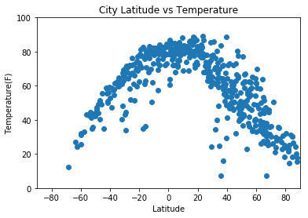
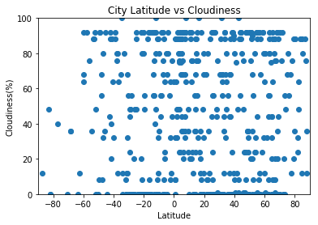

Unit 6 | Assignment - What's the Weather Like?
Background
Whether financial, political, or social -- data's true power lies in its ability to answer questions definitively. So let's take what you've learned about Python requests, APIs, and JSON traversals to answer a fundamental question: "What's the weather like as we approach the equator?"

Now, we know what you may be thinking: "Duh. It gets hotter..."

But, if pressed, how would you prove it?

Equator

WeatherPy
In this example, you'll be creating a Python script to visualize the weather of 500+ cities across the world of varying distance from the equator. To accomplish this, you'll be utilizing a simple Python library, the OpenWeatherMap API, and a little common sense to create a representative model of weather across world cities.

Your objective is to build a series of scatter plots to showcase the following relationships:

Temperature (F) vs. Latitude
Humidity (%) vs. Latitude
Cloudiness (%) vs. Latitude
Wind Speed (mph) vs. Latitude
Your final notebook must:

Randomly select at least 500 unique (non-repeat) cities based on latitude and longitude.
Perform a weather check on each of the cities using a series of successive API calls.
Include a print log of each city as it's being processed with the city number, city name, and requested URL.
Save both a CSV of all data retrieved and png images for each scatter plot.
As final considerations:

You must use the Matplotlib and Seaborn libraries.
You must include a written description of three observable trends based on the data.
You must use proper labeling of your plots, including aspects like: Plot Titles (with date of analysis) and Axes Labels.
You must include an exported markdown version of your Notebook called README.md in your GitHub repository.
See Example Solution for a reference on expected format.
Hints and Considerations
You may want to start this assignment by refreshing yourself on 4th grade geography, in particular, the geographic coordinate system.

Next, spend the requisite time necessary to study the OpenWeatherMap API. Based on your initial study, you should be able to answer basic questions about the API: Where do you request the API key? Which Weather API in particular will you need? What URL endpoints does it expect? What JSON structure does it respond with? Before you write a line of code, you should be aiming to have a crystal clear understanding of your intended outcome.

Though we've never worked with the citipy Python library, push yourself to decipher how it works, and why it might be relevant. Before you try to incorporate the library into your analysis, start by creating simple test cases outside your main script to confirm that you are using it correctly. Too often, when introduced to a new library, students get bogged down by the most minor of errors -- spending hours investigating their entire code -- when, in fact, a simple and focused test would have shown their basic utilization of the library was wrong from the start. Don't let this be you!

Part of our expectation in this challenge is that you will use critical thinking skills to understand how and why we're recommending the tools we are. What is Citipy for? Why would you use it in conjunction with the OpenWeatherMap API? How would you do so?

In building your script, pay attention to the cities you are using in your query pool. Are you getting coverage of the full gamut of latitudes and longitudes? Or are you simply choosing 500 cities concentrated in one region of the world? Even if you were a geographic genius, simply rattling 500 cities based on your human selection would create a biased dataset. Be thinking of how you should counter this. (Hint: Consider the full range of latitudes).

Lastly, remember -- this is a challenging activity. Push yourself! If you complete this task, then you can safely say that you've gained a strong mastery of the core foundations of data analytics and it will only go better from here. Good luck!

Copyright
Coding Boot Camp (C) 2016. All Rights Reserved.


```python
from citipy import citipy
import pandas as pd
import matplotlib.pyplot as plt
import requests
import random
api_key = open("../owm").read()
```


```python
cities = []
lats = []
lngs = []

while (len(cities)<500):
    
    lat = random.uniform(-90,90)
    long = random.uniform(-180,180)
    city = citipy.nearest_city(lat, long).city_name
    
    if city not in cities:
        lats.append(lat)
        lngs.append(long)
        cities.append(city)
```


```python
# Temperature (F) vs. Latitude
# Humidity (%) vs. Latitude
# Cloudiness (%) vs. Latitude
# Wind Speed (mph) vs. Latitude
temperature = []
humidity = []
cloudiness = []
wind = []

units = "imperial"
for i in range(len(cities)):
    query_url = f"http://api.openweathermap.org/data/2.5/weather?lat={lats[i]}&lon={lngs[i]}&appid={api_key}&units={units}"

    response = requests.get(query_url).json()
    
    temperature.append(response['main']['temp'])
    humidity.append(response['main']['humidity'])
    cloudiness.append(response['clouds']['all'])
    wind.append(response['wind']['speed'])
    
    print(f'Processing city #{i+1} | {cities[i]}\n{query_url}')

```

    Processing city #1 | punta arenas
    http://api.openweathermap.org/data/2.5/weather?lat=-53.00836972862856&lon=-75.98023863228357&appid=6fa22bbdfaabff26712c62b3b4d34cf1&units=imperial
    Processing city #2 | ushuaia
    http://api.openweathermap.org/data/2.5/weather?lat=-59.989673195191365&lon=-57.885656951612745&appid=6fa22bbdfaabff26712c62b3b4d34cf1&units=imperial
    Processing city #3 | mataura
    http://api.openweathermap.org/data/2.5/weather?lat=-34.258746447444885&lon=-147.48995328545465&appid=6fa22bbdfaabff26712c62b3b4d34cf1&units=imperial
    Processing city #4 | coquimbo
    http://api.openweathermap.org/data/2.5/weather?lat=-27.55506838995764&lon=-78.93249126567834&appid=6fa22bbdfaabff26712c62b3b4d34cf1&units=imperial
    Processing city #5 | bredasdorp
    http://api.openweathermap.org/data/2.5/weather?lat=-59.80658964118447&lon=20.11378363984312&appid=6fa22bbdfaabff26712c62b3b4d34cf1&units=imperial
    Processing city #6 | torbay
    http://api.openweathermap.org/data/2.5/weather?lat=36.57530318604144&lon=-44.994048204999956&appid=6fa22bbdfaabff26712c62b3b4d34cf1&units=imperial
    Processing city #7 | bengkulu
    http://api.openweathermap.org/data/2.5/weather?lat=-6.183029928580979&lon=96.21883013168781&appid=6fa22bbdfaabff26712c62b3b4d34cf1&units=imperial
    Processing city #8 | albany
    http://api.openweathermap.org/data/2.5/weather?lat=-82.0245852212555&lon=105.94004006591967&appid=6fa22bbdfaabff26712c62b3b4d34cf1&units=imperial
    Processing city #9 | rikitea
    http://api.openweathermap.org/data/2.5/weather?lat=-68.69229812192948&lon=-131.48506866961188&appid=6fa22bbdfaabff26712c62b3b4d34cf1&units=imperial
    Processing city #10 | busselton
    http://api.openweathermap.org/data/2.5/weather?lat=-48.211021917886356&lon=92.28444616555396&appid=6fa22bbdfaabff26712c62b3b4d34cf1&units=imperial
    Processing city #11 | hovd
    http://api.openweathermap.org/data/2.5/weather?lat=45.373025931554565&lon=99.8951854840983&appid=6fa22bbdfaabff26712c62b3b4d34cf1&units=imperial
    Processing city #12 | jejuri
    http://api.openweathermap.org/data/2.5/weather?lat=18.107767847045224&lon=74.16194845659157&appid=6fa22bbdfaabff26712c62b3b4d34cf1&units=imperial
    Processing city #13 | lebu
    http://api.openweathermap.org/data/2.5/weather?lat=-34.41654146405364&lon=-80.4812010856898&appid=6fa22bbdfaabff26712c62b3b4d34cf1&units=imperial
    Processing city #14 | castro
    http://api.openweathermap.org/data/2.5/weather?lat=-54.53669817415753&lon=-101.85656221233714&appid=6fa22bbdfaabff26712c62b3b4d34cf1&units=imperial
    Processing city #15 | provideniya
    http://api.openweathermap.org/data/2.5/weather?lat=66.67285080002134&lon=-175.13205862376884&appid=6fa22bbdfaabff26712c62b3b4d34cf1&units=imperial
    Processing city #16 | samarai
    http://api.openweathermap.org/data/2.5/weather?lat=-11.185793795746832&lon=151.57897789114713&appid=6fa22bbdfaabff26712c62b3b4d34cf1&units=imperial
    Processing city #17 | norman wells
    http://api.openweathermap.org/data/2.5/weather?lat=63.31668391514643&lon=-128.5942192254412&appid=6fa22bbdfaabff26712c62b3b4d34cf1&units=imperial
    Processing city #18 | kapaa
    http://api.openweathermap.org/data/2.5/weather?lat=15.250175230556508&lon=-166.1910793507773&appid=6fa22bbdfaabff26712c62b3b4d34cf1&units=imperial
    Processing city #19 | barrow
    http://api.openweathermap.org/data/2.5/weather?lat=79.59571574285832&lon=-166.91746833855663&appid=6fa22bbdfaabff26712c62b3b4d34cf1&units=imperial
    Processing city #20 | riacho de santana
    http://api.openweathermap.org/data/2.5/weather?lat=-13.440991343262453&lon=-42.80655643750825&appid=6fa22bbdfaabff26712c62b3b4d34cf1&units=imperial
    Processing city #21 | chokurdakh
    http://api.openweathermap.org/data/2.5/weather?lat=77.76334507698024&lon=147.76589561595495&appid=6fa22bbdfaabff26712c62b3b4d34cf1&units=imperial
    Processing city #22 | tuktoyaktuk
    http://api.openweathermap.org/data/2.5/weather?lat=84.66934000698839&lon=-135.51608986632095&appid=6fa22bbdfaabff26712c62b3b4d34cf1&units=imperial
    Processing city #23 | bethel
    http://api.openweathermap.org/data/2.5/weather?lat=51.2735582886709&lon=-159.74111355435653&appid=6fa22bbdfaabff26712c62b3b4d34cf1&units=imperial
    Processing city #24 | taywarah
    http://api.openweathermap.org/data/2.5/weather?lat=33.227107859229434&lon=63.93503094455548&appid=6fa22bbdfaabff26712c62b3b4d34cf1&units=imperial
    Processing city #25 | sosva
    http://api.openweathermap.org/data/2.5/weather?lat=59.64648319377574&lon=61.91205750475032&appid=6fa22bbdfaabff26712c62b3b4d34cf1&units=imperial
    Processing city #26 | hithadhoo
    http://api.openweathermap.org/data/2.5/weather?lat=-11.880181496600073&lon=79.7052091453383&appid=6fa22bbdfaabff26712c62b3b4d34cf1&units=imperial
    Processing city #27 | takoradi
    http://api.openweathermap.org/data/2.5/weather?lat=-4.46793169888015&lon=-1.565160746969184&appid=6fa22bbdfaabff26712c62b3b4d34cf1&units=imperial
    Processing city #28 | deputatskiy
    http://api.openweathermap.org/data/2.5/weather?lat=70.27353841774729&lon=142.57290635813047&appid=6fa22bbdfaabff26712c62b3b4d34cf1&units=imperial
    Processing city #29 | luderitz
    http://api.openweathermap.org/data/2.5/weather?lat=-30.455389328225714&lon=0.37518617863233317&appid=6fa22bbdfaabff26712c62b3b4d34cf1&units=imperial
    Processing city #30 | himora
    http://api.openweathermap.org/data/2.5/weather?lat=13.646161604964263&lon=36.900580430429045&appid=6fa22bbdfaabff26712c62b3b4d34cf1&units=imperial
    Processing city #31 | qasigiannguit
    http://api.openweathermap.org/data/2.5/weather?lat=67.21137340474891&lon=-45.919193723216466&appid=6fa22bbdfaabff26712c62b3b4d34cf1&units=imperial
    Processing city #32 | nanortalik
    http://api.openweathermap.org/data/2.5/weather?lat=51.45699347493385&lon=-44.50696416814432&appid=6fa22bbdfaabff26712c62b3b4d34cf1&units=imperial
    Processing city #33 | mercedes
    http://api.openweathermap.org/data/2.5/weather?lat=-29.067826232426135&lon=-58.30606456855314&appid=6fa22bbdfaabff26712c62b3b4d34cf1&units=imperial
    Processing city #34 | aswan
    http://api.openweathermap.org/data/2.5/weather?lat=23.607150868819573&lon=29.773884786229274&appid=6fa22bbdfaabff26712c62b3b4d34cf1&units=imperial
    Processing city #35 | gamboma
    http://api.openweathermap.org/data/2.5/weather?lat=-2.250235581257513&lon=15.521584944897597&appid=6fa22bbdfaabff26712c62b3b4d34cf1&units=imperial
    Processing city #36 | contamana
    http://api.openweathermap.org/data/2.5/weather?lat=-6.776951345962374&lon=-75.06600064313803&appid=6fa22bbdfaabff26712c62b3b4d34cf1&units=imperial
    Processing city #37 | sidi bu zayd
    http://api.openweathermap.org/data/2.5/weather?lat=34.80038507496698&lon=9.350255335444018&appid=6fa22bbdfaabff26712c62b3b4d34cf1&units=imperial
    Processing city #38 | victor harbor
    http://api.openweathermap.org/data/2.5/weather?lat=-38.698912081425426&lon=136.34714012381676&appid=6fa22bbdfaabff26712c62b3b4d34cf1&units=imperial
    Processing city #39 | thompson
    http://api.openweathermap.org/data/2.5/weather?lat=60.11836640310173&lon=-92.74825254396748&appid=6fa22bbdfaabff26712c62b3b4d34cf1&units=imperial
    Processing city #40 | yining
    http://api.openweathermap.org/data/2.5/weather?lat=44.08820663670667&lon=82.60918121307162&appid=6fa22bbdfaabff26712c62b3b4d34cf1&units=imperial
    Processing city #41 | mys shmidta
    http://api.openweathermap.org/data/2.5/weather?lat=71.21992277863288&lon=-175.81407645212775&appid=6fa22bbdfaabff26712c62b3b4d34cf1&units=imperial
    Processing city #42 | ribeira grande
    http://api.openweathermap.org/data/2.5/weather?lat=27.153562433035745&lon=-40.977093717509575&appid=6fa22bbdfaabff26712c62b3b4d34cf1&units=imperial
    Processing city #43 | guerrero negro
    http://api.openweathermap.org/data/2.5/weather?lat=12.856167439872223&lon=-131.62574573023196&appid=6fa22bbdfaabff26712c62b3b4d34cf1&units=imperial
    Processing city #44 | westport
    http://api.openweathermap.org/data/2.5/weather?lat=55.0053553601189&lon=-11.029817000477635&appid=6fa22bbdfaabff26712c62b3b4d34cf1&units=imperial
    Processing city #45 | puerto ayora
    http://api.openweathermap.org/data/2.5/weather?lat=-18.591543214302632&lon=-105.22839994795524&appid=6fa22bbdfaabff26712c62b3b4d34cf1&units=imperial
    Processing city #46 | avarua
    http://api.openweathermap.org/data/2.5/weather?lat=-25.087886965059198&lon=-159.53724676231514&appid=6fa22bbdfaabff26712c62b3b4d34cf1&units=imperial
    Processing city #47 | ilulissat
    http://api.openweathermap.org/data/2.5/weather?lat=82.43444000468722&lon=-43.68901793485844&appid=6fa22bbdfaabff26712c62b3b4d34cf1&units=imperial
    Processing city #48 | jamestown
    http://api.openweathermap.org/data/2.5/weather?lat=-19.673523103963092&lon=-12.030115353396923&appid=6fa22bbdfaabff26712c62b3b4d34cf1&units=imperial
    Processing city #49 | muros
    http://api.openweathermap.org/data/2.5/weather?lat=44.065142387420906&lon=-15.714557411071581&appid=6fa22bbdfaabff26712c62b3b4d34cf1&units=imperial
    Processing city #50 | cururupu
    http://api.openweathermap.org/data/2.5/weather?lat=5.10037934682741&lon=-41.1181529689305&appid=6fa22bbdfaabff26712c62b3b4d34cf1&units=imperial
    Processing city #51 | victoria
    http://api.openweathermap.org/data/2.5/weather?lat=-2.36009974737199&lon=51.88078137170592&appid=6fa22bbdfaabff26712c62b3b4d34cf1&units=imperial
    Processing city #52 | havre-saint-pierre
    http://api.openweathermap.org/data/2.5/weather?lat=53.743211808767796&lon=-63.62232155804769&appid=6fa22bbdfaabff26712c62b3b4d34cf1&units=imperial
    Processing city #53 | lorengau
    http://api.openweathermap.org/data/2.5/weather?lat=9.486297121638344&lon=146.23779367521132&appid=6fa22bbdfaabff26712c62b3b4d34cf1&units=imperial
    Processing city #54 | isangel
    http://api.openweathermap.org/data/2.5/weather?lat=-21.8089644404251&lon=177.53261090781382&appid=6fa22bbdfaabff26712c62b3b4d34cf1&units=imperial
    Processing city #55 | atuona
    http://api.openweathermap.org/data/2.5/weather?lat=1.6557899228990607&lon=-152.53045650841685&appid=6fa22bbdfaabff26712c62b3b4d34cf1&units=imperial
    Processing city #56 | mar del plata
    http://api.openweathermap.org/data/2.5/weather?lat=-57.76324985284249&lon=-37.64205127111114&appid=6fa22bbdfaabff26712c62b3b4d34cf1&units=imperial
    Processing city #57 | colares
    http://api.openweathermap.org/data/2.5/weather?lat=38.50141591721072&lon=-11.901653687968093&appid=6fa22bbdfaabff26712c62b3b4d34cf1&units=imperial
    Processing city #58 | yerbogachen
    http://api.openweathermap.org/data/2.5/weather?lat=64.73593085252378&lon=106.70193409962894&appid=6fa22bbdfaabff26712c62b3b4d34cf1&units=imperial
    Processing city #59 | bluff
    http://api.openweathermap.org/data/2.5/weather?lat=-77.36073611094326&lon=168.2657927858558&appid=6fa22bbdfaabff26712c62b3b4d34cf1&units=imperial
    Processing city #60 | zharkovskiy
    http://api.openweathermap.org/data/2.5/weather?lat=56.11882645725879&lon=32.30960799354793&appid=6fa22bbdfaabff26712c62b3b4d34cf1&units=imperial
    Processing city #61 | fairbanks
    http://api.openweathermap.org/data/2.5/weather?lat=64.52592918892222&lon=-147.14264960711475&appid=6fa22bbdfaabff26712c62b3b4d34cf1&units=imperial
    Processing city #62 | lagoa
    http://api.openweathermap.org/data/2.5/weather?lat=49.0375980347259&lon=-27.996931575413242&appid=6fa22bbdfaabff26712c62b3b4d34cf1&units=imperial
    Processing city #63 | gabu
    http://api.openweathermap.org/data/2.5/weather?lat=12.487378444970275&lon=-14.336662488067077&appid=6fa22bbdfaabff26712c62b3b4d34cf1&units=imperial
    Processing city #64 | doha
    http://api.openweathermap.org/data/2.5/weather?lat=29.326678024475342&lon=47.07311993156742&appid=6fa22bbdfaabff26712c62b3b4d34cf1&units=imperial
    Processing city #65 | sawtell
    http://api.openweathermap.org/data/2.5/weather?lat=-31.425483846283157&lon=158.19690221468983&appid=6fa22bbdfaabff26712c62b3b4d34cf1&units=imperial
    Processing city #66 | kamenskoye
    http://api.openweathermap.org/data/2.5/weather?lat=63.45232712623911&lon=170.4571590155051&appid=6fa22bbdfaabff26712c62b3b4d34cf1&units=imperial
    Processing city #67 | ahipara
    http://api.openweathermap.org/data/2.5/weather?lat=-32.80866322632522&lon=167.80073816455575&appid=6fa22bbdfaabff26712c62b3b4d34cf1&units=imperial
    Processing city #68 | bundaberg
    http://api.openweathermap.org/data/2.5/weather?lat=-21.80121344331991&lon=154.36124070112368&appid=6fa22bbdfaabff26712c62b3b4d34cf1&units=imperial
    Processing city #69 | kodiak
    http://api.openweathermap.org/data/2.5/weather?lat=49.093161920251475&lon=-156.3786623631097&appid=6fa22bbdfaabff26712c62b3b4d34cf1&units=imperial
    Processing city #70 | merauke
    http://api.openweathermap.org/data/2.5/weather?lat=-7.5096806390562705&lon=140.2331901235458&appid=6fa22bbdfaabff26712c62b3b4d34cf1&units=imperial
    Processing city #71 | shubarshi
    http://api.openweathermap.org/data/2.5/weather?lat=48.04511386339638&lon=56.335570371729176&appid=6fa22bbdfaabff26712c62b3b4d34cf1&units=imperial
    Processing city #72 | illoqqortoormiut
    http://api.openweathermap.org/data/2.5/weather?lat=73.42798887784562&lon=-21.074458615762495&appid=6fa22bbdfaabff26712c62b3b4d34cf1&units=imperial
    Processing city #73 | goderich
    http://api.openweathermap.org/data/2.5/weather?lat=7.552909996987054&lon=-16.947133978090932&appid=6fa22bbdfaabff26712c62b3b4d34cf1&units=imperial
    Processing city #74 | palabuhanratu
    http://api.openweathermap.org/data/2.5/weather?lat=-7.382646549810488&lon=106.72266056014632&appid=6fa22bbdfaabff26712c62b3b4d34cf1&units=imperial
    Processing city #75 | dikson
    http://api.openweathermap.org/data/2.5/weather?lat=84.91260668795255&lon=83.62532381346466&appid=6fa22bbdfaabff26712c62b3b4d34cf1&units=imperial
    Processing city #76 | banjar
    http://api.openweathermap.org/data/2.5/weather?lat=-10.366489115880384&lon=107.01908756120821&appid=6fa22bbdfaabff26712c62b3b4d34cf1&units=imperial
    Processing city #77 | vila franca do campo
    http://api.openweathermap.org/data/2.5/weather?lat=43.79180306508863&lon=-21.37533931861836&appid=6fa22bbdfaabff26712c62b3b4d34cf1&units=imperial
    Processing city #78 | komsomolskiy
    http://api.openweathermap.org/data/2.5/weather?lat=81.90087296755752&lon=175.0012183972242&appid=6fa22bbdfaabff26712c62b3b4d34cf1&units=imperial
    Processing city #79 | hermanus
    http://api.openweathermap.org/data/2.5/weather?lat=-82.01680342347234&lon=-9.785683430112499&appid=6fa22bbdfaabff26712c62b3b4d34cf1&units=imperial
    Processing city #80 | katsuura
    http://api.openweathermap.org/data/2.5/weather?lat=19.89448471839897&lon=148.20002261127195&appid=6fa22bbdfaabff26712c62b3b4d34cf1&units=imperial
    Processing city #81 | cape town
    http://api.openweathermap.org/data/2.5/weather?lat=-52.561992846392016&lon=-7.0059203945440345&appid=6fa22bbdfaabff26712c62b3b4d34cf1&units=imperial
    Processing city #82 | tuxpan
    http://api.openweathermap.org/data/2.5/weather?lat=21.656444452986904&lon=-106.28577950231822&appid=6fa22bbdfaabff26712c62b3b4d34cf1&units=imperial
    Processing city #83 | ponta do sol
    http://api.openweathermap.org/data/2.5/weather?lat=26.325936851557728&lon=-32.99398695421718&appid=6fa22bbdfaabff26712c62b3b4d34cf1&units=imperial
    Processing city #84 | grand river south east
    http://api.openweathermap.org/data/2.5/weather?lat=-20.15290918946964&lon=63.71907512452222&appid=6fa22bbdfaabff26712c62b3b4d34cf1&units=imperial
    Processing city #85 | dukat
    http://api.openweathermap.org/data/2.5/weather?lat=62.39777475487321&lon=154.14937276465287&appid=6fa22bbdfaabff26712c62b3b4d34cf1&units=imperial
    Processing city #86 | georgetown
    http://api.openweathermap.org/data/2.5/weather?lat=-13.322409130150362&lon=-17.722093386408716&appid=6fa22bbdfaabff26712c62b3b4d34cf1&units=imperial
    Processing city #87 | hilo
    http://api.openweathermap.org/data/2.5/weather?lat=7.686988621938127&lon=-154.67590836234757&appid=6fa22bbdfaabff26712c62b3b4d34cf1&units=imperial
    Processing city #88 | mayya
    http://api.openweathermap.org/data/2.5/weather?lat=60.635222748507545&lon=130.75245697834737&appid=6fa22bbdfaabff26712c62b3b4d34cf1&units=imperial
    Processing city #89 | jaramana
    http://api.openweathermap.org/data/2.5/weather?lat=33.118035756673365&lon=36.73192314968111&appid=6fa22bbdfaabff26712c62b3b4d34cf1&units=imperial
    Processing city #90 | port elizabeth
    http://api.openweathermap.org/data/2.5/weather?lat=-68.67581166706034&lon=31.572925340396154&appid=6fa22bbdfaabff26712c62b3b4d34cf1&units=imperial
    Processing city #91 | phalaborwa
    http://api.openweathermap.org/data/2.5/weather?lat=-23.765443549289813&lon=31.67999734382863&appid=6fa22bbdfaabff26712c62b3b4d34cf1&units=imperial
    Processing city #92 | vaini
    http://api.openweathermap.org/data/2.5/weather?lat=-83.07508396029833&lon=-170.15990261846792&appid=6fa22bbdfaabff26712c62b3b4d34cf1&units=imperial
    Processing city #93 | batang berjuntai
    http://api.openweathermap.org/data/2.5/weather?lat=3.3369921454044515&lon=101.35924265396909&appid=6fa22bbdfaabff26712c62b3b4d34cf1&units=imperial
    Processing city #94 | samusu
    http://api.openweathermap.org/data/2.5/weather?lat=-1.7362413695450272&lon=-161.10461988134008&appid=6fa22bbdfaabff26712c62b3b4d34cf1&units=imperial
    Processing city #95 | butaritari
    http://api.openweathermap.org/data/2.5/weather?lat=19.74618777931248&lon=157.29782359663847&appid=6fa22bbdfaabff26712c62b3b4d34cf1&units=imperial
    Processing city #96 | nizhneyansk
    http://api.openweathermap.org/data/2.5/weather?lat=76.31974587321506&lon=137.45006023140127&appid=6fa22bbdfaabff26712c62b3b4d34cf1&units=imperial
    Processing city #97 | praia
    http://api.openweathermap.org/data/2.5/weather?lat=5.384722470472624&lon=-23.392860244750324&appid=6fa22bbdfaabff26712c62b3b4d34cf1&units=imperial
    Processing city #98 | sao paulo de olivenca
    http://api.openweathermap.org/data/2.5/weather?lat=-3.940271942075725&lon=-69.28816579690194&appid=6fa22bbdfaabff26712c62b3b4d34cf1&units=imperial
    Processing city #99 | hasaki
    http://api.openweathermap.org/data/2.5/weather?lat=34.87656299318303&lon=142.77520427351226&appid=6fa22bbdfaabff26712c62b3b4d34cf1&units=imperial
    Processing city #100 | catabola
    http://api.openweathermap.org/data/2.5/weather?lat=-11.391519127341624&lon=16.549246334842678&appid=6fa22bbdfaabff26712c62b3b4d34cf1&units=imperial
    Processing city #101 | bambous virieux
    http://api.openweathermap.org/data/2.5/weather?lat=-36.717385338218165&lon=83.36287236308743&appid=6fa22bbdfaabff26712c62b3b4d34cf1&units=imperial
    Processing city #102 | kem
    http://api.openweathermap.org/data/2.5/weather?lat=65.47133727354131&lon=33.85430653706828&appid=6fa22bbdfaabff26712c62b3b4d34cf1&units=imperial
    Processing city #103 | lata
    http://api.openweathermap.org/data/2.5/weather?lat=-8.851339958619022&lon=166.70338961848137&appid=6fa22bbdfaabff26712c62b3b4d34cf1&units=imperial
    Processing city #104 | shingu
    http://api.openweathermap.org/data/2.5/weather?lat=23.10828383903892&lon=140.61482456705727&appid=6fa22bbdfaabff26712c62b3b4d34cf1&units=imperial
    Processing city #105 | ercis
    http://api.openweathermap.org/data/2.5/weather?lat=39.28311086703002&lon=43.48736870440004&appid=6fa22bbdfaabff26712c62b3b4d34cf1&units=imperial
    Processing city #106 | salinopolis
    http://api.openweathermap.org/data/2.5/weather?lat=2.9228776051418777&lon=-46.07443568979028&appid=6fa22bbdfaabff26712c62b3b4d34cf1&units=imperial
    Processing city #107 | roma
    http://api.openweathermap.org/data/2.5/weather?lat=-25.845636016619295&lon=145.4831356902028&appid=6fa22bbdfaabff26712c62b3b4d34cf1&units=imperial
    Processing city #108 | port alfred
    http://api.openweathermap.org/data/2.5/weather?lat=-62.538910807307346&lon=39.14203859446013&appid=6fa22bbdfaabff26712c62b3b4d34cf1&units=imperial
    Processing city #109 | faya
    http://api.openweathermap.org/data/2.5/weather?lat=22.21810998558513&lon=23.119211711638116&appid=6fa22bbdfaabff26712c62b3b4d34cf1&units=imperial
    Processing city #110 | bay city
    http://api.openweathermap.org/data/2.5/weather?lat=28.523939592024888&lon=-96.03893566356545&appid=6fa22bbdfaabff26712c62b3b4d34cf1&units=imperial
    Processing city #111 | qaanaaq
    http://api.openweathermap.org/data/2.5/weather?lat=87.74708029508795&lon=-80.60376652695845&appid=6fa22bbdfaabff26712c62b3b4d34cf1&units=imperial
    Processing city #112 | new norfolk
    http://api.openweathermap.org/data/2.5/weather?lat=-45.58936876148303&lon=142.4624229793805&appid=6fa22bbdfaabff26712c62b3b4d34cf1&units=imperial
    Processing city #113 | sambava
    http://api.openweathermap.org/data/2.5/weather?lat=-11.828227989465532&lon=56.39695398089464&appid=6fa22bbdfaabff26712c62b3b4d34cf1&units=imperial
    Processing city #114 | chumikan
    http://api.openweathermap.org/data/2.5/weather?lat=57.10541954003065&lon=133.66695269991942&appid=6fa22bbdfaabff26712c62b3b4d34cf1&units=imperial
    Processing city #115 | burica
    http://api.openweathermap.org/data/2.5/weather?lat=5.767198990097896&lon=-84.1449688265209&appid=6fa22bbdfaabff26712c62b3b4d34cf1&units=imperial
    Processing city #116 | balkanabat
    http://api.openweathermap.org/data/2.5/weather?lat=40.31549925049512&lon=54.17054064205044&appid=6fa22bbdfaabff26712c62b3b4d34cf1&units=imperial
    Processing city #117 | kamloops
    http://api.openweathermap.org/data/2.5/weather?lat=50.741281326609&lon=-120.1019977960537&appid=6fa22bbdfaabff26712c62b3b4d34cf1&units=imperial
    Processing city #118 | belawan
    http://api.openweathermap.org/data/2.5/weather?lat=3.959213377915191&lon=98.77061163782486&appid=6fa22bbdfaabff26712c62b3b4d34cf1&units=imperial
    Processing city #119 | east london
    http://api.openweathermap.org/data/2.5/weather?lat=-70.76199669478109&lon=51.11109986097722&appid=6fa22bbdfaabff26712c62b3b4d34cf1&units=imperial
    Processing city #120 | ashington
    http://api.openweathermap.org/data/2.5/weather?lat=55.27220085585685&lon=-1.9243426756251267&appid=6fa22bbdfaabff26712c62b3b4d34cf1&units=imperial
    Processing city #121 | longyearbyen
    http://api.openweathermap.org/data/2.5/weather?lat=87.43575107935024&lon=22.896558047356677&appid=6fa22bbdfaabff26712c62b3b4d34cf1&units=imperial
    Processing city #122 | dicabisagan
    http://api.openweathermap.org/data/2.5/weather?lat=16.750605066399487&lon=124.17265583671457&appid=6fa22bbdfaabff26712c62b3b4d34cf1&units=imperial
    Processing city #123 | belushya guba
    http://api.openweathermap.org/data/2.5/weather?lat=81.89359307351384&lon=54.01601503611042&appid=6fa22bbdfaabff26712c62b3b4d34cf1&units=imperial
    Processing city #124 | halalo
    http://api.openweathermap.org/data/2.5/weather?lat=-13.023171328296897&lon=-178.78166254803196&appid=6fa22bbdfaabff26712c62b3b4d34cf1&units=imperial
    Processing city #125 | soe
    http://api.openweathermap.org/data/2.5/weather?lat=-11.423397501909818&lon=126.44277779088543&appid=6fa22bbdfaabff26712c62b3b4d34cf1&units=imperial
    Processing city #126 | lompoc
    http://api.openweathermap.org/data/2.5/weather?lat=25.401959963443076&lon=-131.36513355923356&appid=6fa22bbdfaabff26712c62b3b4d34cf1&units=imperial
    Processing city #127 | rio branco
    http://api.openweathermap.org/data/2.5/weather?lat=-9.843381524125846&lon=-68.34117409110836&appid=6fa22bbdfaabff26712c62b3b4d34cf1&units=imperial
    Processing city #128 | tiksi
    http://api.openweathermap.org/data/2.5/weather?lat=73.29314410753582&lon=130.6614121546715&appid=6fa22bbdfaabff26712c62b3b4d34cf1&units=imperial
    Processing city #129 | hobart
    http://api.openweathermap.org/data/2.5/weather?lat=-87.50031594282187&lon=138.01107496287705&appid=6fa22bbdfaabff26712c62b3b4d34cf1&units=imperial
    Processing city #130 | zachepylivka
    http://api.openweathermap.org/data/2.5/weather?lat=49.028610094649395&lon=35.514120960042874&appid=6fa22bbdfaabff26712c62b3b4d34cf1&units=imperial
    Processing city #131 | chikoy
    http://api.openweathermap.org/data/2.5/weather?lat=49.49207371156314&lon=107.30944888385443&appid=6fa22bbdfaabff26712c62b3b4d34cf1&units=imperial
    Processing city #132 | quesnel
    http://api.openweathermap.org/data/2.5/weather?lat=52.514192969222705&lon=-123.37146580737698&appid=6fa22bbdfaabff26712c62b3b4d34cf1&units=imperial
    Processing city #133 | springbok
    http://api.openweathermap.org/data/2.5/weather?lat=-29.10853291077275&lon=17.89681107196924&appid=6fa22bbdfaabff26712c62b3b4d34cf1&units=imperial
    Processing city #134 | severo-kurilsk
    http://api.openweathermap.org/data/2.5/weather?lat=41.926467883885806&lon=158.04106567558597&appid=6fa22bbdfaabff26712c62b3b4d34cf1&units=imperial
    Processing city #135 | caravelas
    http://api.openweathermap.org/data/2.5/weather?lat=-18.3738157578713&lon=-30.792524530720698&appid=6fa22bbdfaabff26712c62b3b4d34cf1&units=imperial
    Processing city #136 | pilar
    http://api.openweathermap.org/data/2.5/weather?lat=10.468444492388429&lon=128.14700020258869&appid=6fa22bbdfaabff26712c62b3b4d34cf1&units=imperial
    Processing city #137 | tasiilaq
    http://api.openweathermap.org/data/2.5/weather?lat=72.46262882725475&lon=-36.50617122682331&appid=6fa22bbdfaabff26712c62b3b4d34cf1&units=imperial
    Processing city #138 | saldanha
    http://api.openweathermap.org/data/2.5/weather?lat=-37.4275063466258&lon=6.934170136967367&appid=6fa22bbdfaabff26712c62b3b4d34cf1&units=imperial
    Processing city #139 | tilichiki
    http://api.openweathermap.org/data/2.5/weather?lat=58.99072294715765&lon=167.76993071354963&appid=6fa22bbdfaabff26712c62b3b4d34cf1&units=imperial
    Processing city #140 | a
    http://api.openweathermap.org/data/2.5/weather?lat=64.56606927574182&lon=10.242391818389791&appid=6fa22bbdfaabff26712c62b3b4d34cf1&units=imperial
    Processing city #141 | manaure
    http://api.openweathermap.org/data/2.5/weather?lat=14.167479779311364&lon=-73.32431078455127&appid=6fa22bbdfaabff26712c62b3b4d34cf1&units=imperial
    Processing city #142 | ilhabela
    http://api.openweathermap.org/data/2.5/weather?lat=-28.551278789034328&lon=-42.624376135168205&appid=6fa22bbdfaabff26712c62b3b4d34cf1&units=imperial
    Processing city #143 | hueytown
    http://api.openweathermap.org/data/2.5/weather?lat=33.3693883446641&lon=-87.24377990159863&appid=6fa22bbdfaabff26712c62b3b4d34cf1&units=imperial
    Processing city #144 | igarka
    http://api.openweathermap.org/data/2.5/weather?lat=66.73774283412371&lon=86.25966514876836&appid=6fa22bbdfaabff26712c62b3b4d34cf1&units=imperial
    Processing city #145 | airai
    http://api.openweathermap.org/data/2.5/weather?lat=4.942493342906076&lon=136.86084629224&appid=6fa22bbdfaabff26712c62b3b4d34cf1&units=imperial
    Processing city #146 | touros
    http://api.openweathermap.org/data/2.5/weather?lat=1.2597775359212875&lon=-30.651009068931614&appid=6fa22bbdfaabff26712c62b3b4d34cf1&units=imperial
    Processing city #147 | vardo
    http://api.openweathermap.org/data/2.5/weather?lat=88.01283390041885&lon=38.089786593159175&appid=6fa22bbdfaabff26712c62b3b4d34cf1&units=imperial
    Processing city #148 | khatanga
    http://api.openweathermap.org/data/2.5/weather?lat=85.11376316196373&lon=97.1367529501693&appid=6fa22bbdfaabff26712c62b3b4d34cf1&units=imperial
    Processing city #149 | mrirt
    http://api.openweathermap.org/data/2.5/weather?lat=32.06587898800797&lon=-5.728793264178904&appid=6fa22bbdfaabff26712c62b3b4d34cf1&units=imperial
    Processing city #150 | burnie
    http://api.openweathermap.org/data/2.5/weather?lat=-42.09764478489453&lon=144.21180360742488&appid=6fa22bbdfaabff26712c62b3b4d34cf1&units=imperial
    Processing city #151 | svetlogorsk
    http://api.openweathermap.org/data/2.5/weather?lat=68.13439642374038&lon=89.90878587538185&appid=6fa22bbdfaabff26712c62b3b4d34cf1&units=imperial
    Processing city #152 | tilhar
    http://api.openweathermap.org/data/2.5/weather?lat=27.966683621509944&lon=79.71339653519738&appid=6fa22bbdfaabff26712c62b3b4d34cf1&units=imperial
    Processing city #153 | taolanaro
    http://api.openweathermap.org/data/2.5/weather?lat=-37.934998903397826&lon=52.15378653895641&appid=6fa22bbdfaabff26712c62b3b4d34cf1&units=imperial
    Processing city #154 | ayolas
    http://api.openweathermap.org/data/2.5/weather?lat=-27.806573014830377&lon=-56.987803507025106&appid=6fa22bbdfaabff26712c62b3b4d34cf1&units=imperial
    Processing city #155 | arraial do cabo
    http://api.openweathermap.org/data/2.5/weather?lat=-42.067881732019686&lon=-19.788489774036236&appid=6fa22bbdfaabff26712c62b3b4d34cf1&units=imperial
    Processing city #156 | pevek
    http://api.openweathermap.org/data/2.5/weather?lat=83.77655406056445&lon=168.6917986493994&appid=6fa22bbdfaabff26712c62b3b4d34cf1&units=imperial
    Processing city #157 | aflu
    http://api.openweathermap.org/data/2.5/weather?lat=32.00290518971171&lon=2.9490695501922914&appid=6fa22bbdfaabff26712c62b3b4d34cf1&units=imperial
    Processing city #158 | toila
    http://api.openweathermap.org/data/2.5/weather?lat=59.50850061160202&lon=27.39409818944131&appid=6fa22bbdfaabff26712c62b3b4d34cf1&units=imperial
    Processing city #159 | limbang
    http://api.openweathermap.org/data/2.5/weather?lat=4.46828765703431&lon=114.96853565327831&appid=6fa22bbdfaabff26712c62b3b4d34cf1&units=imperial
    Processing city #160 | acopiara
    http://api.openweathermap.org/data/2.5/weather?lat=-6.040721155551694&lon=-39.57109052917809&appid=6fa22bbdfaabff26712c62b3b4d34cf1&units=imperial
    Processing city #161 | taixing
    http://api.openweathermap.org/data/2.5/weather?lat=32.17503811805891&lon=119.86323848458579&appid=6fa22bbdfaabff26712c62b3b4d34cf1&units=imperial
    Processing city #162 | kincardine
    http://api.openweathermap.org/data/2.5/weather?lat=44.183194639705306&lon=-81.64960252101142&appid=6fa22bbdfaabff26712c62b3b4d34cf1&units=imperial
    Processing city #163 | veraval
    http://api.openweathermap.org/data/2.5/weather?lat=17.325878336094362&lon=67.54698093381364&appid=6fa22bbdfaabff26712c62b3b4d34cf1&units=imperial
    Processing city #164 | sola
    http://api.openweathermap.org/data/2.5/weather?lat=-13.798008164122379&lon=172.5942826762004&appid=6fa22bbdfaabff26712c62b3b4d34cf1&units=imperial
    Processing city #165 | conde
    http://api.openweathermap.org/data/2.5/weather?lat=-13.335595968044245&lon=-35.8549843916484&appid=6fa22bbdfaabff26712c62b3b4d34cf1&units=imperial
    Processing city #166 | matagami
    http://api.openweathermap.org/data/2.5/weather?lat=50.72618333430398&lon=-78.02832492952643&appid=6fa22bbdfaabff26712c62b3b4d34cf1&units=imperial
    Processing city #167 | beringovskiy
    http://api.openweathermap.org/data/2.5/weather?lat=58.902565180868436&lon=177.96465291838035&appid=6fa22bbdfaabff26712c62b3b4d34cf1&units=imperial
    Processing city #168 | zilair
    http://api.openweathermap.org/data/2.5/weather?lat=52.03473783474453&lon=57.732367159877384&appid=6fa22bbdfaabff26712c62b3b4d34cf1&units=imperial
    Processing city #169 | zemio
    http://api.openweathermap.org/data/2.5/weather?lat=6.334576555687747&lon=24.82909344085249&appid=6fa22bbdfaabff26712c62b3b4d34cf1&units=imperial
    Processing city #170 | los llanos de aridane
    http://api.openweathermap.org/data/2.5/weather?lat=28.31063204316625&lon=-20.567754230451328&appid=6fa22bbdfaabff26712c62b3b4d34cf1&units=imperial
    Processing city #171 | nikolskoye
    http://api.openweathermap.org/data/2.5/weather?lat=44.21624465605754&lon=172.82411993264304&appid=6fa22bbdfaabff26712c62b3b4d34cf1&units=imperial
    Processing city #172 | tura
    http://api.openweathermap.org/data/2.5/weather?lat=25.705654084158724&lon=90.23097376739906&appid=6fa22bbdfaabff26712c62b3b4d34cf1&units=imperial
    Processing city #173 | bokspits
    http://api.openweathermap.org/data/2.5/weather?lat=-26.173225154227268&lon=19.545211394785355&appid=6fa22bbdfaabff26712c62b3b4d34cf1&units=imperial
    Processing city #174 | sentyabrskiy
    http://api.openweathermap.org/data/2.5/weather?lat=37.41552855097062&lon=159.21797294019416&appid=6fa22bbdfaabff26712c62b3b4d34cf1&units=imperial
    Processing city #175 | villanueva de cordoba
    http://api.openweathermap.org/data/2.5/weather?lat=38.27508053222954&lon=-4.4450324110777615&appid=6fa22bbdfaabff26712c62b3b4d34cf1&units=imperial
    Processing city #176 | rawson
    http://api.openweathermap.org/data/2.5/weather?lat=-47.810296154318515&lon=-62.21370421683902&appid=6fa22bbdfaabff26712c62b3b4d34cf1&units=imperial
    Processing city #177 | le vauclin
    http://api.openweathermap.org/data/2.5/weather?lat=15.893176517593488&lon=-58.73621440852348&appid=6fa22bbdfaabff26712c62b3b4d34cf1&units=imperial
    Processing city #178 | clyde river
    http://api.openweathermap.org/data/2.5/weather?lat=67.75466550294914&lon=-81.57507745362132&appid=6fa22bbdfaabff26712c62b3b4d34cf1&units=imperial
    Processing city #179 | semey
    http://api.openweathermap.org/data/2.5/weather?lat=49.25200270403019&lon=78.77142246255346&appid=6fa22bbdfaabff26712c62b3b4d34cf1&units=imperial
    Processing city #180 | portland
    http://api.openweathermap.org/data/2.5/weather?lat=-48.11602867680744&lon=136.12805437409452&appid=6fa22bbdfaabff26712c62b3b4d34cf1&units=imperial
    Processing city #181 | khormuj
    http://api.openweathermap.org/data/2.5/weather?lat=28.21508399577928&lon=51.38953557465791&appid=6fa22bbdfaabff26712c62b3b4d34cf1&units=imperial
    Processing city #182 | daru
    http://api.openweathermap.org/data/2.5/weather?lat=-12.642441089550005&lon=142.38338009716074&appid=6fa22bbdfaabff26712c62b3b4d34cf1&units=imperial
    Processing city #183 | vao
    http://api.openweathermap.org/data/2.5/weather?lat=-28.348995596457037&lon=166.93426098954677&appid=6fa22bbdfaabff26712c62b3b4d34cf1&units=imperial
    Processing city #184 | aleksandrov gay
    http://api.openweathermap.org/data/2.5/weather?lat=48.89035329075122&lon=49.199002108540185&appid=6fa22bbdfaabff26712c62b3b4d34cf1&units=imperial
    Processing city #185 | puerto carreno
    http://api.openweathermap.org/data/2.5/weather?lat=7.128609100392055&lon=-67.43280865841602&appid=6fa22bbdfaabff26712c62b3b4d34cf1&units=imperial
    Processing city #186 | barentsburg
    http://api.openweathermap.org/data/2.5/weather?lat=84.93450304130678&lon=0.6506409379350657&appid=6fa22bbdfaabff26712c62b3b4d34cf1&units=imperial
    Processing city #187 | ban dung
    http://api.openweathermap.org/data/2.5/weather?lat=17.98518497300026&lon=103.2721220041285&appid=6fa22bbdfaabff26712c62b3b4d34cf1&units=imperial
    Processing city #188 | waipawa
    http://api.openweathermap.org/data/2.5/weather?lat=-45.924238959316774&lon=179.27470074223294&appid=6fa22bbdfaabff26712c62b3b4d34cf1&units=imperial
    Processing city #189 | baracoa
    http://api.openweathermap.org/data/2.5/weather?lat=19.734407043063413&lon=-74.65856530530382&appid=6fa22bbdfaabff26712c62b3b4d34cf1&units=imperial
    Processing city #190 | luena
    http://api.openweathermap.org/data/2.5/weather?lat=-10.8664045168712&lon=19.577705590887206&appid=6fa22bbdfaabff26712c62b3b4d34cf1&units=imperial
    Processing city #191 | mareeba
    http://api.openweathermap.org/data/2.5/weather?lat=-15.25821046478606&lon=142.20911524941755&appid=6fa22bbdfaabff26712c62b3b4d34cf1&units=imperial
    Processing city #192 | leningradskiy
    http://api.openweathermap.org/data/2.5/weather?lat=72.82189244791905&lon=179.5537591675606&appid=6fa22bbdfaabff26712c62b3b4d34cf1&units=imperial
    Processing city #193 | chuy
    http://api.openweathermap.org/data/2.5/weather?lat=-49.70979679292373&lon=-35.77606006577423&appid=6fa22bbdfaabff26712c62b3b4d34cf1&units=imperial
    Processing city #194 | saint-philippe
    http://api.openweathermap.org/data/2.5/weather?lat=-59.95194997087415&lon=72.40149553215272&appid=6fa22bbdfaabff26712c62b3b4d34cf1&units=imperial
    Processing city #195 | kloulklubed
    http://api.openweathermap.org/data/2.5/weather?lat=5.908247968605281&lon=133.19118037502983&appid=6fa22bbdfaabff26712c62b3b4d34cf1&units=imperial
    Processing city #196 | salalah
    http://api.openweathermap.org/data/2.5/weather?lat=16.34231002116681&lon=58.36186820446744&appid=6fa22bbdfaabff26712c62b3b4d34cf1&units=imperial
    Processing city #197 | dzhebariki-khaya
    http://api.openweathermap.org/data/2.5/weather?lat=62.56547744467841&lon=137.91427265340508&appid=6fa22bbdfaabff26712c62b3b4d34cf1&units=imperial
    Processing city #198 | aklavik
    http://api.openweathermap.org/data/2.5/weather?lat=67.0786396040107&lon=-134.7998475222912&appid=6fa22bbdfaabff26712c62b3b4d34cf1&units=imperial
    Processing city #199 | acapulco
    http://api.openweathermap.org/data/2.5/weather?lat=7.047256854110188&lon=-103.83653038362557&appid=6fa22bbdfaabff26712c62b3b4d34cf1&units=imperial
    Processing city #200 | zhigansk
    http://api.openweathermap.org/data/2.5/weather?lat=71.71061087988681&lon=122.52025337650605&appid=6fa22bbdfaabff26712c62b3b4d34cf1&units=imperial
    Processing city #201 | san cristobal
    http://api.openweathermap.org/data/2.5/weather?lat=-7.11633138840179&lon=-88.50085440545196&appid=6fa22bbdfaabff26712c62b3b4d34cf1&units=imperial
    Processing city #202 | kavieng
    http://api.openweathermap.org/data/2.5/weather?lat=-1.5395754932185497&lon=150.71827265622926&appid=6fa22bbdfaabff26712c62b3b4d34cf1&units=imperial
    Processing city #203 | peravurani
    http://api.openweathermap.org/data/2.5/weather?lat=10.269286939075613&lon=79.26081732685014&appid=6fa22bbdfaabff26712c62b3b4d34cf1&units=imperial
    Processing city #204 | kelvington
    http://api.openweathermap.org/data/2.5/weather?lat=52.4782219318667&lon=-103.70605731823758&appid=6fa22bbdfaabff26712c62b3b4d34cf1&units=imperial
    Processing city #205 | olga
    http://api.openweathermap.org/data/2.5/weather?lat=42.466093392403224&lon=136.168737645185&appid=6fa22bbdfaabff26712c62b3b4d34cf1&units=imperial
    Processing city #206 | srednekolymsk
    http://api.openweathermap.org/data/2.5/weather?lat=74.03274029720654&lon=154.15073543200822&appid=6fa22bbdfaabff26712c62b3b4d34cf1&units=imperial
    Processing city #207 | saint george
    http://api.openweathermap.org/data/2.5/weather?lat=30.59980171710427&lon=-60.57711213735625&appid=6fa22bbdfaabff26712c62b3b4d34cf1&units=imperial
    Processing city #208 | cuamba
    http://api.openweathermap.org/data/2.5/weather?lat=-15.971806932955872&lon=36.967913187141505&appid=6fa22bbdfaabff26712c62b3b4d34cf1&units=imperial
    Processing city #209 | port hedland
    http://api.openweathermap.org/data/2.5/weather?lat=-17.423495377443857&lon=118.65798141876456&appid=6fa22bbdfaabff26712c62b3b4d34cf1&units=imperial
    Processing city #210 | upernavik
    http://api.openweathermap.org/data/2.5/weather?lat=68.70268874229149&lon=-59.304435397344676&appid=6fa22bbdfaabff26712c62b3b4d34cf1&units=imperial
    Processing city #211 | dalbandin
    http://api.openweathermap.org/data/2.5/weather?lat=28.828419530580547&lon=64.8547105168725&appid=6fa22bbdfaabff26712c62b3b4d34cf1&units=imperial
    Processing city #212 | oxford
    http://api.openweathermap.org/data/2.5/weather?lat=51.70037375707582&lon=-1.0323507830914878&appid=6fa22bbdfaabff26712c62b3b4d34cf1&units=imperial
    Processing city #213 | sechura
    http://api.openweathermap.org/data/2.5/weather?lat=-10.699066042733946&lon=-87.13928484037508&appid=6fa22bbdfaabff26712c62b3b4d34cf1&units=imperial
    Processing city #214 | busembatia
    http://api.openweathermap.org/data/2.5/weather?lat=0.5566415539564247&lon=33.79731484864803&appid=6fa22bbdfaabff26712c62b3b4d34cf1&units=imperial
    Processing city #215 | lasa
    http://api.openweathermap.org/data/2.5/weather?lat=29.13800118019728&lon=92.54131445687841&appid=6fa22bbdfaabff26712c62b3b4d34cf1&units=imperial
    Processing city #216 | uthal
    http://api.openweathermap.org/data/2.5/weather?lat=25.56818372548726&lon=66.10869693664546&appid=6fa22bbdfaabff26712c62b3b4d34cf1&units=imperial
    Processing city #217 | thaba nchu
    http://api.openweathermap.org/data/2.5/weather?lat=-29.554228830759413&lon=26.813746386840762&appid=6fa22bbdfaabff26712c62b3b4d34cf1&units=imperial
    Processing city #218 | mount isa
    http://api.openweathermap.org/data/2.5/weather?lat=-23.90807404811771&lon=138.26207941523882&appid=6fa22bbdfaabff26712c62b3b4d34cf1&units=imperial
    Processing city #219 | barstow
    http://api.openweathermap.org/data/2.5/weather?lat=35.7046470395335&lon=-116.77486421377401&appid=6fa22bbdfaabff26712c62b3b4d34cf1&units=imperial
    Processing city #220 | namibe
    http://api.openweathermap.org/data/2.5/weather?lat=-21.1700379202468&lon=4.3768363740989&appid=6fa22bbdfaabff26712c62b3b4d34cf1&units=imperial
    Processing city #221 | coihaique
    http://api.openweathermap.org/data/2.5/weather?lat=-49.28270989044022&lon=-77.4125179163803&appid=6fa22bbdfaabff26712c62b3b4d34cf1&units=imperial
    Processing city #222 | yumen
    http://api.openweathermap.org/data/2.5/weather?lat=34.73169971457993&lon=95.90845073414988&appid=6fa22bbdfaabff26712c62b3b4d34cf1&units=imperial
    Processing city #223 | hofn
    http://api.openweathermap.org/data/2.5/weather?lat=64.59800616705121&lon=-15.778841205360663&appid=6fa22bbdfaabff26712c62b3b4d34cf1&units=imperial
    Processing city #224 | cabo san lucas
    http://api.openweathermap.org/data/2.5/weather?lat=11.770114394491443&lon=-115.7862050925923&appid=6fa22bbdfaabff26712c62b3b4d34cf1&units=imperial
    Processing city #225 | abu dhabi
    http://api.openweathermap.org/data/2.5/weather?lat=23.61545928005978&lon=55.704828209829685&appid=6fa22bbdfaabff26712c62b3b4d34cf1&units=imperial
    Processing city #226 | souillac
    http://api.openweathermap.org/data/2.5/weather?lat=-24.784412931419013&lon=59.003505039075776&appid=6fa22bbdfaabff26712c62b3b4d34cf1&units=imperial
    Processing city #227 | axim
    http://api.openweathermap.org/data/2.5/weather?lat=4.018031545796873&lon=-1.9798539503913446&appid=6fa22bbdfaabff26712c62b3b4d34cf1&units=imperial
    Processing city #228 | makakilo city
    http://api.openweathermap.org/data/2.5/weather?lat=14.908835814031093&lon=-161.08439249655663&appid=6fa22bbdfaabff26712c62b3b4d34cf1&units=imperial
    Processing city #229 | zermatt
    http://api.openweathermap.org/data/2.5/weather?lat=46.16844081401922&lon=7.765170094981215&appid=6fa22bbdfaabff26712c62b3b4d34cf1&units=imperial
    Processing city #230 | moron
    http://api.openweathermap.org/data/2.5/weather?lat=48.03990971553091&lon=99.08015619987003&appid=6fa22bbdfaabff26712c62b3b4d34cf1&units=imperial
    Processing city #231 | karkaralinsk
    http://api.openweathermap.org/data/2.5/weather?lat=49.78657828077513&lon=76.8468138178032&appid=6fa22bbdfaabff26712c62b3b4d34cf1&units=imperial
    Processing city #232 | talnakh
    http://api.openweathermap.org/data/2.5/weather?lat=79.23134802901777&lon=91.20883532477308&appid=6fa22bbdfaabff26712c62b3b4d34cf1&units=imperial
    Processing city #233 | kavaratti
    http://api.openweathermap.org/data/2.5/weather?lat=10.637171517646465&lon=65.0616817884235&appid=6fa22bbdfaabff26712c62b3b4d34cf1&units=imperial
    Processing city #234 | vaitupu
    http://api.openweathermap.org/data/2.5/weather?lat=-12.158692197087788&lon=-179.65572050518662&appid=6fa22bbdfaabff26712c62b3b4d34cf1&units=imperial
    Processing city #235 | yulara
    http://api.openweathermap.org/data/2.5/weather?lat=-26.786404899675468&lon=132.17194235400598&appid=6fa22bbdfaabff26712c62b3b4d34cf1&units=imperial
    Processing city #236 | olavarria
    http://api.openweathermap.org/data/2.5/weather?lat=-37.300282961576904&lon=-60.602531349157246&appid=6fa22bbdfaabff26712c62b3b4d34cf1&units=imperial
    Processing city #237 | gravdal
    http://api.openweathermap.org/data/2.5/weather?lat=68.57513978567084&lon=12.736989764016926&appid=6fa22bbdfaabff26712c62b3b4d34cf1&units=imperial
    Processing city #238 | skalistyy
    http://api.openweathermap.org/data/2.5/weather?lat=75.5192482414773&lon=35.36119043333943&appid=6fa22bbdfaabff26712c62b3b4d34cf1&units=imperial
    Processing city #239 | getashen
    http://api.openweathermap.org/data/2.5/weather?lat=39.97489707037124&lon=43.962603704602316&appid=6fa22bbdfaabff26712c62b3b4d34cf1&units=imperial
    Processing city #240 | pemangkat
    http://api.openweathermap.org/data/2.5/weather?lat=3.376920534903718&lon=107.68703841601723&appid=6fa22bbdfaabff26712c62b3b4d34cf1&units=imperial
    Processing city #241 | kaitangata
    http://api.openweathermap.org/data/2.5/weather?lat=-56.2163986551916&lon=174.12833934575144&appid=6fa22bbdfaabff26712c62b3b4d34cf1&units=imperial
    Processing city #242 | kawana waters
    http://api.openweathermap.org/data/2.5/weather?lat=-26.394834488945577&lon=154.24123063886174&appid=6fa22bbdfaabff26712c62b3b4d34cf1&units=imperial
    Processing city #243 | sur
    http://api.openweathermap.org/data/2.5/weather?lat=15.598914827353795&lon=61.8944884002982&appid=6fa22bbdfaabff26712c62b3b4d34cf1&units=imperial
    Processing city #244 | kavant
    http://api.openweathermap.org/data/2.5/weather?lat=21.894951569040614&lon=74.11849448338941&appid=6fa22bbdfaabff26712c62b3b4d34cf1&units=imperial
    Processing city #245 | kimbe
    http://api.openweathermap.org/data/2.5/weather?lat=-6.4597859831317805&lon=151.32683467248398&appid=6fa22bbdfaabff26712c62b3b4d34cf1&units=imperial
    Processing city #246 | taksimo
    http://api.openweathermap.org/data/2.5/weather?lat=56.3868482444646&lon=114.73579618955824&appid=6fa22bbdfaabff26712c62b3b4d34cf1&units=imperial
    Processing city #247 | sao filipe
    http://api.openweathermap.org/data/2.5/weather?lat=7.641915681740912&lon=-32.704881980816936&appid=6fa22bbdfaabff26712c62b3b4d34cf1&units=imperial
    Processing city #248 | viedma
    http://api.openweathermap.org/data/2.5/weather?lat=-40.72067100721841&lon=-61.894497902077134&appid=6fa22bbdfaabff26712c62b3b4d34cf1&units=imperial
    Processing city #249 | meulaboh
    http://api.openweathermap.org/data/2.5/weather?lat=-4.20110933270125&lon=88.96557497183494&appid=6fa22bbdfaabff26712c62b3b4d34cf1&units=imperial
    Processing city #250 | sorata
    http://api.openweathermap.org/data/2.5/weather?lat=-15.67980226967164&lon=-68.80190210214391&appid=6fa22bbdfaabff26712c62b3b4d34cf1&units=imperial
    Processing city #251 | guilin
    http://api.openweathermap.org/data/2.5/weather?lat=25.73382384352773&lon=110.85879581258365&appid=6fa22bbdfaabff26712c62b3b4d34cf1&units=imperial
    Processing city #252 | laguna
    http://api.openweathermap.org/data/2.5/weather?lat=-42.93366411904602&lon=-31.93953411792569&appid=6fa22bbdfaabff26712c62b3b4d34cf1&units=imperial
    Processing city #253 | desnogorsk
    http://api.openweathermap.org/data/2.5/weather?lat=54.29728853684702&lon=33.222438980933305&appid=6fa22bbdfaabff26712c62b3b4d34cf1&units=imperial
    Processing city #254 | tongren
    http://api.openweathermap.org/data/2.5/weather?lat=26.81686287097463&lon=108.64167525416167&appid=6fa22bbdfaabff26712c62b3b4d34cf1&units=imperial
    Processing city #255 | pangnirtung
    http://api.openweathermap.org/data/2.5/weather?lat=65.98941473649313&lon=-67.08214521295672&appid=6fa22bbdfaabff26712c62b3b4d34cf1&units=imperial
    Processing city #256 | inirida
    http://api.openweathermap.org/data/2.5/weather?lat=3.6805459691389473&lon=-67.24896638164485&appid=6fa22bbdfaabff26712c62b3b4d34cf1&units=imperial
    Processing city #257 | lind
    http://api.openweathermap.org/data/2.5/weather?lat=56.098290500094265&lon=8.956384150618192&appid=6fa22bbdfaabff26712c62b3b4d34cf1&units=imperial
    Processing city #258 | kapoeta
    http://api.openweathermap.org/data/2.5/weather?lat=4.693136410569295&lon=33.597052286232184&appid=6fa22bbdfaabff26712c62b3b4d34cf1&units=imperial
    Processing city #259 | tautira
    http://api.openweathermap.org/data/2.5/weather?lat=-15.383757382857112&lon=-144.32512402191097&appid=6fa22bbdfaabff26712c62b3b4d34cf1&units=imperial
    Processing city #260 | sarangani
    http://api.openweathermap.org/data/2.5/weather?lat=3.556252953927199&lon=124.4761080384842&appid=6fa22bbdfaabff26712c62b3b4d34cf1&units=imperial
    Processing city #261 | gorno-chuyskiy
    http://api.openweathermap.org/data/2.5/weather?lat=56.98295565614498&lon=111.45231984683426&appid=6fa22bbdfaabff26712c62b3b4d34cf1&units=imperial
    Processing city #262 | russell
    http://api.openweathermap.org/data/2.5/weather?lat=-34.35998309383777&lon=174.68965105345274&appid=6fa22bbdfaabff26712c62b3b4d34cf1&units=imperial
    Processing city #263 | saint-georges
    http://api.openweathermap.org/data/2.5/weather?lat=5.442783703188567&lon=-47.88691513503409&appid=6fa22bbdfaabff26712c62b3b4d34cf1&units=imperial
    Processing city #264 | pizarro
    http://api.openweathermap.org/data/2.5/weather?lat=3.7715072682775883&lon=-81.60790494329359&appid=6fa22bbdfaabff26712c62b3b4d34cf1&units=imperial
    Processing city #265 | esperance
    http://api.openweathermap.org/data/2.5/weather?lat=-40.0963700879156&lon=127.16279798721058&appid=6fa22bbdfaabff26712c62b3b4d34cf1&units=imperial
    Processing city #266 | berlevag
    http://api.openweathermap.org/data/2.5/weather?lat=78.12465243419487&lon=30.20720324381284&appid=6fa22bbdfaabff26712c62b3b4d34cf1&units=imperial
    Processing city #267 | port hawkesbury
    http://api.openweathermap.org/data/2.5/weather?lat=38.97910432812645&lon=-59.53586168712235&appid=6fa22bbdfaabff26712c62b3b4d34cf1&units=imperial
    Processing city #268 | aykhal
    http://api.openweathermap.org/data/2.5/weather?lat=65.6028238461493&lon=108.43117165322661&appid=6fa22bbdfaabff26712c62b3b4d34cf1&units=imperial
    Processing city #269 | port moresby
    http://api.openweathermap.org/data/2.5/weather?lat=-9.941430134447614&lon=146.59380546475148&appid=6fa22bbdfaabff26712c62b3b4d34cf1&units=imperial
    Processing city #270 | praya
    http://api.openweathermap.org/data/2.5/weather?lat=-13.121698873831036&lon=116.53718746775513&appid=6fa22bbdfaabff26712c62b3b4d34cf1&units=imperial
    Processing city #271 | ust-tsilma
    http://api.openweathermap.org/data/2.5/weather?lat=65.7410231607088&lon=52.17317202866067&appid=6fa22bbdfaabff26712c62b3b4d34cf1&units=imperial
    Processing city #272 | marsh harbour
    http://api.openweathermap.org/data/2.5/weather?lat=30.16811165944651&lon=-76.58610432492863&appid=6fa22bbdfaabff26712c62b3b4d34cf1&units=imperial
    Processing city #273 | escanaba
    http://api.openweathermap.org/data/2.5/weather?lat=46.190238444739066&lon=-86.2895313637946&appid=6fa22bbdfaabff26712c62b3b4d34cf1&units=imperial
    Processing city #274 | broken hill
    http://api.openweathermap.org/data/2.5/weather?lat=-31.12132786790457&lon=143.31888892419073&appid=6fa22bbdfaabff26712c62b3b4d34cf1&units=imperial
    Processing city #275 | amderma
    http://api.openweathermap.org/data/2.5/weather?lat=79.15686157339172&lon=59.375776002157465&appid=6fa22bbdfaabff26712c62b3b4d34cf1&units=imperial
    Processing city #276 | warqla
    http://api.openweathermap.org/data/2.5/weather?lat=31.84767277197355&lon=3.222049695796443&appid=6fa22bbdfaabff26712c62b3b4d34cf1&units=imperial
    Processing city #277 | biltine
    http://api.openweathermap.org/data/2.5/weather?lat=14.41906473046717&lon=20.517224469949895&appid=6fa22bbdfaabff26712c62b3b4d34cf1&units=imperial
    Processing city #278 | esna
    http://api.openweathermap.org/data/2.5/weather?lat=25.043842654320997&lon=33.410631015270326&appid=6fa22bbdfaabff26712c62b3b4d34cf1&units=imperial
    Processing city #279 | labytnangi
    http://api.openweathermap.org/data/2.5/weather?lat=68.37103985445046&lon=66.96056020724376&appid=6fa22bbdfaabff26712c62b3b4d34cf1&units=imperial
    Processing city #280 | chengam
    http://api.openweathermap.org/data/2.5/weather?lat=12.233443409726547&lon=78.61474613981682&appid=6fa22bbdfaabff26712c62b3b4d34cf1&units=imperial
    Processing city #281 | gornopravdinsk
    http://api.openweathermap.org/data/2.5/weather?lat=62.468661408370565&lon=70.29825621183613&appid=6fa22bbdfaabff26712c62b3b4d34cf1&units=imperial
    Processing city #282 | rosarito
    http://api.openweathermap.org/data/2.5/weather?lat=30.1605708196291&lon=-119.43783265923392&appid=6fa22bbdfaabff26712c62b3b4d34cf1&units=imperial
    Processing city #283 | bo
    http://api.openweathermap.org/data/2.5/weather?lat=68.50782894099203&lon=16.910327856385152&appid=6fa22bbdfaabff26712c62b3b4d34cf1&units=imperial
    Processing city #284 | mahebourg
    http://api.openweathermap.org/data/2.5/weather?lat=-52.04094974064677&lon=78.16934121645733&appid=6fa22bbdfaabff26712c62b3b4d34cf1&units=imperial
    Processing city #285 | lolua
    http://api.openweathermap.org/data/2.5/weather?lat=-6.157412203664109&lon=174.5652015103629&appid=6fa22bbdfaabff26712c62b3b4d34cf1&units=imperial
    Processing city #286 | eskasem
    http://api.openweathermap.org/data/2.5/weather?lat=37.577168359399636&lon=72.8162529732644&appid=6fa22bbdfaabff26712c62b3b4d34cf1&units=imperial
    Processing city #287 | alofi
    http://api.openweathermap.org/data/2.5/weather?lat=-21.242012054555147&lon=-165.85037696828329&appid=6fa22bbdfaabff26712c62b3b4d34cf1&units=imperial
    Processing city #288 | chiang klang
    http://api.openweathermap.org/data/2.5/weather?lat=19.512283917194765&lon=101.18712494770585&appid=6fa22bbdfaabff26712c62b3b4d34cf1&units=imperial
    Processing city #289 | ewa beach
    http://api.openweathermap.org/data/2.5/weather?lat=14.24157598374137&lon=-160.17776859708178&appid=6fa22bbdfaabff26712c62b3b4d34cf1&units=imperial
    Processing city #290 | comodoro rivadavia
    http://api.openweathermap.org/data/2.5/weather?lat=-47.07252966832485&lon=-64.9791528128293&appid=6fa22bbdfaabff26712c62b3b4d34cf1&units=imperial
    Processing city #291 | kafanchan
    http://api.openweathermap.org/data/2.5/weather?lat=9.760217963106058&lon=7.709733613278587&appid=6fa22bbdfaabff26712c62b3b4d34cf1&units=imperial
    Processing city #292 | phan rang
    http://api.openweathermap.org/data/2.5/weather?lat=9.47365723523491&lon=111.75257653312855&appid=6fa22bbdfaabff26712c62b3b4d34cf1&units=imperial
    Processing city #293 | cidreira
    http://api.openweathermap.org/data/2.5/weather?lat=-50.48152255997883&lon=-29.28871245179849&appid=6fa22bbdfaabff26712c62b3b4d34cf1&units=imperial
    Processing city #294 | carnarvon
    http://api.openweathermap.org/data/2.5/weather?lat=-29.098661591356276&lon=88.86182290495469&appid=6fa22bbdfaabff26712c62b3b4d34cf1&units=imperial
    Processing city #295 | touho
    http://api.openweathermap.org/data/2.5/weather?lat=-20.290737052956104&lon=165.6640081218613&appid=6fa22bbdfaabff26712c62b3b4d34cf1&units=imperial
    Processing city #296 | yeppoon
    http://api.openweathermap.org/data/2.5/weather?lat=-17.649300744591187&lon=155.90025159752946&appid=6fa22bbdfaabff26712c62b3b4d34cf1&units=imperial
    Processing city #297 | klaksvik
    http://api.openweathermap.org/data/2.5/weather?lat=64.61373861101745&lon=-4.823002697296573&appid=6fa22bbdfaabff26712c62b3b4d34cf1&units=imperial
    Processing city #298 | lensk
    http://api.openweathermap.org/data/2.5/weather?lat=60.14463834617996&lon=115.99845652117364&appid=6fa22bbdfaabff26712c62b3b4d34cf1&units=imperial
    Processing city #299 | paraiso
    http://api.openweathermap.org/data/2.5/weather?lat=19.400162797332186&lon=-93.50632106351908&appid=6fa22bbdfaabff26712c62b3b4d34cf1&units=imperial
    Processing city #300 | bambanglipuro
    http://api.openweathermap.org/data/2.5/weather?lat=-8.335542378869945&lon=110.28007872259474&appid=6fa22bbdfaabff26712c62b3b4d34cf1&units=imperial
    Processing city #301 | bubaque
    http://api.openweathermap.org/data/2.5/weather?lat=7.250071952136096&lon=-19.58178623258314&appid=6fa22bbdfaabff26712c62b3b4d34cf1&units=imperial
    Processing city #302 | tequixquitla
    http://api.openweathermap.org/data/2.5/weather?lat=19.29444656727901&lon=-97.68477608889086&appid=6fa22bbdfaabff26712c62b3b4d34cf1&units=imperial
    Processing city #303 | mafinga
    http://api.openweathermap.org/data/2.5/weather?lat=-7.1453263458635945&lon=34.84025582583371&appid=6fa22bbdfaabff26712c62b3b4d34cf1&units=imperial
    Processing city #304 | catuday
    http://api.openweathermap.org/data/2.5/weather?lat=17.318426834190134&lon=116.11373798748377&appid=6fa22bbdfaabff26712c62b3b4d34cf1&units=imperial
    Processing city #305 | mahadday weyne
    http://api.openweathermap.org/data/2.5/weather?lat=2.8618980534649268&lon=47.458571748881354&appid=6fa22bbdfaabff26712c62b3b4d34cf1&units=imperial
    Processing city #306 | yabrud
    http://api.openweathermap.org/data/2.5/weather?lat=33.772365973778406&lon=37.413687261944204&appid=6fa22bbdfaabff26712c62b3b4d34cf1&units=imperial
    Processing city #307 | tuatapere
    http://api.openweathermap.org/data/2.5/weather?lat=-53.52748090979136&lon=158.0710751668164&appid=6fa22bbdfaabff26712c62b3b4d34cf1&units=imperial
    Processing city #308 | ca mau
    http://api.openweathermap.org/data/2.5/weather?lat=7.052096290631198&lon=105.57901228025236&appid=6fa22bbdfaabff26712c62b3b4d34cf1&units=imperial
    Processing city #309 | taitung
    http://api.openweathermap.org/data/2.5/weather?lat=22.327300102938892&lon=121.56490909729371&appid=6fa22bbdfaabff26712c62b3b4d34cf1&units=imperial
    Processing city #310 | necochea
    http://api.openweathermap.org/data/2.5/weather?lat=-41.363066861178986&lon=-59.3124684204266&appid=6fa22bbdfaabff26712c62b3b4d34cf1&units=imperial
    Processing city #311 | anadyr
    http://api.openweathermap.org/data/2.5/weather?lat=66.78224510195008&lon=177.74767579808758&appid=6fa22bbdfaabff26712c62b3b4d34cf1&units=imperial
    Processing city #312 | constitucion
    http://api.openweathermap.org/data/2.5/weather?lat=14.275264129327866&lon=-127.65160504883397&appid=6fa22bbdfaabff26712c62b3b4d34cf1&units=imperial
    Processing city #313 | vostok
    http://api.openweathermap.org/data/2.5/weather?lat=51.07137586050558&lon=150.1570751011941&appid=6fa22bbdfaabff26712c62b3b4d34cf1&units=imperial
    Processing city #314 | letlhakane
    http://api.openweathermap.org/data/2.5/weather?lat=-21.872179199121405&lon=25.781900669954496&appid=6fa22bbdfaabff26712c62b3b4d34cf1&units=imperial
    Processing city #315 | lavrentiya
    http://api.openweathermap.org/data/2.5/weather?lat=69.18039095629169&lon=-172.83090849716686&appid=6fa22bbdfaabff26712c62b3b4d34cf1&units=imperial
    Processing city #316 | great yarmouth
    http://api.openweathermap.org/data/2.5/weather?lat=53.812501283152216&lon=2.8844384027799492&appid=6fa22bbdfaabff26712c62b3b4d34cf1&units=imperial
    Processing city #317 | gubkinskiy
    http://api.openweathermap.org/data/2.5/weather?lat=64.54390475443239&lon=76.29024068689944&appid=6fa22bbdfaabff26712c62b3b4d34cf1&units=imperial
    Processing city #318 | danjiangkou
    http://api.openweathermap.org/data/2.5/weather?lat=33.27716702123418&lon=111.50644866269812&appid=6fa22bbdfaabff26712c62b3b4d34cf1&units=imperial
    Processing city #319 | tumannyy
    http://api.openweathermap.org/data/2.5/weather?lat=75.02444418064078&lon=36.06774584628113&appid=6fa22bbdfaabff26712c62b3b4d34cf1&units=imperial
    Processing city #320 | haimen
    http://api.openweathermap.org/data/2.5/weather?lat=22.900430330970025&lon=117.41931712412128&appid=6fa22bbdfaabff26712c62b3b4d34cf1&units=imperial
    Processing city #321 | becsehely
    http://api.openweathermap.org/data/2.5/weather?lat=46.452485108885696&lon=16.748547126534646&appid=6fa22bbdfaabff26712c62b3b4d34cf1&units=imperial
    Processing city #322 | de aar
    http://api.openweathermap.org/data/2.5/weather?lat=-29.783661018415096&lon=23.898307819355608&appid=6fa22bbdfaabff26712c62b3b4d34cf1&units=imperial
    Processing city #323 | jackson
    http://api.openweathermap.org/data/2.5/weather?lat=42.548324250943494&lon=-110.11555266008446&appid=6fa22bbdfaabff26712c62b3b4d34cf1&units=imperial
    Processing city #324 | bandarbeyla
    http://api.openweathermap.org/data/2.5/weather?lat=5.749897423292836&lon=60.93365348898706&appid=6fa22bbdfaabff26712c62b3b4d34cf1&units=imperial
    Processing city #325 | high prairie
    http://api.openweathermap.org/data/2.5/weather?lat=55.12936635965289&lon=-115.65977987532104&appid=6fa22bbdfaabff26712c62b3b4d34cf1&units=imperial
    Processing city #326 | zhanatas
    http://api.openweathermap.org/data/2.5/weather?lat=43.68745933773914&lon=69.97116471607845&appid=6fa22bbdfaabff26712c62b3b4d34cf1&units=imperial
    Processing city #327 | zabaykalsk
    http://api.openweathermap.org/data/2.5/weather?lat=47.96283972336644&lon=116.1861544416277&appid=6fa22bbdfaabff26712c62b3b4d34cf1&units=imperial
    Processing city #328 | rio gallegos
    http://api.openweathermap.org/data/2.5/weather?lat=-51.71412650077635&lon=-64.16097889132215&appid=6fa22bbdfaabff26712c62b3b4d34cf1&units=imperial
    Processing city #329 | vila
    http://api.openweathermap.org/data/2.5/weather?lat=-16.195724431038656&lon=171.74737520199807&appid=6fa22bbdfaabff26712c62b3b4d34cf1&units=imperial
    Processing city #330 | faanui
    http://api.openweathermap.org/data/2.5/weather?lat=-8.54220361154023&lon=-153.53396791596418&appid=6fa22bbdfaabff26712c62b3b4d34cf1&units=imperial
    Processing city #331 | kruisfontein
    http://api.openweathermap.org/data/2.5/weather?lat=-63.84720978617728&lon=27.97066341125634&appid=6fa22bbdfaabff26712c62b3b4d34cf1&units=imperial
    Processing city #332 | aquiraz
    http://api.openweathermap.org/data/2.5/weather?lat=-3.0532035802746122&lon=-37.1735351595791&appid=6fa22bbdfaabff26712c62b3b4d34cf1&units=imperial
    Processing city #333 | olinda
    http://api.openweathermap.org/data/2.5/weather?lat=-9.77848366862024&lon=-25.66312398920448&appid=6fa22bbdfaabff26712c62b3b4d34cf1&units=imperial
    Processing city #334 | middelburg
    http://api.openweathermap.org/data/2.5/weather?lat=-31.84212935456597&lon=25.044187014438307&appid=6fa22bbdfaabff26712c62b3b4d34cf1&units=imperial
    Processing city #335 | gouyave
    http://api.openweathermap.org/data/2.5/weather?lat=11.673340772719001&lon=-62.078006408106134&appid=6fa22bbdfaabff26712c62b3b4d34cf1&units=imperial
    Processing city #336 | zdvinsk
    http://api.openweathermap.org/data/2.5/weather?lat=54.333364548065276&lon=78.91193295173082&appid=6fa22bbdfaabff26712c62b3b4d34cf1&units=imperial
    Processing city #337 | cukai
    http://api.openweathermap.org/data/2.5/weather?lat=4.06423213373003&lon=105.68168535395444&appid=6fa22bbdfaabff26712c62b3b4d34cf1&units=imperial
    Processing city #338 | bykovo
    http://api.openweathermap.org/data/2.5/weather?lat=49.544436232059155&lon=46.18467341628261&appid=6fa22bbdfaabff26712c62b3b4d34cf1&units=imperial
    Processing city #339 | zyryanka
    http://api.openweathermap.org/data/2.5/weather?lat=66.93356511724406&lon=149.04593597821804&appid=6fa22bbdfaabff26712c62b3b4d34cf1&units=imperial
    Processing city #340 | silopi
    http://api.openweathermap.org/data/2.5/weather?lat=37.01922239218686&lon=42.65166192641237&appid=6fa22bbdfaabff26712c62b3b4d34cf1&units=imperial
    Processing city #341 | turukhansk
    http://api.openweathermap.org/data/2.5/weather?lat=64.80458486634126&lon=88.41681663688252&appid=6fa22bbdfaabff26712c62b3b4d34cf1&units=imperial
    Processing city #342 | shiyan
    http://api.openweathermap.org/data/2.5/weather?lat=32.1072668005976&lon=110.32015336438042&appid=6fa22bbdfaabff26712c62b3b4d34cf1&units=imperial
    Processing city #343 | north bend
    http://api.openweathermap.org/data/2.5/weather?lat=43.44853017307213&lon=-126.77802803490474&appid=6fa22bbdfaabff26712c62b3b4d34cf1&units=imperial
    Processing city #344 | tiznit
    http://api.openweathermap.org/data/2.5/weather?lat=27.404868093094876&lon=-7.797570340104471&appid=6fa22bbdfaabff26712c62b3b4d34cf1&units=imperial
    Processing city #345 | chulumani
    http://api.openweathermap.org/data/2.5/weather?lat=-16.269605822946772&lon=-67.15645186876235&appid=6fa22bbdfaabff26712c62b3b4d34cf1&units=imperial
    Processing city #346 | rincon
    http://api.openweathermap.org/data/2.5/weather?lat=14.363063837272477&lon=-66.29034034794589&appid=6fa22bbdfaabff26712c62b3b4d34cf1&units=imperial
    Processing city #347 | port lincoln
    http://api.openweathermap.org/data/2.5/weather?lat=-41.747475640775995&lon=131.744731969344&appid=6fa22bbdfaabff26712c62b3b4d34cf1&units=imperial
    Processing city #348 | akropong
    http://api.openweathermap.org/data/2.5/weather?lat=6.185256925242058&lon=0.09750478089208059&appid=6fa22bbdfaabff26712c62b3b4d34cf1&units=imperial
    Processing city #349 | coahuayana
    http://api.openweathermap.org/data/2.5/weather?lat=-2.607721399782122&lon=-114.76310184705171&appid=6fa22bbdfaabff26712c62b3b4d34cf1&units=imperial
    Processing city #350 | tsihombe
    http://api.openweathermap.org/data/2.5/weather?lat=-30.802788523339274&lon=43.68655955843994&appid=6fa22bbdfaabff26712c62b3b4d34cf1&units=imperial
    Processing city #351 | bonito
    http://api.openweathermap.org/data/2.5/weather?lat=-21.322914297801944&lon=-56.748156569726206&appid=6fa22bbdfaabff26712c62b3b4d34cf1&units=imperial
    Processing city #352 | huntington
    http://api.openweathermap.org/data/2.5/weather?lat=40.92430398309119&lon=-73.4873669138165&appid=6fa22bbdfaabff26712c62b3b4d34cf1&units=imperial
    Processing city #353 | mecca
    http://api.openweathermap.org/data/2.5/weather?lat=23.90107546737258&lon=40.15600672553717&appid=6fa22bbdfaabff26712c62b3b4d34cf1&units=imperial
    Processing city #354 | umzimvubu
    http://api.openweathermap.org/data/2.5/weather?lat=-47.11337968628119&lon=43.62182896432765&appid=6fa22bbdfaabff26712c62b3b4d34cf1&units=imperial
    Processing city #355 | arcata
    http://api.openweathermap.org/data/2.5/weather?lat=41.44911611172759&lon=-123.84611795050878&appid=6fa22bbdfaabff26712c62b3b4d34cf1&units=imperial
    Processing city #356 | el ejido
    http://api.openweathermap.org/data/2.5/weather?lat=36.8721095972991&lon=-2.79330866418627&appid=6fa22bbdfaabff26712c62b3b4d34cf1&units=imperial
    Processing city #357 | asau
    http://api.openweathermap.org/data/2.5/weather?lat=-14.776971837031923&lon=178.88893568719993&appid=6fa22bbdfaabff26712c62b3b4d34cf1&units=imperial
    Processing city #358 | placido de castro
    http://api.openweathermap.org/data/2.5/weather?lat=-10.425579295602176&lon=-67.4737368579257&appid=6fa22bbdfaabff26712c62b3b4d34cf1&units=imperial
    Processing city #359 | araouane
    http://api.openweathermap.org/data/2.5/weather?lat=19.13233333263146&lon=-4.412702655082171&appid=6fa22bbdfaabff26712c62b3b4d34cf1&units=imperial
    Processing city #360 | bahia de caraquez
    http://api.openweathermap.org/data/2.5/weather?lat=-0.1457825712741112&lon=-81.19574436186338&appid=6fa22bbdfaabff26712c62b3b4d34cf1&units=imperial
    Processing city #361 | fort nelson
    http://api.openweathermap.org/data/2.5/weather?lat=59.21824297049696&lon=-120.55626958904122&appid=6fa22bbdfaabff26712c62b3b4d34cf1&units=imperial
    Processing city #362 | santo estevao
    http://api.openweathermap.org/data/2.5/weather?lat=-12.156194385578033&lon=-39.26580952811415&appid=6fa22bbdfaabff26712c62b3b4d34cf1&units=imperial
    Processing city #363 | kletnya
    http://api.openweathermap.org/data/2.5/weather?lat=53.26299440522041&lon=33.428067429275984&appid=6fa22bbdfaabff26712c62b3b4d34cf1&units=imperial
    Processing city #364 | krasnoselkup
    http://api.openweathermap.org/data/2.5/weather?lat=63.175546033213436&lon=82.4205633045076&appid=6fa22bbdfaabff26712c62b3b4d34cf1&units=imperial
    Processing city #365 | artigas
    http://api.openweathermap.org/data/2.5/weather?lat=-30.925762385901784&lon=-56.785243758486786&appid=6fa22bbdfaabff26712c62b3b4d34cf1&units=imperial
    Processing city #366 | agirish
    http://api.openweathermap.org/data/2.5/weather?lat=62.60505269984634&lon=62.68963164465259&appid=6fa22bbdfaabff26712c62b3b4d34cf1&units=imperial
    Processing city #367 | weinan
    http://api.openweathermap.org/data/2.5/weather?lat=34.304380532962256&lon=109.85892931200846&appid=6fa22bbdfaabff26712c62b3b4d34cf1&units=imperial
    Processing city #368 | maymanak
    http://api.openweathermap.org/data/2.5/weather?lat=39.178316181343604&lon=65.35731836633616&appid=6fa22bbdfaabff26712c62b3b4d34cf1&units=imperial
    Processing city #369 | bangassou
    http://api.openweathermap.org/data/2.5/weather?lat=5.8696865577786355&lon=22.92429327810507&appid=6fa22bbdfaabff26712c62b3b4d34cf1&units=imperial
    Processing city #370 | buala
    http://api.openweathermap.org/data/2.5/weather?lat=0.7312069944049711&lon=163.2619902860667&appid=6fa22bbdfaabff26712c62b3b4d34cf1&units=imperial
    Processing city #371 | yenagoa
    http://api.openweathermap.org/data/2.5/weather?lat=1.3310323483155457&lon=3.2190077928276537&appid=6fa22bbdfaabff26712c62b3b4d34cf1&units=imperial
    Processing city #372 | flinders
    http://api.openweathermap.org/data/2.5/weather?lat=-32.13603226931903&lon=135.6884455123992&appid=6fa22bbdfaabff26712c62b3b4d34cf1&units=imperial
    Processing city #373 | praia da vitoria
    http://api.openweathermap.org/data/2.5/weather?lat=42.53126473621103&lon=-25.109263821025138&appid=6fa22bbdfaabff26712c62b3b4d34cf1&units=imperial
    Processing city #374 | ixtapa
    http://api.openweathermap.org/data/2.5/weather?lat=7.00659795420583&lon=-106.54190371392846&appid=6fa22bbdfaabff26712c62b3b4d34cf1&units=imperial
    Processing city #375 | kieta
    http://api.openweathermap.org/data/2.5/weather?lat=0.840872327360529&lon=159.17217984296673&appid=6fa22bbdfaabff26712c62b3b4d34cf1&units=imperial
    Processing city #376 | wanaka
    http://api.openweathermap.org/data/2.5/weather?lat=-44.38995448195223&lon=169.36178879102812&appid=6fa22bbdfaabff26712c62b3b4d34cf1&units=imperial
    Processing city #377 | bartica
    http://api.openweathermap.org/data/2.5/weather?lat=6.159448476229613&lon=-59.69456623621542&appid=6fa22bbdfaabff26712c62b3b4d34cf1&units=imperial
    Processing city #378 | wanning
    http://api.openweathermap.org/data/2.5/weather?lat=17.635562984801098&lon=111.88289530177633&appid=6fa22bbdfaabff26712c62b3b4d34cf1&units=imperial
    Processing city #379 | lodja
    http://api.openweathermap.org/data/2.5/weather?lat=-1.3939050885118576&lon=23.438957801658688&appid=6fa22bbdfaabff26712c62b3b4d34cf1&units=imperial
    Processing city #380 | nuevitas
    http://api.openweathermap.org/data/2.5/weather?lat=22.131737302500895&lon=-77.38910827590108&appid=6fa22bbdfaabff26712c62b3b4d34cf1&units=imperial
    Processing city #381 | katangi
    http://api.openweathermap.org/data/2.5/weather?lat=21.78777244022497&lon=79.79496497649711&appid=6fa22bbdfaabff26712c62b3b4d34cf1&units=imperial
    Processing city #382 | marsa matruh
    http://api.openweathermap.org/data/2.5/weather?lat=28.84161506513604&lon=26.006126768043487&appid=6fa22bbdfaabff26712c62b3b4d34cf1&units=imperial
    Processing city #383 | alta floresta
    http://api.openweathermap.org/data/2.5/weather?lat=-11.146902647714668&lon=-54.375378387611306&appid=6fa22bbdfaabff26712c62b3b4d34cf1&units=imperial
    Processing city #384 | husavik
    http://api.openweathermap.org/data/2.5/weather?lat=80.1938800943318&lon=-6.565655691133145&appid=6fa22bbdfaabff26712c62b3b4d34cf1&units=imperial
    Processing city #385 | amapa
    http://api.openweathermap.org/data/2.5/weather?lat=5.072039376833374&lon=-46.042746349101606&appid=6fa22bbdfaabff26712c62b3b4d34cf1&units=imperial
    Processing city #386 | port hardy
    http://api.openweathermap.org/data/2.5/weather?lat=52.07794157856131&lon=-126.5719256465101&appid=6fa22bbdfaabff26712c62b3b4d34cf1&units=imperial
    Processing city #387 | nabire
    http://api.openweathermap.org/data/2.5/weather?lat=-5.239817241885476&lon=137.22128361440286&appid=6fa22bbdfaabff26712c62b3b4d34cf1&units=imperial
    Processing city #388 | beloslav
    http://api.openweathermap.org/data/2.5/weather?lat=43.105225791232726&lon=27.61422957798254&appid=6fa22bbdfaabff26712c62b3b4d34cf1&units=imperial
    Processing city #389 | fort collins
    http://api.openweathermap.org/data/2.5/weather?lat=40.710504878359956&lon=-105.30267376136547&appid=6fa22bbdfaabff26712c62b3b4d34cf1&units=imperial
    Processing city #390 | webuye
    http://api.openweathermap.org/data/2.5/weather?lat=0.8683825578608406&lon=34.65241635568185&appid=6fa22bbdfaabff26712c62b3b4d34cf1&units=imperial
    Processing city #391 | glendive
    http://api.openweathermap.org/data/2.5/weather?lat=47.51918620745363&lon=-104.75984403852108&appid=6fa22bbdfaabff26712c62b3b4d34cf1&units=imperial
    Processing city #392 | darhan
    http://api.openweathermap.org/data/2.5/weather?lat=47.63088860598785&lon=108.9455797786934&appid=6fa22bbdfaabff26712c62b3b4d34cf1&units=imperial
    Processing city #393 | yellowknife
    http://api.openweathermap.org/data/2.5/weather?lat=86.89843174940552&lon=-103.1996599775356&appid=6fa22bbdfaabff26712c62b3b4d34cf1&units=imperial
    Processing city #394 | say
    http://api.openweathermap.org/data/2.5/weather?lat=13.031081043810119&lon=2.6295564595978362&appid=6fa22bbdfaabff26712c62b3b4d34cf1&units=imperial
    Processing city #395 | codrington
    http://api.openweathermap.org/data/2.5/weather?lat=25.55792748853864&lon=-49.942639401691025&appid=6fa22bbdfaabff26712c62b3b4d34cf1&units=imperial
    Processing city #396 | fershampenuaz
    http://api.openweathermap.org/data/2.5/weather?lat=53.412768167893404&lon=59.88979645711623&appid=6fa22bbdfaabff26712c62b3b4d34cf1&units=imperial
    Processing city #397 | jinchang
    http://api.openweathermap.org/data/2.5/weather?lat=39.08609977890913&lon=102.81842147629578&appid=6fa22bbdfaabff26712c62b3b4d34cf1&units=imperial
    Processing city #398 | pangai
    http://api.openweathermap.org/data/2.5/weather?lat=-19.717459813626135&lon=-172.7475886451272&appid=6fa22bbdfaabff26712c62b3b4d34cf1&units=imperial
    Processing city #399 | launceston
    http://api.openweathermap.org/data/2.5/weather?lat=-41.49261698462371&lon=146.88307285367733&appid=6fa22bbdfaabff26712c62b3b4d34cf1&units=imperial
    Processing city #400 | hambantota
    http://api.openweathermap.org/data/2.5/weather?lat=2.5577509613866596&lon=86.19631289868965&appid=6fa22bbdfaabff26712c62b3b4d34cf1&units=imperial
    Processing city #401 | energetik
    http://api.openweathermap.org/data/2.5/weather?lat=51.84118750546821&lon=59.03443052287952&appid=6fa22bbdfaabff26712c62b3b4d34cf1&units=imperial
    Processing city #402 | iqaluit
    http://api.openweathermap.org/data/2.5/weather?lat=63.10142042254549&lon=-65.70748486851902&appid=6fa22bbdfaabff26712c62b3b4d34cf1&units=imperial
    Processing city #403 | kirkland lake
    http://api.openweathermap.org/data/2.5/weather?lat=47.76596020656913&lon=-80.6088406548089&appid=6fa22bbdfaabff26712c62b3b4d34cf1&units=imperial
    Processing city #404 | san patricio
    http://api.openweathermap.org/data/2.5/weather?lat=11.816951184156494&lon=-111.1869729989595&appid=6fa22bbdfaabff26712c62b3b4d34cf1&units=imperial
    Processing city #405 | loiza
    http://api.openweathermap.org/data/2.5/weather?lat=21.027515665942687&lon=-65.4199009129681&appid=6fa22bbdfaabff26712c62b3b4d34cf1&units=imperial
    Processing city #406 | terney
    http://api.openweathermap.org/data/2.5/weather?lat=44.81589602890767&lon=137.0444897943612&appid=6fa22bbdfaabff26712c62b3b4d34cf1&units=imperial
    Processing city #407 | jalu
    http://api.openweathermap.org/data/2.5/weather?lat=23.3111673001074&lon=22.67918076461936&appid=6fa22bbdfaabff26712c62b3b4d34cf1&units=imperial
    Processing city #408 | sitka
    http://api.openweathermap.org/data/2.5/weather?lat=55.323126920263434&lon=-134.21663232227394&appid=6fa22bbdfaabff26712c62b3b4d34cf1&units=imperial
    Processing city #409 | pochutla
    http://api.openweathermap.org/data/2.5/weather?lat=11.564435852460207&lon=-97.47328051107831&appid=6fa22bbdfaabff26712c62b3b4d34cf1&units=imperial
    Processing city #410 | belyy yar
    http://api.openweathermap.org/data/2.5/weather?lat=59.48726114783469&lon=85.98472317799951&appid=6fa22bbdfaabff26712c62b3b4d34cf1&units=imperial
    Processing city #411 | safford
    http://api.openweathermap.org/data/2.5/weather?lat=32.98101976484831&lon=-109.39477112391931&appid=6fa22bbdfaabff26712c62b3b4d34cf1&units=imperial
    Processing city #412 | haines junction
    http://api.openweathermap.org/data/2.5/weather?lat=56.48581337559523&lon=-142.13754191479464&appid=6fa22bbdfaabff26712c62b3b4d34cf1&units=imperial
    Processing city #413 | kasongo-lunda
    http://api.openweathermap.org/data/2.5/weather?lat=-7.326325186363448&lon=16.902067533818183&appid=6fa22bbdfaabff26712c62b3b4d34cf1&units=imperial
    Processing city #414 | kalmunai
    http://api.openweathermap.org/data/2.5/weather?lat=5.241930637061358&lon=85.79152070241281&appid=6fa22bbdfaabff26712c62b3b4d34cf1&units=imperial
    Processing city #415 | casimiro de abreu
    http://api.openweathermap.org/data/2.5/weather?lat=-22.565697596556248&lon=-42.09136145461753&appid=6fa22bbdfaabff26712c62b3b4d34cf1&units=imperial
    Processing city #416 | karakendzha
    http://api.openweathermap.org/data/2.5/weather?lat=39.45831057019487&lon=72.27003825876082&appid=6fa22bbdfaabff26712c62b3b4d34cf1&units=imperial
    Processing city #417 | nalut
    http://api.openweathermap.org/data/2.5/weather?lat=31.18367562356174&lon=9.278057162337745&appid=6fa22bbdfaabff26712c62b3b4d34cf1&units=imperial
    Processing city #418 | milkovo
    http://api.openweathermap.org/data/2.5/weather?lat=55.18926985468593&lon=159.7898486061165&appid=6fa22bbdfaabff26712c62b3b4d34cf1&units=imperial
    Processing city #419 | miyako
    http://api.openweathermap.org/data/2.5/weather?lat=40.328696306529054&lon=142.28981511845262&appid=6fa22bbdfaabff26712c62b3b4d34cf1&units=imperial
    Processing city #420 | okhotsk
    http://api.openweathermap.org/data/2.5/weather?lat=57.23333387888502&lon=143.0092820830626&appid=6fa22bbdfaabff26712c62b3b4d34cf1&units=imperial
    Processing city #421 | grindavik
    http://api.openweathermap.org/data/2.5/weather?lat=61.75900109177525&lon=-22.1246460171364&appid=6fa22bbdfaabff26712c62b3b4d34cf1&units=imperial
    Processing city #422 | myitkyina
    http://api.openweathermap.org/data/2.5/weather?lat=25.105082058663044&lon=96.99573772092043&appid=6fa22bbdfaabff26712c62b3b4d34cf1&units=imperial
    Processing city #423 | port macquarie
    http://api.openweathermap.org/data/2.5/weather?lat=-35.072605220535934&lon=160.15380952981974&appid=6fa22bbdfaabff26712c62b3b4d34cf1&units=imperial
    Processing city #424 | west wendover
    http://api.openweathermap.org/data/2.5/weather?lat=39.32349129943364&lon=-114.71965097837719&appid=6fa22bbdfaabff26712c62b3b4d34cf1&units=imperial
    Processing city #425 | homer
    http://api.openweathermap.org/data/2.5/weather?lat=60.75796979931425&lon=-155.64511586682121&appid=6fa22bbdfaabff26712c62b3b4d34cf1&units=imperial
    Processing city #426 | soldotna
    http://api.openweathermap.org/data/2.5/weather?lat=60.651848651792335&lon=-150.95109821630524&appid=6fa22bbdfaabff26712c62b3b4d34cf1&units=imperial
    Processing city #427 | kozhva
    http://api.openweathermap.org/data/2.5/weather?lat=65.42908244188979&lon=56.30693551289025&appid=6fa22bbdfaabff26712c62b3b4d34cf1&units=imperial
    Processing city #428 | morondava
    http://api.openweathermap.org/data/2.5/weather?lat=-18.84920249628206&lon=43.39694031455963&appid=6fa22bbdfaabff26712c62b3b4d34cf1&units=imperial
    Processing city #429 | pleszew
    http://api.openweathermap.org/data/2.5/weather?lat=51.84189564099586&lon=17.7345338722657&appid=6fa22bbdfaabff26712c62b3b4d34cf1&units=imperial
    Processing city #430 | maningrida
    http://api.openweathermap.org/data/2.5/weather?lat=-8.912634080316224&lon=133.80962549716196&appid=6fa22bbdfaabff26712c62b3b4d34cf1&units=imperial
    Processing city #431 | labuan
    http://api.openweathermap.org/data/2.5/weather?lat=7.330283064655774&lon=113.77707396217329&appid=6fa22bbdfaabff26712c62b3b4d34cf1&units=imperial
    Processing city #432 | shache
    http://api.openweathermap.org/data/2.5/weather?lat=39.92878474444231&lon=77.73569366858004&appid=6fa22bbdfaabff26712c62b3b4d34cf1&units=imperial
    Processing city #433 | saskylakh
    http://api.openweathermap.org/data/2.5/weather?lat=77.38175086090376&lon=116.36477031607228&appid=6fa22bbdfaabff26712c62b3b4d34cf1&units=imperial
    Processing city #434 | maloy
    http://api.openweathermap.org/data/2.5/weather?lat=63.24223571048651&lon=1.7986279217280128&appid=6fa22bbdfaabff26712c62b3b4d34cf1&units=imperial
    Processing city #435 | isla vista
    http://api.openweathermap.org/data/2.5/weather?lat=28.851375733193322&lon=-121.95507451543997&appid=6fa22bbdfaabff26712c62b3b4d34cf1&units=imperial
    Processing city #436 | solnechnyy
    http://api.openweathermap.org/data/2.5/weather?lat=59.99661683773681&lon=140.23585382445975&appid=6fa22bbdfaabff26712c62b3b4d34cf1&units=imperial
    Processing city #437 | cherskiy
    http://api.openweathermap.org/data/2.5/weather?lat=82.6178587514718&lon=157.98200920802276&appid=6fa22bbdfaabff26712c62b3b4d34cf1&units=imperial
    Processing city #438 | esmeraldas
    http://api.openweathermap.org/data/2.5/weather?lat=3.724926718072723&lon=-82.16916869004926&appid=6fa22bbdfaabff26712c62b3b4d34cf1&units=imperial
    Processing city #439 | scarborough
    http://api.openweathermap.org/data/2.5/weather?lat=10.903137320391622&lon=-59.529805024262586&appid=6fa22bbdfaabff26712c62b3b4d34cf1&units=imperial
    Processing city #440 | fredericton
    http://api.openweathermap.org/data/2.5/weather?lat=46.3036216036744&lon=-66.61336445113093&appid=6fa22bbdfaabff26712c62b3b4d34cf1&units=imperial
    Processing city #441 | pundaguitan
    http://api.openweathermap.org/data/2.5/weather?lat=5.307924690237911&lon=128.00819915823615&appid=6fa22bbdfaabff26712c62b3b4d34cf1&units=imperial
    Processing city #442 | beidao
    http://api.openweathermap.org/data/2.5/weather?lat=34.37507007803957&lon=105.24685581558379&appid=6fa22bbdfaabff26712c62b3b4d34cf1&units=imperial
    Processing city #443 | waitati
    http://api.openweathermap.org/data/2.5/weather?lat=-48.95808935690019&lon=176.07180280017707&appid=6fa22bbdfaabff26712c62b3b4d34cf1&units=imperial
    Processing city #444 | attawapiskat
    http://api.openweathermap.org/data/2.5/weather?lat=57.368544458462395&lon=-82.54863232937416&appid=6fa22bbdfaabff26712c62b3b4d34cf1&units=imperial
    Processing city #445 | karaul
    http://api.openweathermap.org/data/2.5/weather?lat=70.17995389186817&lon=83.47611597378977&appid=6fa22bbdfaabff26712c62b3b4d34cf1&units=imperial
    Processing city #446 | kralendijk
    http://api.openweathermap.org/data/2.5/weather?lat=13.981658112406123&lon=-65.48780397596492&appid=6fa22bbdfaabff26712c62b3b4d34cf1&units=imperial
    Processing city #447 | cape elizabeth
    http://api.openweathermap.org/data/2.5/weather?lat=42.7457668799118&lon=-69.55797321743677&appid=6fa22bbdfaabff26712c62b3b4d34cf1&units=imperial
    Processing city #448 | maghama
    http://api.openweathermap.org/data/2.5/weather?lat=15.96003784682253&lon=-12.562354718146992&appid=6fa22bbdfaabff26712c62b3b4d34cf1&units=imperial
    Processing city #449 | henties bay
    http://api.openweathermap.org/data/2.5/weather?lat=-23.355240272697444&lon=7.985188586098445&appid=6fa22bbdfaabff26712c62b3b4d34cf1&units=imperial
    Processing city #450 | grand-santi
    http://api.openweathermap.org/data/2.5/weather?lat=3.1006449109209484&lon=-55.71493087310441&appid=6fa22bbdfaabff26712c62b3b4d34cf1&units=imperial
    Processing city #451 | namatanai
    http://api.openweathermap.org/data/2.5/weather?lat=1.884743845160017&lon=156.7609379710018&appid=6fa22bbdfaabff26712c62b3b4d34cf1&units=imperial
    Processing city #452 | kingman
    http://api.openweathermap.org/data/2.5/weather?lat=35.66183691973046&lon=-113.66075472781692&appid=6fa22bbdfaabff26712c62b3b4d34cf1&units=imperial
    Processing city #453 | harper
    http://api.openweathermap.org/data/2.5/weather?lat=0.6726826219865956&lon=-7.792668731756379&appid=6fa22bbdfaabff26712c62b3b4d34cf1&units=imperial
    Processing city #454 | roald
    http://api.openweathermap.org/data/2.5/weather?lat=66.37221568818919&lon=3.6817765908034517&appid=6fa22bbdfaabff26712c62b3b4d34cf1&units=imperial
    Processing city #455 | teya
    http://api.openweathermap.org/data/2.5/weather?lat=61.87195759814196&lon=89.34125693141317&appid=6fa22bbdfaabff26712c62b3b4d34cf1&units=imperial
    Processing city #456 | atar
    http://api.openweathermap.org/data/2.5/weather?lat=23.88418145057696&lon=-13.808094473385296&appid=6fa22bbdfaabff26712c62b3b4d34cf1&units=imperial
    Processing city #457 | gaziantep
    http://api.openweathermap.org/data/2.5/weather?lat=37.36758874901972&lon=37.22357535054667&appid=6fa22bbdfaabff26712c62b3b4d34cf1&units=imperial
    Processing city #458 | guanica
    http://api.openweathermap.org/data/2.5/weather?lat=17.488475413186677&lon=-67.21964118292576&appid=6fa22bbdfaabff26712c62b3b4d34cf1&units=imperial
    Processing city #459 | sarkand
    http://api.openweathermap.org/data/2.5/weather?lat=45.97698767099004&lon=79.78129519851683&appid=6fa22bbdfaabff26712c62b3b4d34cf1&units=imperial
    Processing city #460 | northam
    http://api.openweathermap.org/data/2.5/weather?lat=-31.304125703494414&lon=118.61433147000082&appid=6fa22bbdfaabff26712c62b3b4d34cf1&units=imperial
    Processing city #461 | sao joao da barra
    http://api.openweathermap.org/data/2.5/weather?lat=-24.75815146149415&lon=-36.23661906659737&appid=6fa22bbdfaabff26712c62b3b4d34cf1&units=imperial
    Processing city #462 | ayagoz
    http://api.openweathermap.org/data/2.5/weather?lat=47.39118610118578&lon=80.57929789459655&appid=6fa22bbdfaabff26712c62b3b4d34cf1&units=imperial
    Processing city #463 | aljezur
    http://api.openweathermap.org/data/2.5/weather?lat=37.33622723326543&lon=-9.28723917744719&appid=6fa22bbdfaabff26712c62b3b4d34cf1&units=imperial
    Processing city #464 | leh
    http://api.openweathermap.org/data/2.5/weather?lat=35.80404955840831&lon=78.10365364050801&appid=6fa22bbdfaabff26712c62b3b4d34cf1&units=imperial
    Processing city #465 | hun
    http://api.openweathermap.org/data/2.5/weather?lat=29.756196234063893&lon=14.33860345981492&appid=6fa22bbdfaabff26712c62b3b4d34cf1&units=imperial
    Processing city #466 | kemin
    http://api.openweathermap.org/data/2.5/weather?lat=44.113614642974056&lon=75.70780684560756&appid=6fa22bbdfaabff26712c62b3b4d34cf1&units=imperial
    Processing city #467 | grand gaube
    http://api.openweathermap.org/data/2.5/weather?lat=-13.063959234076535&lon=66.14710189314229&appid=6fa22bbdfaabff26712c62b3b4d34cf1&units=imperial
    Processing city #468 | atasu
    http://api.openweathermap.org/data/2.5/weather?lat=48.6223889720909&lon=69.7227084884261&appid=6fa22bbdfaabff26712c62b3b4d34cf1&units=imperial
    Processing city #469 | korla
    http://api.openweathermap.org/data/2.5/weather?lat=37.86690312173502&lon=85.45415049237226&appid=6fa22bbdfaabff26712c62b3b4d34cf1&units=imperial
    Processing city #470 | corinto
    http://api.openweathermap.org/data/2.5/weather?lat=12.153949772209657&lon=-87.91335895601883&appid=6fa22bbdfaabff26712c62b3b4d34cf1&units=imperial
    Processing city #471 | wanlaweyn
    http://api.openweathermap.org/data/2.5/weather?lat=2.636298616973008&lon=44.52928404195595&appid=6fa22bbdfaabff26712c62b3b4d34cf1&units=imperial
    Processing city #472 | hamilton
    http://api.openweathermap.org/data/2.5/weather?lat=26.133460604955317&lon=-64.24356402333297&appid=6fa22bbdfaabff26712c62b3b4d34cf1&units=imperial
    Processing city #473 | dondo
    http://api.openweathermap.org/data/2.5/weather?lat=-19.918434717646676&lon=34.1623110706023&appid=6fa22bbdfaabff26712c62b3b4d34cf1&units=imperial
    Processing city #474 | dutlwe
    http://api.openweathermap.org/data/2.5/weather?lat=-23.266572310514547&lon=23.79700126950584&appid=6fa22bbdfaabff26712c62b3b4d34cf1&units=imperial
    Processing city #475 | nichinan
    http://api.openweathermap.org/data/2.5/weather?lat=31.70885468697304&lon=131.49426475476315&appid=6fa22bbdfaabff26712c62b3b4d34cf1&units=imperial
    Processing city #476 | nelson bay
    http://api.openweathermap.org/data/2.5/weather?lat=-37.71789674689517&lon=160.876380346544&appid=6fa22bbdfaabff26712c62b3b4d34cf1&units=imperial
    Processing city #477 | zhezkazgan
    http://api.openweathermap.org/data/2.5/weather?lat=48.74910813572683&lon=69.48251725933056&appid=6fa22bbdfaabff26712c62b3b4d34cf1&units=imperial
    Processing city #478 | saleaula
    http://api.openweathermap.org/data/2.5/weather?lat=1.130660593994051&lon=-170.86487475118602&appid=6fa22bbdfaabff26712c62b3b4d34cf1&units=imperial
    Processing city #479 | wairoa
    http://api.openweathermap.org/data/2.5/weather?lat=-39.06767228920633&lon=177.13383592339034&appid=6fa22bbdfaabff26712c62b3b4d34cf1&units=imperial
    Processing city #480 | rialma
    http://api.openweathermap.org/data/2.5/weather?lat=-15.377214547094567&lon=-49.57104774669969&appid=6fa22bbdfaabff26712c62b3b4d34cf1&units=imperial
    Processing city #481 | pointe michel
    http://api.openweathermap.org/data/2.5/weather?lat=14.961543522955012&lon=-62.2427715572592&appid=6fa22bbdfaabff26712c62b3b4d34cf1&units=imperial
    Processing city #482 | hyderabad
    http://api.openweathermap.org/data/2.5/weather?lat=17.320693416305815&lon=78.4065089779537&appid=6fa22bbdfaabff26712c62b3b4d34cf1&units=imperial
    Processing city #483 | malwan
    http://api.openweathermap.org/data/2.5/weather?lat=14.971702686731078&lon=66.45093824054621&appid=6fa22bbdfaabff26712c62b3b4d34cf1&units=imperial
    Processing city #484 | acajutla
    http://api.openweathermap.org/data/2.5/weather?lat=9.395567864152312&lon=-90.75808577950372&appid=6fa22bbdfaabff26712c62b3b4d34cf1&units=imperial
    Processing city #485 | hihifo
    http://api.openweathermap.org/data/2.5/weather?lat=-16.759007962601217&lon=-173.8000360459211&appid=6fa22bbdfaabff26712c62b3b4d34cf1&units=imperial
    Processing city #486 | fortuna
    http://api.openweathermap.org/data/2.5/weather?lat=33.395642715737&lon=-140.56129795156684&appid=6fa22bbdfaabff26712c62b3b4d34cf1&units=imperial
    Processing city #487 | puerto escondido
    http://api.openweathermap.org/data/2.5/weather?lat=14.220552560768098&lon=-98.32753989920286&appid=6fa22bbdfaabff26712c62b3b4d34cf1&units=imperial
    Processing city #488 | teluknaga
    http://api.openweathermap.org/data/2.5/weather?lat=-4.81519388888492&lon=106.89714967655607&appid=6fa22bbdfaabff26712c62b3b4d34cf1&units=imperial
    Processing city #489 | fergus falls
    http://api.openweathermap.org/data/2.5/weather?lat=46.97630076643151&lon=-95.88441543588979&appid=6fa22bbdfaabff26712c62b3b4d34cf1&units=imperial
    Processing city #490 | patacamaya
    http://api.openweathermap.org/data/2.5/weather?lat=-17.551508776531776&lon=-68.67450143744358&appid=6fa22bbdfaabff26712c62b3b4d34cf1&units=imperial
    Processing city #491 | college
    http://api.openweathermap.org/data/2.5/weather?lat=69.21249487980205&lon=-150.28459090589678&appid=6fa22bbdfaabff26712c62b3b4d34cf1&units=imperial
    Processing city #492 | ninghai
    http://api.openweathermap.org/data/2.5/weather?lat=37.178280197610434&lon=121.43065606007895&appid=6fa22bbdfaabff26712c62b3b4d34cf1&units=imperial
    Processing city #493 | moberly
    http://api.openweathermap.org/data/2.5/weather?lat=39.7608539747217&lon=-92.29673925350222&appid=6fa22bbdfaabff26712c62b3b4d34cf1&units=imperial
    Processing city #494 | verkhnevilyuysk
    http://api.openweathermap.org/data/2.5/weather?lat=65.55179733519816&lon=119.58996536982005&appid=6fa22bbdfaabff26712c62b3b4d34cf1&units=imperial
    Processing city #495 | tambun
    http://api.openweathermap.org/data/2.5/weather?lat=-5.910939067166154&lon=107.21764927720488&appid=6fa22bbdfaabff26712c62b3b4d34cf1&units=imperial
    Processing city #496 | vestmannaeyjar
    http://api.openweathermap.org/data/2.5/weather?lat=58.09833129857188&lon=-17.496590256638967&appid=6fa22bbdfaabff26712c62b3b4d34cf1&units=imperial
    Processing city #497 | muisne
    http://api.openweathermap.org/data/2.5/weather?lat=2.0644774757037823&lon=-82.93955567022618&appid=6fa22bbdfaabff26712c62b3b4d34cf1&units=imperial
    Processing city #498 | okha
    http://api.openweathermap.org/data/2.5/weather?lat=55.170110014418384&lon=142.11279031488658&appid=6fa22bbdfaabff26712c62b3b4d34cf1&units=imperial
    Processing city #499 | villaviciosa
    http://api.openweathermap.org/data/2.5/weather?lat=44.56130212990138&lon=-5.009321055087867&appid=6fa22bbdfaabff26712c62b3b4d34cf1&units=imperial
    Processing city #500 | nome
    http://api.openweathermap.org/data/2.5/weather?lat=67.05214132999222&lon=-161.16400446084023&appid=6fa22bbdfaabff26712c62b3b4d34cf1&units=imperial


```python
my_dict = {"City":cities, 
           "Latitude" : lats, 
           "Longitude": lngs,
           "Temperature": temperature,
           "Humidity": humidity,
           "Cloudiness" : cloudiness,
           "Wind Speed" : wind
          }
data = pd.DataFrame(my_dict)
```


```python
data.to_csv('data.csv')
data.head()
```


<div>
<style scoped>
    .dataframe tbody tr th:only-of-type {
        vertical-align: middle;
    }

    .dataframe tbody tr th {
        vertical-align: top;
    }

    .dataframe thead th {
        text-align: right;
    }
</style>
<table border="1" class="dataframe">
  <thead>
    <tr style="text-align: right;">
      <th></th>
      <th>City</th>
      <th>Cloudiness</th>
      <th>Humidity</th>
      <th>Latitude</th>
      <th>Longitude</th>
      <th>Temperature</th>
      <th>Wind Speed</th>
    </tr>
  </thead>
  <tbody>
    <tr>
      <th>0</th>
      <td>punta arenas</td>
      <td>88</td>
      <td>100</td>
      <td>-53.008370</td>
      <td>-75.980239</td>
      <td>41.38</td>
      <td>9.31</td>
    </tr>
    <tr>
      <th>1</th>
      <td>ushuaia</td>
      <td>64</td>
      <td>100</td>
      <td>-59.989673</td>
      <td>-57.885657</td>
      <td>31.12</td>
      <td>27.20</td>
    </tr>
    <tr>
      <th>2</th>
      <td>mataura</td>
      <td>12</td>
      <td>100</td>
      <td>-34.258746</td>
      <td>-147.489953</td>
      <td>64.87</td>
      <td>24.40</td>
    </tr>
    <tr>
      <th>3</th>
      <td>coquimbo</td>
      <td>0</td>
      <td>100</td>
      <td>-27.555068</td>
      <td>-78.932491</td>
      <td>64.15</td>
      <td>10.31</td>
    </tr>
    <tr>
      <th>4</th>
      <td>bredasdorp</td>
      <td>92</td>
      <td>96</td>
      <td>-59.806590</td>
      <td>20.113784</td>
      <td>32.02</td>
      <td>38.65</td>
    </tr>
  </tbody>
</table>
</div>


```python
plt.scatter(x=data['Latitude'],y=data['Temperature'])
plt.axis([-90,90,0,100])
plt.xlabel('Latitude')
plt.ylabel('Temperature(F)')
plt.title('City Latitude vs Temperature');
```





```python
plt.scatter(x=data['Latitude'],y=data['Cloudiness'])
plt.axis([-90,90,0,100])
plt.xlabel('Latitude')
plt.ylabel('Cloudiness(%)')
plt.title('City Latitude vs Cloudiness');
```





```python
plt.scatter(x=data['Latitude'],y=data['Humidity'])
plt.axis([-90,90,0,100])
plt.xlabel('Latitude')
plt.ylabel('Humidity(%)')
plt.title('City Latitude vs Humidity');
```


```python
plt.scatter(x=data['Latitude'],y=data['Wind Speed'])
plt.axis([-90,90,0,40])
plt.xlabel('Latitude')
plt.ylabel('Windspeed(mph)')
plt.title('City Latitude vs Windspeed');
```


1) A noticeable trend is temperature is higher as latitude is closer to 0(i.e. near the equator)
2) There isn't a noticeable relationship between latitude and both windspeed and humidity. Looks as most places have high humidity
3) Cloudiness looks as it is a fairly arbitrary measure. There are many repeated cloudiness percentages which results in horizontal lines on the graph
