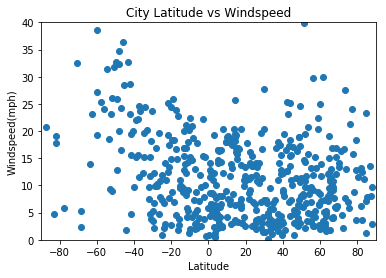

Unit 6 | Assignment - What's the Weather Like?
Background
Whether financial, political, or social -- data's true power lies in its ability to answer questions definitively. So let's take what you've learned about Python requests, APIs, and JSON traversals to answer a fundamental question: "What's the weather like as we approach the equator?"

Now, we know what you may be thinking: "Duh. It gets hotter..."

But, if pressed, how would you prove it?

Equator

WeatherPy
In this example, you'll be creating a Python script to visualize the weather of 500+ cities across the world of varying distance from the equator. To accomplish this, you'll be utilizing a simple Python library, the OpenWeatherMap API, and a little common sense to create a representative model of weather across world cities.

Your objective is to build a series of scatter plots to showcase the following relationships:

Temperature (F) vs. Latitude
Humidity (%) vs. Latitude
Cloudiness (%) vs. Latitude
Wind Speed (mph) vs. Latitude
Your final notebook must:

Randomly select at least 500 unique (non-repeat) cities based on latitude and longitude.
Perform a weather check on each of the cities using a series of successive API calls.
Include a print log of each city as it's being processed with the city number, city name, and requested URL.
Save both a CSV of all data retrieved and png images for each scatter plot.
As final considerations:

You must use the Matplotlib and Seaborn libraries.
You must include a written description of three observable trends based on the data.
You must use proper labeling of your plots, including aspects like: Plot Titles (with date of analysis) and Axes Labels.
You must include an exported markdown version of your Notebook called README.md in your GitHub repository.
See Example Solution for a reference on expected format.
Hints and Considerations
You may want to start this assignment by refreshing yourself on 4th grade geography, in particular, the geographic coordinate system.

Next, spend the requisite time necessary to study the OpenWeatherMap API. Based on your initial study, you should be able to answer basic questions about the API: Where do you request the API key? Which Weather API in particular will you need? What URL endpoints does it expect? What JSON structure does it respond with? Before you write a line of code, you should be aiming to have a crystal clear understanding of your intended outcome.

Though we've never worked with the citipy Python library, push yourself to decipher how it works, and why it might be relevant. Before you try to incorporate the library into your analysis, start by creating simple test cases outside your main script to confirm that you are using it correctly. Too often, when introduced to a new library, students get bogged down by the most minor of errors -- spending hours investigating their entire code -- when, in fact, a simple and focused test would have shown their basic utilization of the library was wrong from the start. Don't let this be you!

Part of our expectation in this challenge is that you will use critical thinking skills to understand how and why we're recommending the tools we are. What is Citipy for? Why would you use it in conjunction with the OpenWeatherMap API? How would you do so?

In building your script, pay attention to the cities you are using in your query pool. Are you getting coverage of the full gamut of latitudes and longitudes? Or are you simply choosing 500 cities concentrated in one region of the world? Even if you were a geographic genius, simply rattling 500 cities based on your human selection would create a biased dataset. Be thinking of how you should counter this. (Hint: Consider the full range of latitudes).

Lastly, remember -- this is a challenging activity. Push yourself! If you complete this task, then you can safely say that you've gained a strong mastery of the core foundations of data analytics and it will only go better from here. Good luck!

Copyright
Coding Boot Camp (C) 2016. All Rights Reserved.


```python
from citipy import citipy
import pandas as pd
import matplotlib.pyplot as plt
import requests
import random
api_key = open("../owm").read()
```


```python
cities = []
lats = []
lngs = []

while (len(cities)<500):
    
    lat = random.uniform(-90,90)
    long = random.uniform(-180,180)
    city = citipy.nearest_city(lat, long).city_name
    
    if city not in cities:
        lats.append(lat)
        lngs.append(long)
        cities.append(city)
```


```python
# Temperature (F) vs. Latitude
# Humidity (%) vs. Latitude
# Cloudiness (%) vs. Latitude
# Wind Speed (mph) vs. Latitude
temperature = []
humidity = []
cloudiness = []
wind = []

units = "imperial"
for i in range(len(cities)):
    query_url = f"http://api.openweathermap.org/data/2.5/weather?lat={lats[i]}&lon={lngs[i]}&appid={api_key}&units={units}"

    response = requests.get(query_url).json()
    
    temperature.append(response['main']['temp'])
    humidity.append(response['main']['humidity'])
    cloudiness.append(response['clouds']['all'])
    wind.append(response['wind']['speed'])
    
    print(f'Processing city #{i+1} | {cities[i]}\n{query_url}')

```

    Processing city #1 | tura
    http://api.openweathermap.org/data/2.5/weather?lat=67.35863177315042&lon=95.73168036079528&appid=4c95fa1bdf837c50dc8354f889abf3d8&units=imperial
    Processing city #2 | bredasdorp
    http://api.openweathermap.org/data/2.5/weather?lat=-58.682575147820515&lon=19.11536887760616&appid=4c95fa1bdf837c50dc8354f889abf3d8&units=imperial
    Processing city #3 | carballo
    http://api.openweathermap.org/data/2.5/weather?lat=46.00412088668861&lon=-10.345260252749341&appid=4c95fa1bdf837c50dc8354f889abf3d8&units=imperial
    Processing city #4 | khatanga
    http://api.openweathermap.org/data/2.5/weather?lat=70.49908105679262&lon=106.45221903630767&appid=4c95fa1bdf837c50dc8354f889abf3d8&units=imperial
    Processing city #5 | turochak
    http://api.openweathermap.org/data/2.5/weather?lat=51.841877984120146&lon=87.72292305116201&appid=4c95fa1bdf837c50dc8354f889abf3d8&units=imperial
    Processing city #6 | kaitangata
    http://api.openweathermap.org/data/2.5/weather?lat=-53.77802042572694&lon=171.40200902340496&appid=4c95fa1bdf837c50dc8354f889abf3d8&units=imperial
    Processing city #7 | hobart
    http://api.openweathermap.org/data/2.5/weather?lat=-42.98269603147752&lon=149.4685089731638&appid=4c95fa1bdf837c50dc8354f889abf3d8&units=imperial
    Processing city #8 | yining
    http://api.openweathermap.org/data/2.5/weather?lat=44.98458121384306&lon=82.93334416038135&appid=4c95fa1bdf837c50dc8354f889abf3d8&units=imperial
    Processing city #9 | ushuaia
    http://api.openweathermap.org/data/2.5/weather?lat=-66.20393549580494&lon=-65.8949015113373&appid=4c95fa1bdf837c50dc8354f889abf3d8&units=imperial
    Processing city #10 | hermanus
    http://api.openweathermap.org/data/2.5/weather?lat=-76.57968974718511&lon=13.379467527548144&appid=4c95fa1bdf837c50dc8354f889abf3d8&units=imperial
    Processing city #11 | usinsk
    http://api.openweathermap.org/data/2.5/weather?lat=68.00588715233039&lon=57.48275390953313&appid=4c95fa1bdf837c50dc8354f889abf3d8&units=imperial
    Processing city #12 | tuktoyaktuk
    http://api.openweathermap.org/data/2.5/weather?lat=84.77218384663607&lon=-140.60654993476024&appid=4c95fa1bdf837c50dc8354f889abf3d8&units=imperial
    Processing city #13 | mataura
    http://api.openweathermap.org/data/2.5/weather?lat=-54.73093969383772&lon=-159.37838032085176&appid=4c95fa1bdf837c50dc8354f889abf3d8&units=imperial
    Processing city #14 | zhigansk
    http://api.openweathermap.org/data/2.5/weather?lat=69.02476154991541&lon=123.50504186339776&appid=4c95fa1bdf837c50dc8354f889abf3d8&units=imperial
    Processing city #15 | hamamatsu
    http://api.openweathermap.org/data/2.5/weather?lat=34.68420268964793&lon=137.64516109624782&appid=4c95fa1bdf837c50dc8354f889abf3d8&units=imperial
    Processing city #16 | kenai
    http://api.openweathermap.org/data/2.5/weather?lat=62.79637159072223&lon=-156.18886741912075&appid=4c95fa1bdf837c50dc8354f889abf3d8&units=imperial
    Processing city #17 | sayat
    http://api.openweathermap.org/data/2.5/weather?lat=37.93368653395619&lon=63.36916764568261&appid=4c95fa1bdf837c50dc8354f889abf3d8&units=imperial
    Processing city #18 | rio gallegos
    http://api.openweathermap.org/data/2.5/weather?lat=-51.282425020744945&lon=-62.61897355409073&appid=4c95fa1bdf837c50dc8354f889abf3d8&units=imperial
    Processing city #19 | hobyo
    http://api.openweathermap.org/data/2.5/weather?lat=6.690409874001162&lon=47.27544668049279&appid=4c95fa1bdf837c50dc8354f889abf3d8&units=imperial
    Processing city #20 | port elizabeth
    http://api.openweathermap.org/data/2.5/weather?lat=-38.787067469923116&lon=26.17657383417108&appid=4c95fa1bdf837c50dc8354f889abf3d8&units=imperial
    Processing city #21 | sur
    http://api.openweathermap.org/data/2.5/weather?lat=17.319636681853055&lon=62.49852874704635&appid=4c95fa1bdf837c50dc8354f889abf3d8&units=imperial
    Processing city #22 | streamwood
    http://api.openweathermap.org/data/2.5/weather?lat=42.03731476254575&lon=-88.21629695662423&appid=4c95fa1bdf837c50dc8354f889abf3d8&units=imperial
    Processing city #23 | barrow
    http://api.openweathermap.org/data/2.5/weather?lat=73.77293353226725&lon=-153.03197168206614&appid=4c95fa1bdf837c50dc8354f889abf3d8&units=imperial
    Processing city #24 | hurghada
    http://api.openweathermap.org/data/2.5/weather?lat=28.173598752568694&lon=32.73000610627133&appid=4c95fa1bdf837c50dc8354f889abf3d8&units=imperial
    Processing city #25 | bastia
    http://api.openweathermap.org/data/2.5/weather?lat=42.914224532843434&lon=9.056934516111028&appid=4c95fa1bdf837c50dc8354f889abf3d8&units=imperial
    Processing city #26 | sioux lookout
    http://api.openweathermap.org/data/2.5/weather?lat=54.00848611546553&lon=-90.965136908217&appid=4c95fa1bdf837c50dc8354f889abf3d8&units=imperial
    Processing city #27 | qaanaaq
    http://api.openweathermap.org/data/2.5/weather?lat=88.9820564526751&lon=-67.34623951789703&appid=4c95fa1bdf837c50dc8354f889abf3d8&units=imperial
    Processing city #28 | kondinskoye
    http://api.openweathermap.org/data/2.5/weather?lat=59.89515683364061&lon=67.92450720906945&appid=4c95fa1bdf837c50dc8354f889abf3d8&units=imperial
    Processing city #29 | bonfim
    http://api.openweathermap.org/data/2.5/weather?lat=0.8384199914051749&lon=-58.328257714343565&appid=4c95fa1bdf837c50dc8354f889abf3d8&units=imperial
    Processing city #30 | jamestown
    http://api.openweathermap.org/data/2.5/weather?lat=-28.830232875937654&lon=-15.736593833829488&appid=4c95fa1bdf837c50dc8354f889abf3d8&units=imperial
    Processing city #31 | castro
    http://api.openweathermap.org/data/2.5/weather?lat=-52.37725725340772&lon=-100.08851409386634&appid=4c95fa1bdf837c50dc8354f889abf3d8&units=imperial
    Processing city #32 | busselton
    http://api.openweathermap.org/data/2.5/weather?lat=-46.88692763601415&lon=103.04491644911394&appid=4c95fa1bdf837c50dc8354f889abf3d8&units=imperial
    Processing city #33 | saldanha
    http://api.openweathermap.org/data/2.5/weather?lat=-43.98294121215366&lon=-3.747217386397182&appid=4c95fa1bdf837c50dc8354f889abf3d8&units=imperial
    Processing city #34 | kavieng
    http://api.openweathermap.org/data/2.5/weather?lat=12.64835155602617&lon=154.8796675953276&appid=4c95fa1bdf837c50dc8354f889abf3d8&units=imperial
    Processing city #35 | talnakh
    http://api.openweathermap.org/data/2.5/weather?lat=70.02435360894228&lon=91.10830486856037&appid=4c95fa1bdf837c50dc8354f889abf3d8&units=imperial
    Processing city #36 | bluff
    http://api.openweathermap.org/data/2.5/weather?lat=-89.78486164480742&lon=175.83061162949662&appid=4c95fa1bdf837c50dc8354f889abf3d8&units=imperial
    Processing city #37 | kodiak
    http://api.openweathermap.org/data/2.5/weather?lat=42.012864388748085&lon=-156.08672747200285&appid=4c95fa1bdf837c50dc8354f889abf3d8&units=imperial
    Processing city #38 | east london
    http://api.openweathermap.org/data/2.5/weather?lat=-78.5576176378027&lon=55.55409345007013&appid=4c95fa1bdf837c50dc8354f889abf3d8&units=imperial
    Processing city #39 | tulsipur
    http://api.openweathermap.org/data/2.5/weather?lat=28.279011913108576&lon=82.26945978181948&appid=4c95fa1bdf837c50dc8354f889abf3d8&units=imperial
    Processing city #40 | falealupo
    http://api.openweathermap.org/data/2.5/weather?lat=-10.122241420092664&lon=-173.88136354033463&appid=4c95fa1bdf837c50dc8354f889abf3d8&units=imperial
    Processing city #41 | rikitea
    http://api.openweathermap.org/data/2.5/weather?lat=-49.00484441464496&lon=-132.27221300671974&appid=4c95fa1bdf837c50dc8354f889abf3d8&units=imperial
    Processing city #42 | bonavista
    http://api.openweathermap.org/data/2.5/weather?lat=53.026807828461585&lon=-50.1350765356604&appid=4c95fa1bdf837c50dc8354f889abf3d8&units=imperial
    Processing city #43 | ocotal
    http://api.openweathermap.org/data/2.5/weather?lat=13.660586558445374&lon=-86.31236907907608&appid=4c95fa1bdf837c50dc8354f889abf3d8&units=imperial
    Processing city #44 | mahebourg
    http://api.openweathermap.org/data/2.5/weather?lat=-29.41315432808979&lon=63.899770705054635&appid=4c95fa1bdf837c50dc8354f889abf3d8&units=imperial
    Processing city #45 | albany
    http://api.openweathermap.org/data/2.5/weather?lat=-84.73133797800078&lon=105.49193633679033&appid=4c95fa1bdf837c50dc8354f889abf3d8&units=imperial
    Processing city #46 | manzanillo
    http://api.openweathermap.org/data/2.5/weather?lat=15.01334014728323&lon=-106.17021469848369&appid=4c95fa1bdf837c50dc8354f889abf3d8&units=imperial
    Processing city #47 | balaguer
    http://api.openweathermap.org/data/2.5/weather?lat=42.36069971662465&lon=0.8839606126917943&appid=4c95fa1bdf837c50dc8354f889abf3d8&units=imperial
    Processing city #48 | tchaourou
    http://api.openweathermap.org/data/2.5/weather?lat=9.009008056700296&lon=2.599628533093778&appid=4c95fa1bdf837c50dc8354f889abf3d8&units=imperial
    Processing city #49 | axim
    http://api.openweathermap.org/data/2.5/weather?lat=-3.9591481639872796&lon=-3.803687422762522&appid=4c95fa1bdf837c50dc8354f889abf3d8&units=imperial
    Processing city #50 | sentyabrskiy
    http://api.openweathermap.org/data/2.5/weather?lat=35.553985254423694&lon=153.84043583015404&appid=4c95fa1bdf837c50dc8354f889abf3d8&units=imperial
    Processing city #51 | geraldton
    http://api.openweathermap.org/data/2.5/weather?lat=-31.679476325190812&lon=105.5056978047894&appid=4c95fa1bdf837c50dc8354f889abf3d8&units=imperial
    Processing city #52 | kodinsk
    http://api.openweathermap.org/data/2.5/weather?lat=59.464052295465365&lon=98.51726730474036&appid=4c95fa1bdf837c50dc8354f889abf3d8&units=imperial
    Processing city #53 | ribeira grande
    http://api.openweathermap.org/data/2.5/weather?lat=29.430920874016692&lon=-43.427050134605565&appid=4c95fa1bdf837c50dc8354f889abf3d8&units=imperial
    Processing city #54 | raudeberg
    http://api.openweathermap.org/data/2.5/weather?lat=62.895324449457945&lon=3.4069336417986165&appid=4c95fa1bdf837c50dc8354f889abf3d8&units=imperial
    Processing city #55 | bay roberts
    http://api.openweathermap.org/data/2.5/weather?lat=47.55960727748297&lon=-54.03822259031452&appid=4c95fa1bdf837c50dc8354f889abf3d8&units=imperial
    Processing city #56 | oussouye
    http://api.openweathermap.org/data/2.5/weather?lat=10.192562922671485&lon=-19.457760234979787&appid=4c95fa1bdf837c50dc8354f889abf3d8&units=imperial
    Processing city #57 | port alfred
    http://api.openweathermap.org/data/2.5/weather?lat=-74.80803804908494&lon=47.35024412027505&appid=4c95fa1bdf837c50dc8354f889abf3d8&units=imperial
    Processing city #58 | henties bay
    http://api.openweathermap.org/data/2.5/weather?lat=-21.106661005453176&lon=14.123334524696531&appid=4c95fa1bdf837c50dc8354f889abf3d8&units=imperial
    Processing city #59 | anderson
    http://api.openweathermap.org/data/2.5/weather?lat=40.38157710924824&lon=-122.10187912470822&appid=4c95fa1bdf837c50dc8354f889abf3d8&units=imperial
    Processing city #60 | bethel
    http://api.openweathermap.org/data/2.5/weather?lat=50.038314507168735&lon=-167.64284618763003&appid=4c95fa1bdf837c50dc8354f889abf3d8&units=imperial
    Processing city #61 | hohhot
    http://api.openweathermap.org/data/2.5/weather?lat=41.962473199054045&lon=111.36627242217389&appid=4c95fa1bdf837c50dc8354f889abf3d8&units=imperial
    Processing city #62 | nouadhibou
    http://api.openweathermap.org/data/2.5/weather?lat=19.40573474877533&lon=-17.011726463134664&appid=4c95fa1bdf837c50dc8354f889abf3d8&units=imperial
    Processing city #63 | revuca
    http://api.openweathermap.org/data/2.5/weather?lat=48.56728239151661&lon=20.174206628960775&appid=4c95fa1bdf837c50dc8354f889abf3d8&units=imperial
    Processing city #64 | punta arenas
    http://api.openweathermap.org/data/2.5/weather?lat=-84.19004588564289&lon=-101.35689514306017&appid=4c95fa1bdf837c50dc8354f889abf3d8&units=imperial
    Processing city #65 | porto seguro
    http://api.openweathermap.org/data/2.5/weather?lat=-16.987240646468905&lon=-38.041643600630124&appid=4c95fa1bdf837c50dc8354f889abf3d8&units=imperial
    Processing city #66 | evanston
    http://api.openweathermap.org/data/2.5/weather?lat=40.858740328177845&lon=-111.09581990360572&appid=4c95fa1bdf837c50dc8354f889abf3d8&units=imperial
    Processing city #67 | thap khlo
    http://api.openweathermap.org/data/2.5/weather?lat=16.03738455463504&lon=100.67314083761482&appid=4c95fa1bdf837c50dc8354f889abf3d8&units=imperial
    Processing city #68 | yellowknife
    http://api.openweathermap.org/data/2.5/weather?lat=75.50756612303596&lon=-105.12498060186483&appid=4c95fa1bdf837c50dc8354f889abf3d8&units=imperial
    Processing city #69 | dikson
    http://api.openweathermap.org/data/2.5/weather?lat=88.03135663563984&lon=82.07095936865841&appid=4c95fa1bdf837c50dc8354f889abf3d8&units=imperial
    Processing city #70 | barentsburg
    http://api.openweathermap.org/data/2.5/weather?lat=73.65291971379179&lon=14.733558503312395&appid=4c95fa1bdf837c50dc8354f889abf3d8&units=imperial
    Processing city #71 | callaway
    http://api.openweathermap.org/data/2.5/weather?lat=29.367337208978768&lon=-85.09655427506917&appid=4c95fa1bdf837c50dc8354f889abf3d8&units=imperial
    Processing city #72 | shelburne
    http://api.openweathermap.org/data/2.5/weather?lat=39.47618541617257&lon=-63.65769341323255&appid=4c95fa1bdf837c50dc8354f889abf3d8&units=imperial
    Processing city #73 | andevoranto
    http://api.openweathermap.org/data/2.5/weather?lat=-20.002366422791326&lon=52.14376872210164&appid=4c95fa1bdf837c50dc8354f889abf3d8&units=imperial
    Processing city #74 | thayetmyo
    http://api.openweathermap.org/data/2.5/weather?lat=19.10726284875099&lon=93.91410998327422&appid=4c95fa1bdf837c50dc8354f889abf3d8&units=imperial
    Processing city #75 | norman wells
    http://api.openweathermap.org/data/2.5/weather?lat=65.34790812244941&lon=-128.33668065873232&appid=4c95fa1bdf837c50dc8354f889abf3d8&units=imperial
    Processing city #76 | sola
    http://api.openweathermap.org/data/2.5/weather?lat=-12.500107559901124&lon=171.03675516714185&appid=4c95fa1bdf837c50dc8354f889abf3d8&units=imperial
    Processing city #77 | talas
    http://api.openweathermap.org/data/2.5/weather?lat=39.03641928352124&lon=35.949119304939785&appid=4c95fa1bdf837c50dc8354f889abf3d8&units=imperial
    Processing city #78 | shimoda
    http://api.openweathermap.org/data/2.5/weather?lat=22.49039200590859&lon=143.0455402269455&appid=4c95fa1bdf837c50dc8354f889abf3d8&units=imperial
    Processing city #79 | vila
    http://api.openweathermap.org/data/2.5/weather?lat=-16.886581550352872&lon=170.63692709690832&appid=4c95fa1bdf837c50dc8354f889abf3d8&units=imperial
    Processing city #80 | lastoursville
    http://api.openweathermap.org/data/2.5/weather?lat=-0.7398269097001986&lon=12.920219353604836&appid=4c95fa1bdf837c50dc8354f889abf3d8&units=imperial
    Processing city #81 | makakilo city
    http://api.openweathermap.org/data/2.5/weather?lat=19.703841193811414&lon=-159.15816332693672&appid=4c95fa1bdf837c50dc8354f889abf3d8&units=imperial
    Processing city #82 | mys shmidta
    http://api.openweathermap.org/data/2.5/weather?lat=78.75358277107992&lon=-172.98611105010528&appid=4c95fa1bdf837c50dc8354f889abf3d8&units=imperial
    Processing city #83 | hilo
    http://api.openweathermap.org/data/2.5/weather?lat=9.604729950800973&lon=-151.30855645219046&appid=4c95fa1bdf837c50dc8354f889abf3d8&units=imperial
    Processing city #84 | kangaatsiaq
    http://api.openweathermap.org/data/2.5/weather?lat=68.04097216789859&lon=-55.061481492990566&appid=4c95fa1bdf837c50dc8354f889abf3d8&units=imperial
    Processing city #85 | suntar
    http://api.openweathermap.org/data/2.5/weather?lat=60.16600298556304&lon=116.97330815714804&appid=4c95fa1bdf837c50dc8354f889abf3d8&units=imperial
    Processing city #86 | kawalu
    http://api.openweathermap.org/data/2.5/weather?lat=-7.44815627748369&lon=108.20379021412163&appid=4c95fa1bdf837c50dc8354f889abf3d8&units=imperial
    Processing city #87 | lompoc
    http://api.openweathermap.org/data/2.5/weather?lat=27.999693464515886&lon=-127.97243560713065&appid=4c95fa1bdf837c50dc8354f889abf3d8&units=imperial
    Processing city #88 | pareora
    http://api.openweathermap.org/data/2.5/weather?lat=-45.011805928559184&lon=171.84227500471616&appid=4c95fa1bdf837c50dc8354f889abf3d8&units=imperial
    Processing city #89 | ponta do sol
    http://api.openweathermap.org/data/2.5/weather?lat=23.695453966603736&lon=-38.805895626224896&appid=4c95fa1bdf837c50dc8354f889abf3d8&units=imperial
    Processing city #90 | kashan
    http://api.openweathermap.org/data/2.5/weather?lat=34.11947329964903&lon=51.52151010223983&appid=4c95fa1bdf837c50dc8354f889abf3d8&units=imperial
    Processing city #91 | cukai
    http://api.openweathermap.org/data/2.5/weather?lat=4.095101741585438&lon=104.62460125273321&appid=4c95fa1bdf837c50dc8354f889abf3d8&units=imperial
    Processing city #92 | joshimath
    http://api.openweathermap.org/data/2.5/weather?lat=30.833034960753906&lon=79.7739725040284&appid=4c95fa1bdf837c50dc8354f889abf3d8&units=imperial
    Processing city #93 | grand river south east
    http://api.openweathermap.org/data/2.5/weather?lat=-21.843338883788107&lon=71.43413462126625&appid=4c95fa1bdf837c50dc8354f889abf3d8&units=imperial
    Processing city #94 | torbay
    http://api.openweathermap.org/data/2.5/weather?lat=37.603343820604096&lon=-48.44978649929325&appid=4c95fa1bdf837c50dc8354f889abf3d8&units=imperial
    Processing city #95 | vaini
    http://api.openweathermap.org/data/2.5/weather?lat=-29.579823874051236&lon=-172.68533920592216&appid=4c95fa1bdf837c50dc8354f889abf3d8&units=imperial
    Processing city #96 | lazaro cardenas
    http://api.openweathermap.org/data/2.5/weather?lat=0.9462741785051065&lon=-111.1083918242006&appid=4c95fa1bdf837c50dc8354f889abf3d8&units=imperial
    Processing city #97 | pudozh
    http://api.openweathermap.org/data/2.5/weather?lat=61.36479712094561&lon=37.19802367198798&appid=4c95fa1bdf837c50dc8354f889abf3d8&units=imperial
    Processing city #98 | oromocto
    http://api.openweathermap.org/data/2.5/weather?lat=45.49174995730283&lon=-66.67068202239273&appid=4c95fa1bdf837c50dc8354f889abf3d8&units=imperial
    Processing city #99 | saint george
    http://api.openweathermap.org/data/2.5/weather?lat=37.06653617869702&lon=-113.71380342363018&appid=4c95fa1bdf837c50dc8354f889abf3d8&units=imperial
    Processing city #100 | bilma
    http://api.openweathermap.org/data/2.5/weather?lat=19.818526026469357&lon=11.129708173657406&appid=4c95fa1bdf837c50dc8354f889abf3d8&units=imperial
    Processing city #101 | nikolskoye
    http://api.openweathermap.org/data/2.5/weather?lat=45.5871490280428&lon=171.88534368410296&appid=4c95fa1bdf837c50dc8354f889abf3d8&units=imperial
    Processing city #102 | isangel
    http://api.openweathermap.org/data/2.5/weather?lat=-15.189935504302866&lon=175.8786021518003&appid=4c95fa1bdf837c50dc8354f889abf3d8&units=imperial
    Processing city #103 | chokurdakh
    http://api.openweathermap.org/data/2.5/weather?lat=79.48048091578337&lon=154.05944092972663&appid=4c95fa1bdf837c50dc8354f889abf3d8&units=imperial
    Processing city #104 | abu zabad
    http://api.openweathermap.org/data/2.5/weather?lat=12.635343119624636&lon=29.714087377980945&appid=4c95fa1bdf837c50dc8354f889abf3d8&units=imperial
    Processing city #105 | kapaa
    http://api.openweathermap.org/data/2.5/weather?lat=12.28142573382921&lon=-165.8139613531779&appid=4c95fa1bdf837c50dc8354f889abf3d8&units=imperial
    Processing city #106 | mayo
    http://api.openweathermap.org/data/2.5/weather?lat=64.98015887058571&lon=-134.503319875632&appid=4c95fa1bdf837c50dc8354f889abf3d8&units=imperial
    Processing city #107 | belushya guba
    http://api.openweathermap.org/data/2.5/weather?lat=78.85854728285281&lon=52.823551325910444&appid=4c95fa1bdf837c50dc8354f889abf3d8&units=imperial
    Processing city #108 | paamiut
    http://api.openweathermap.org/data/2.5/weather?lat=58.04968425908447&lon=-50.44417826712248&appid=4c95fa1bdf837c50dc8354f889abf3d8&units=imperial
    Processing city #109 | byron bay
    http://api.openweathermap.org/data/2.5/weather?lat=-27.62206137416637&lon=159.36219238186726&appid=4c95fa1bdf837c50dc8354f889abf3d8&units=imperial
    Processing city #110 | taolanaro
    http://api.openweathermap.org/data/2.5/weather?lat=-80.42465933098616&lon=72.1561750102507&appid=4c95fa1bdf837c50dc8354f889abf3d8&units=imperial
    Processing city #111 | chuy
    http://api.openweathermap.org/data/2.5/weather?lat=-44.849032728744646&lon=-43.36056393772503&appid=4c95fa1bdf837c50dc8354f889abf3d8&units=imperial
    Processing city #112 | saint-philippe
    http://api.openweathermap.org/data/2.5/weather?lat=-69.5375239532651&lon=73.26123106877176&appid=4c95fa1bdf837c50dc8354f889abf3d8&units=imperial
    Processing city #113 | shimanovsk
    http://api.openweathermap.org/data/2.5/weather?lat=53.073428137185545&lon=128.5330916871942&appid=4c95fa1bdf837c50dc8354f889abf3d8&units=imperial
    Processing city #114 | attawapiskat
    http://api.openweathermap.org/data/2.5/weather?lat=57.88845565872816&lon=-83.5457896023639&appid=4c95fa1bdf837c50dc8354f889abf3d8&units=imperial
    Processing city #115 | daxian
    http://api.openweathermap.org/data/2.5/weather?lat=31.696481773960244&lon=108.0220753631578&appid=4c95fa1bdf837c50dc8354f889abf3d8&units=imperial
    Processing city #116 | beyneu
    http://api.openweathermap.org/data/2.5/weather?lat=45.092667989885&lon=56.11796046610627&appid=4c95fa1bdf837c50dc8354f889abf3d8&units=imperial
    Processing city #117 | koratla
    http://api.openweathermap.org/data/2.5/weather?lat=18.79746057539161&lon=78.70175718818126&appid=4c95fa1bdf837c50dc8354f889abf3d8&units=imperial
    Processing city #118 | new norfolk
    http://api.openweathermap.org/data/2.5/weather?lat=-61.6857189570655&lon=134.10669883864648&appid=4c95fa1bdf837c50dc8354f889abf3d8&units=imperial
    Processing city #119 | leshukonskoye
    http://api.openweathermap.org/data/2.5/weather?lat=66.95594383468881&lon=47.388563628617845&appid=4c95fa1bdf837c50dc8354f889abf3d8&units=imperial
    Processing city #120 | aflu
    http://api.openweathermap.org/data/2.5/weather?lat=32.80529833653672&lon=-0.3772602239548064&appid=4c95fa1bdf837c50dc8354f889abf3d8&units=imperial
    Processing city #121 | port hedland
    http://api.openweathermap.org/data/2.5/weather?lat=-26.383405102173242&lon=120.8609616240978&appid=4c95fa1bdf837c50dc8354f889abf3d8&units=imperial
    Processing city #122 | ratholo
    http://api.openweathermap.org/data/2.5/weather?lat=-22.71437029417757&lon=27.79904977948499&appid=4c95fa1bdf837c50dc8354f889abf3d8&units=imperial
    Processing city #123 | cabo san lucas
    http://api.openweathermap.org/data/2.5/weather?lat=9.162822812062913&lon=-116.51395419289413&appid=4c95fa1bdf837c50dc8354f889abf3d8&units=imperial
    Processing city #124 | illoqqortoormiut
    http://api.openweathermap.org/data/2.5/weather?lat=88.6140238489501&lon=-14.95474873471548&appid=4c95fa1bdf837c50dc8354f889abf3d8&units=imperial
    Processing city #125 | san cristobal
    http://api.openweathermap.org/data/2.5/weather?lat=-10.153468168918096&lon=-90.38105456488032&appid=4c95fa1bdf837c50dc8354f889abf3d8&units=imperial
    Processing city #126 | souillac
    http://api.openweathermap.org/data/2.5/weather?lat=-27.49921287296631&lon=60.265794876999394&appid=4c95fa1bdf837c50dc8354f889abf3d8&units=imperial
    Processing city #127 | parry sound
    http://api.openweathermap.org/data/2.5/weather?lat=45.578271902068764&lon=-80.24803625326852&appid=4c95fa1bdf837c50dc8354f889abf3d8&units=imperial
    Processing city #128 | oranjestad
    http://api.openweathermap.org/data/2.5/weather?lat=14.890824974079834&lon=-71.81308696954812&appid=4c95fa1bdf837c50dc8354f889abf3d8&units=imperial
    Processing city #129 | xichang
    http://api.openweathermap.org/data/2.5/weather?lat=28.509424553055496&lon=101.63995334292724&appid=4c95fa1bdf837c50dc8354f889abf3d8&units=imperial
    Processing city #130 | inuvik
    http://api.openweathermap.org/data/2.5/weather?lat=66.75762992374814&lon=-133.8251396599638&appid=4c95fa1bdf837c50dc8354f889abf3d8&units=imperial
    Processing city #131 | itoman
    http://api.openweathermap.org/data/2.5/weather?lat=19.905303622272328&lon=131.24470271917215&appid=4c95fa1bdf837c50dc8354f889abf3d8&units=imperial
    Processing city #132 | vostok
    http://api.openweathermap.org/data/2.5/weather?lat=45.81900692891904&lon=136.19899928602513&appid=4c95fa1bdf837c50dc8354f889abf3d8&units=imperial
    Processing city #133 | rosarito
    http://api.openweathermap.org/data/2.5/weather?lat=28.50161248957015&lon=-121.59707709376961&appid=4c95fa1bdf837c50dc8354f889abf3d8&units=imperial
    Processing city #134 | valparaiso
    http://api.openweathermap.org/data/2.5/weather?lat=-33.191119733306124&lon=-72.08652330164912&appid=4c95fa1bdf837c50dc8354f889abf3d8&units=imperial
    Processing city #135 | meulaboh
    http://api.openweathermap.org/data/2.5/weather?lat=2.241941833873341&lon=93.77496090292777&appid=4c95fa1bdf837c50dc8354f889abf3d8&units=imperial
    Processing city #136 | saint-pierre
    http://api.openweathermap.org/data/2.5/weather?lat=-22.171284473420442&lon=55.148639559718475&appid=4c95fa1bdf837c50dc8354f889abf3d8&units=imperial
    Processing city #137 | mahon
    http://api.openweathermap.org/data/2.5/weather?lat=39.691521612100075&lon=4.172506810911756&appid=4c95fa1bdf837c50dc8354f889abf3d8&units=imperial
    Processing city #138 | abu dhabi
    http://api.openweathermap.org/data/2.5/weather?lat=23.550247629767142&lon=53.98008930942035&appid=4c95fa1bdf837c50dc8354f889abf3d8&units=imperial
    Processing city #139 | anuradhapura
    http://api.openweathermap.org/data/2.5/weather?lat=8.3401638394907&lon=80.30436994105287&appid=4c95fa1bdf837c50dc8354f889abf3d8&units=imperial
    Processing city #140 | cherskiy
    http://api.openweathermap.org/data/2.5/weather?lat=83.09353743996422&lon=161.19542914611816&appid=4c95fa1bdf837c50dc8354f889abf3d8&units=imperial
    Processing city #141 | saskylakh
    http://api.openweathermap.org/data/2.5/weather?lat=78.35237799939003&lon=112.83426976334596&appid=4c95fa1bdf837c50dc8354f889abf3d8&units=imperial
    Processing city #142 | los llanos de aridane
    http://api.openweathermap.org/data/2.5/weather?lat=26.639969493460953&lon=-24.77114916749923&appid=4c95fa1bdf837c50dc8354f889abf3d8&units=imperial
    Processing city #143 | danane
    http://api.openweathermap.org/data/2.5/weather?lat=7.3055435379701095&lon=-8.022697694944128&appid=4c95fa1bdf837c50dc8354f889abf3d8&units=imperial
    Processing city #144 | salinopolis
    http://api.openweathermap.org/data/2.5/weather?lat=1.4572745874621944&lon=-46.26175054618116&appid=4c95fa1bdf837c50dc8354f889abf3d8&units=imperial
    Processing city #145 | hollola
    http://api.openweathermap.org/data/2.5/weather?lat=60.94470438493025&lon=25.421988777215688&appid=4c95fa1bdf837c50dc8354f889abf3d8&units=imperial
    Processing city #146 | dien bien
    http://api.openweathermap.org/data/2.5/weather?lat=22.30686574685707&lon=102.6693539774518&appid=4c95fa1bdf837c50dc8354f889abf3d8&units=imperial
    Processing city #147 | saleaula
    http://api.openweathermap.org/data/2.5/weather?lat=-10.875355407184784&lon=-172.30093760791027&appid=4c95fa1bdf837c50dc8354f889abf3d8&units=imperial
    Processing city #148 | santa rosa
    http://api.openweathermap.org/data/2.5/weather?lat=-36.80149074082284&lon=-66.40218413566703&appid=4c95fa1bdf837c50dc8354f889abf3d8&units=imperial
    Processing city #149 | chimoio
    http://api.openweathermap.org/data/2.5/weather?lat=-19.45588383113723&lon=33.10803040566992&appid=4c95fa1bdf837c50dc8354f889abf3d8&units=imperial
    Processing city #150 | pangody
    http://api.openweathermap.org/data/2.5/weather?lat=68.27963359364065&lon=73.59015071316279&appid=4c95fa1bdf837c50dc8354f889abf3d8&units=imperial
    Processing city #151 | atuona
    http://api.openweathermap.org/data/2.5/weather?lat=-8.972970171009877&lon=-125.00194629488921&appid=4c95fa1bdf837c50dc8354f889abf3d8&units=imperial
    Processing city #152 | severo-kurilsk
    http://api.openweathermap.org/data/2.5/weather?lat=49.70324504276556&lon=158.89663898732698&appid=4c95fa1bdf837c50dc8354f889abf3d8&units=imperial
    Processing city #153 | katsuura
    http://api.openweathermap.org/data/2.5/weather?lat=23.59454973553551&lon=152.16498382571808&appid=4c95fa1bdf837c50dc8354f889abf3d8&units=imperial
    Processing city #154 | tasiilaq
    http://api.openweathermap.org/data/2.5/weather?lat=57.310836744046014&lon=-32.713665252740526&appid=4c95fa1bdf837c50dc8354f889abf3d8&units=imperial
    Processing city #155 | kuche
    http://api.openweathermap.org/data/2.5/weather?lat=38.149723848858144&lon=84.26271123212211&appid=4c95fa1bdf837c50dc8354f889abf3d8&units=imperial
    Processing city #156 | naranjal
    http://api.openweathermap.org/data/2.5/weather?lat=-2.666855919849695&lon=-79.68874093715773&appid=4c95fa1bdf837c50dc8354f889abf3d8&units=imperial
    Processing city #157 | lavrentiya
    http://api.openweathermap.org/data/2.5/weather?lat=70.39946366133654&lon=-167.56551328305162&appid=4c95fa1bdf837c50dc8354f889abf3d8&units=imperial
    Processing city #158 | ntcheu
    http://api.openweathermap.org/data/2.5/weather?lat=-14.895391505590567&lon=34.677015703588154&appid=4c95fa1bdf837c50dc8354f889abf3d8&units=imperial
    Processing city #159 | mbini
    http://api.openweathermap.org/data/2.5/weather?lat=1.3158190064037427&lon=8.825641362076539&appid=4c95fa1bdf837c50dc8354f889abf3d8&units=imperial
    Processing city #160 | cayenne
    http://api.openweathermap.org/data/2.5/weather?lat=14.35967795178442&lon=-40.68340438691769&appid=4c95fa1bdf837c50dc8354f889abf3d8&units=imperial
    Processing city #161 | cape town
    http://api.openweathermap.org/data/2.5/weather?lat=-53.29321564990331&lon=5.412721652183706&appid=4c95fa1bdf837c50dc8354f889abf3d8&units=imperial
    Processing city #162 | kysyl-syr
    http://api.openweathermap.org/data/2.5/weather?lat=62.021162627162965&lon=122.8218544059335&appid=4c95fa1bdf837c50dc8354f889abf3d8&units=imperial
    Processing city #163 | port lincoln
    http://api.openweathermap.org/data/2.5/weather?lat=-40.76621094533096&lon=133.617286725766&appid=4c95fa1bdf837c50dc8354f889abf3d8&units=imperial
    Processing city #164 | esperance
    http://api.openweathermap.org/data/2.5/weather?lat=-36.84833524394937&lon=122.8473139870539&appid=4c95fa1bdf837c50dc8354f889abf3d8&units=imperial
    Processing city #165 | caravelas
    http://api.openweathermap.org/data/2.5/weather?lat=-20.846263377866038&lon=-30.75582634391145&appid=4c95fa1bdf837c50dc8354f889abf3d8&units=imperial
    Processing city #166 | stornoway
    http://api.openweathermap.org/data/2.5/weather?lat=59.234399879919295&lon=-8.273150231812082&appid=4c95fa1bdf837c50dc8354f889abf3d8&units=imperial
    Processing city #167 | mar del plata
    http://api.openweathermap.org/data/2.5/weather?lat=-45.85469630614554&lon=-50.81120979208481&appid=4c95fa1bdf837c50dc8354f889abf3d8&units=imperial
    Processing city #168 | juifang
    http://api.openweathermap.org/data/2.5/weather?lat=25.211674772293676&lon=122.87869348204833&appid=4c95fa1bdf837c50dc8354f889abf3d8&units=imperial
    Processing city #169 | bundaberg
    http://api.openweathermap.org/data/2.5/weather?lat=-21.982649202129522&lon=155.06318480036413&appid=4c95fa1bdf837c50dc8354f889abf3d8&units=imperial
    Processing city #170 | smithers
    http://api.openweathermap.org/data/2.5/weather?lat=56.43631218504203&lon=-127.02633819122606&appid=4c95fa1bdf837c50dc8354f889abf3d8&units=imperial
    Processing city #171 | khandyga
    http://api.openweathermap.org/data/2.5/weather?lat=63.226962576074385&lon=136.31811203875083&appid=4c95fa1bdf837c50dc8354f889abf3d8&units=imperial
    Processing city #172 | nguiu
    http://api.openweathermap.org/data/2.5/weather?lat=-11.98603980384334&lon=129.0730293155542&appid=4c95fa1bdf837c50dc8354f889abf3d8&units=imperial
    Processing city #173 | nanortalik
    http://api.openweathermap.org/data/2.5/weather?lat=57.454170403175965&lon=-40.402591717155815&appid=4c95fa1bdf837c50dc8354f889abf3d8&units=imperial
    Processing city #174 | kentville
    http://api.openweathermap.org/data/2.5/weather?lat=45.26980484485614&lon=-64.61579423759798&appid=4c95fa1bdf837c50dc8354f889abf3d8&units=imperial
    Processing city #175 | georgetown
    http://api.openweathermap.org/data/2.5/weather?lat=-2.7285927513441806&lon=-23.0342774116408&appid=4c95fa1bdf837c50dc8354f889abf3d8&units=imperial
    Processing city #176 | naze
    http://api.openweathermap.org/data/2.5/weather?lat=26.480297736845273&lon=133.68113385061116&appid=4c95fa1bdf837c50dc8354f889abf3d8&units=imperial
    Processing city #177 | hithadhoo
    http://api.openweathermap.org/data/2.5/weather?lat=-6.2490872299454026&lon=72.20537696609861&appid=4c95fa1bdf837c50dc8354f889abf3d8&units=imperial
    Processing city #178 | toamasina
    http://api.openweathermap.org/data/2.5/weather?lat=-18.605814965619345&lon=51.431489954033424&appid=4c95fa1bdf837c50dc8354f889abf3d8&units=imperial
    Processing city #179 | batagay-alyta
    http://api.openweathermap.org/data/2.5/weather?lat=66.60756702158218&lon=129.83995459380964&appid=4c95fa1bdf837c50dc8354f889abf3d8&units=imperial
    Processing city #180 | provideniya
    http://api.openweathermap.org/data/2.5/weather?lat=58.418774917077855&lon=-172.49703892097776&appid=4c95fa1bdf837c50dc8354f889abf3d8&units=imperial
    Processing city #181 | cidreira
    http://api.openweathermap.org/data/2.5/weather?lat=-48.8197368988217&lon=-33.36172935081021&appid=4c95fa1bdf837c50dc8354f889abf3d8&units=imperial
    Processing city #182 | coahuayana
    http://api.openweathermap.org/data/2.5/weather?lat=18.028118092049354&lon=-104.35204381240928&appid=4c95fa1bdf837c50dc8354f889abf3d8&units=imperial
    Processing city #183 | quatre cocos
    http://api.openweathermap.org/data/2.5/weather?lat=-15.864717809154527&lon=69.34452797969314&appid=4c95fa1bdf837c50dc8354f889abf3d8&units=imperial
    Processing city #184 | port blair
    http://api.openweathermap.org/data/2.5/weather?lat=12.085508050665055&lon=94.26189155549798&appid=4c95fa1bdf837c50dc8354f889abf3d8&units=imperial
    Processing city #185 | bambous virieux
    http://api.openweathermap.org/data/2.5/weather?lat=-37.21751035435261&lon=80.1421384641867&appid=4c95fa1bdf837c50dc8354f889abf3d8&units=imperial
    Processing city #186 | nizhneyansk
    http://api.openweathermap.org/data/2.5/weather?lat=87.14941721382732&lon=136.93785952085733&appid=4c95fa1bdf837c50dc8354f889abf3d8&units=imperial
    Processing city #187 | la ronge
    http://api.openweathermap.org/data/2.5/weather?lat=58.00476372396079&lon=-104.9814936857762&appid=4c95fa1bdf837c50dc8354f889abf3d8&units=imperial
    Processing city #188 | natal
    http://api.openweathermap.org/data/2.5/weather?lat=-1.8862371295283396&lon=-26.55651603753026&appid=4c95fa1bdf837c50dc8354f889abf3d8&units=imperial
    Processing city #189 | labuan
    http://api.openweathermap.org/data/2.5/weather?lat=7.580889593180984&lon=113.0907917074988&appid=4c95fa1bdf837c50dc8354f889abf3d8&units=imperial
    Processing city #190 | moree
    http://api.openweathermap.org/data/2.5/weather?lat=-28.605965024317243&lon=149.20123424988304&appid=4c95fa1bdf837c50dc8354f889abf3d8&units=imperial
    Processing city #191 | arraial do cabo
    http://api.openweathermap.org/data/2.5/weather?lat=-33.603709747666215&lon=-37.19594912450626&appid=4c95fa1bdf837c50dc8354f889abf3d8&units=imperial
    Processing city #192 | hualmay
    http://api.openweathermap.org/data/2.5/weather?lat=-23.632747174273177&lon=-97.74438524673576&appid=4c95fa1bdf837c50dc8354f889abf3d8&units=imperial
    Processing city #193 | kulu
    http://api.openweathermap.org/data/2.5/weather?lat=39.48573706721467&lon=32.960433958525016&appid=4c95fa1bdf837c50dc8354f889abf3d8&units=imperial
    Processing city #194 | asau
    http://api.openweathermap.org/data/2.5/weather?lat=-9.01643540753652&lon=179.2288906516426&appid=4c95fa1bdf837c50dc8354f889abf3d8&units=imperial
    Processing city #195 | amderma
    http://api.openweathermap.org/data/2.5/weather?lat=69.80369763917898&lon=61.315932266992405&appid=4c95fa1bdf837c50dc8354f889abf3d8&units=imperial
    Processing city #196 | japura
    http://api.openweathermap.org/data/2.5/weather?lat=-1.0528796488031418&lon=-68.1450679617706&appid=4c95fa1bdf837c50dc8354f889abf3d8&units=imperial
    Processing city #197 | carthage
    http://api.openweathermap.org/data/2.5/weather?lat=37.054498230957975&lon=-93.93752147939057&appid=4c95fa1bdf837c50dc8354f889abf3d8&units=imperial
    Processing city #198 | manuk mangkaw
    http://api.openweathermap.org/data/2.5/weather?lat=3.649040193977953&lon=120.71515311253643&appid=4c95fa1bdf837c50dc8354f889abf3d8&units=imperial
    Processing city #199 | qandala
    http://api.openweathermap.org/data/2.5/weather?lat=11.463468557352414&lon=49.71622114904875&appid=4c95fa1bdf837c50dc8354f889abf3d8&units=imperial
    Processing city #200 | flinders
    http://api.openweathermap.org/data/2.5/weather?lat=-34.71161522213158&lon=131.98458477832605&appid=4c95fa1bdf837c50dc8354f889abf3d8&units=imperial
    Processing city #201 | hami
    http://api.openweathermap.org/data/2.5/weather?lat=44.073712588230876&lon=94.77681781407051&appid=4c95fa1bdf837c50dc8354f889abf3d8&units=imperial
    Processing city #202 | tumannyy
    http://api.openweathermap.org/data/2.5/weather?lat=76.29883584952333&lon=37.09994382576207&appid=4c95fa1bdf837c50dc8354f889abf3d8&units=imperial
    Processing city #203 | vao
    http://api.openweathermap.org/data/2.5/weather?lat=-26.87456475703975&lon=173.83404648153038&appid=4c95fa1bdf837c50dc8354f889abf3d8&units=imperial
    Processing city #204 | faanui
    http://api.openweathermap.org/data/2.5/weather?lat=-15.343618976064079&lon=-152.40337663144794&appid=4c95fa1bdf837c50dc8354f889abf3d8&units=imperial
    Processing city #205 | constitucion
    http://api.openweathermap.org/data/2.5/weather?lat=16.069133159646825&lon=-123.52222728466711&appid=4c95fa1bdf837c50dc8354f889abf3d8&units=imperial
    Processing city #206 | fortuna
    http://api.openweathermap.org/data/2.5/weather?lat=34.38819054692854&lon=-135.84665470778862&appid=4c95fa1bdf837c50dc8354f889abf3d8&units=imperial
    Processing city #207 | san patricio
    http://api.openweathermap.org/data/2.5/weather?lat=3.573116532695238&lon=-113.46987383685902&appid=4c95fa1bdf837c50dc8354f889abf3d8&units=imperial
    Processing city #208 | butaritari
    http://api.openweathermap.org/data/2.5/weather?lat=18.24275281191335&lon=175.14876401146648&appid=4c95fa1bdf837c50dc8354f889abf3d8&units=imperial
    Processing city #209 | kolokani
    http://api.openweathermap.org/data/2.5/weather?lat=13.523605900899511&lon=-8.479154136602205&appid=4c95fa1bdf837c50dc8354f889abf3d8&units=imperial
    Processing city #210 | mendahara
    http://api.openweathermap.org/data/2.5/weather?lat=-0.3328894812219545&lon=103.81824882540889&appid=4c95fa1bdf837c50dc8354f889abf3d8&units=imperial
    Processing city #211 | westport
    http://api.openweathermap.org/data/2.5/weather?lat=-38.330269674731234&lon=167.8279562016818&appid=4c95fa1bdf837c50dc8354f889abf3d8&units=imperial
    Processing city #212 | obudovac
    http://api.openweathermap.org/data/2.5/weather?lat=44.93166390383848&lon=18.67816638181219&appid=4c95fa1bdf837c50dc8354f889abf3d8&units=imperial
    Processing city #213 | la libertad
    http://api.openweathermap.org/data/2.5/weather?lat=10.793648268990012&lon=-90.10463679606733&appid=4c95fa1bdf837c50dc8354f889abf3d8&units=imperial
    Processing city #214 | puerto del rosario
    http://api.openweathermap.org/data/2.5/weather?lat=27.712733200508794&lon=-13.970657836287785&appid=4c95fa1bdf837c50dc8354f889abf3d8&units=imperial
    Processing city #215 | puerto ayora
    http://api.openweathermap.org/data/2.5/weather?lat=-11.080912593315077&lon=-97.38443937573828&appid=4c95fa1bdf837c50dc8354f889abf3d8&units=imperial
    Processing city #216 | yei
    http://api.openweathermap.org/data/2.5/weather?lat=3.7539016006746095&lon=30.58192839234701&appid=4c95fa1bdf837c50dc8354f889abf3d8&units=imperial
    Processing city #217 | kavaratti
    http://api.openweathermap.org/data/2.5/weather?lat=12.097206526930506&lon=66.60481807755392&appid=4c95fa1bdf837c50dc8354f889abf3d8&units=imperial
    Processing city #218 | broome
    http://api.openweathermap.org/data/2.5/weather?lat=-17.42392554189142&lon=121.54808407092304&appid=4c95fa1bdf837c50dc8354f889abf3d8&units=imperial
    Processing city #219 | kathmandu
    http://api.openweathermap.org/data/2.5/weather?lat=27.73759574492962&lon=85.36634698861252&appid=4c95fa1bdf837c50dc8354f889abf3d8&units=imperial
    Processing city #220 | malinovskiy
    http://api.openweathermap.org/data/2.5/weather?lat=61.4017117030387&lon=62.51460554817032&appid=4c95fa1bdf837c50dc8354f889abf3d8&units=imperial
    Processing city #221 | lufilufi
    http://api.openweathermap.org/data/2.5/weather?lat=-9.741788140284498&lon=-169.41483377757766&appid=4c95fa1bdf837c50dc8354f889abf3d8&units=imperial
    Processing city #222 | tiksi
    http://api.openweathermap.org/data/2.5/weather?lat=84.29912773033013&lon=123.9078067173021&appid=4c95fa1bdf837c50dc8354f889abf3d8&units=imperial
    Processing city #223 | thompson
    http://api.openweathermap.org/data/2.5/weather?lat=65.1275898058959&lon=-95.26772621354064&appid=4c95fa1bdf837c50dc8354f889abf3d8&units=imperial
    Processing city #224 | solnechnyy
    http://api.openweathermap.org/data/2.5/weather?lat=61.36890462570972&lon=140.5347608301567&appid=4c95fa1bdf837c50dc8354f889abf3d8&units=imperial
    Processing city #225 | ancud
    http://api.openweathermap.org/data/2.5/weather?lat=-39.51320111060741&lon=-79.85530819441192&appid=4c95fa1bdf837c50dc8354f889abf3d8&units=imperial
    Processing city #226 | nemuro
    http://api.openweathermap.org/data/2.5/weather?lat=39.52870818884435&lon=149.49093894585758&appid=4c95fa1bdf837c50dc8354f889abf3d8&units=imperial
    Processing city #227 | yagodnoye
    http://api.openweathermap.org/data/2.5/weather?lat=62.59865230417455&lon=149.42506733087555&appid=4c95fa1bdf837c50dc8354f889abf3d8&units=imperial
    Processing city #228 | tsihombe
    http://api.openweathermap.org/data/2.5/weather?lat=-47.83936330668633&lon=47.014772948273304&appid=4c95fa1bdf837c50dc8354f889abf3d8&units=imperial
    Processing city #229 | mehamn
    http://api.openweathermap.org/data/2.5/weather?lat=82.78613733102088&lon=30.17198708679041&appid=4c95fa1bdf837c50dc8354f889abf3d8&units=imperial
    Processing city #230 | maniitsoq
    http://api.openweathermap.org/data/2.5/weather?lat=60.15944973451201&lon=-59.299668355743535&appid=4c95fa1bdf837c50dc8354f889abf3d8&units=imperial
    Processing city #231 | samusu
    http://api.openweathermap.org/data/2.5/weather?lat=-2.9019065527740935&lon=-162.4380952407305&appid=4c95fa1bdf837c50dc8354f889abf3d8&units=imperial
    Processing city #232 | avarua
    http://api.openweathermap.org/data/2.5/weather?lat=-59.563144050002904&lon=-166.1343221622038&appid=4c95fa1bdf837c50dc8354f889abf3d8&units=imperial
    Processing city #233 | umm lajj
    http://api.openweathermap.org/data/2.5/weather?lat=24.73144988897235&lon=37.32112402100688&appid=4c95fa1bdf837c50dc8354f889abf3d8&units=imperial
    Processing city #234 | gamba
    http://api.openweathermap.org/data/2.5/weather?lat=-8.522927167409208&lon=1.7771624422509547&appid=4c95fa1bdf837c50dc8354f889abf3d8&units=imperial
    Processing city #235 | manokwari
    http://api.openweathermap.org/data/2.5/weather?lat=1.345837724437601&lon=134.5360656766244&appid=4c95fa1bdf837c50dc8354f889abf3d8&units=imperial
    Processing city #236 | barcelos
    http://api.openweathermap.org/data/2.5/weather?lat=-1.397816899658082&lon=-63.29881543317731&appid=4c95fa1bdf837c50dc8354f889abf3d8&units=imperial
    Processing city #237 | klaksvik
    http://api.openweathermap.org/data/2.5/weather?lat=78.14991847588112&lon=-4.956042377775191&appid=4c95fa1bdf837c50dc8354f889abf3d8&units=imperial
    Processing city #238 | clyde river
    http://api.openweathermap.org/data/2.5/weather?lat=69.32173366217836&lon=-84.06435138481724&appid=4c95fa1bdf837c50dc8354f889abf3d8&units=imperial
    Processing city #239 | airai
    http://api.openweathermap.org/data/2.5/weather?lat=17.288281527763587&lon=150.4512369095114&appid=4c95fa1bdf837c50dc8354f889abf3d8&units=imperial
    Processing city #240 | meiganga
    http://api.openweathermap.org/data/2.5/weather?lat=6.758571307734627&lon=13.912767585660646&appid=4c95fa1bdf837c50dc8354f889abf3d8&units=imperial
    Processing city #241 | keti bandar
    http://api.openweathermap.org/data/2.5/weather?lat=23.22306775851696&lon=67.41930821122554&appid=4c95fa1bdf837c50dc8354f889abf3d8&units=imperial
    Processing city #242 | vardo
    http://api.openweathermap.org/data/2.5/weather?lat=74.6220681774187&lon=33.36813182801424&appid=4c95fa1bdf837c50dc8354f889abf3d8&units=imperial
    Processing city #243 | hasaki
    http://api.openweathermap.org/data/2.5/weather?lat=25.433387056984174&lon=158.9593628498841&appid=4c95fa1bdf837c50dc8354f889abf3d8&units=imperial
    Processing city #244 | taltal
    http://api.openweathermap.org/data/2.5/weather?lat=-26.11292408736817&lon=-76.51572235801015&appid=4c95fa1bdf837c50dc8354f889abf3d8&units=imperial
    Processing city #245 | pombia
    http://api.openweathermap.org/data/2.5/weather?lat=33.652198904633366&lon=24.46340163307434&appid=4c95fa1bdf837c50dc8354f889abf3d8&units=imperial
    Processing city #246 | sisimiut
    http://api.openweathermap.org/data/2.5/weather?lat=66.25934723276455&lon=-55.213390957217754&appid=4c95fa1bdf837c50dc8354f889abf3d8&units=imperial
    Processing city #247 | roebourne
    http://api.openweathermap.org/data/2.5/weather?lat=-24.358308853635407&lon=118.78043143287016&appid=4c95fa1bdf837c50dc8354f889abf3d8&units=imperial
    Processing city #248 | hirara
    http://api.openweathermap.org/data/2.5/weather?lat=27.60199785453179&lon=124.54877770522188&appid=4c95fa1bdf837c50dc8354f889abf3d8&units=imperial
    Processing city #249 | tessalit
    http://api.openweathermap.org/data/2.5/weather?lat=20.337800064353843&lon=4.116639851385713&appid=4c95fa1bdf837c50dc8354f889abf3d8&units=imperial
    Processing city #250 | makow mazowiecki
    http://api.openweathermap.org/data/2.5/weather?lat=52.87341099040066&lon=21.28597981465677&appid=4c95fa1bdf837c50dc8354f889abf3d8&units=imperial
    Processing city #251 | garowe
    http://api.openweathermap.org/data/2.5/weather?lat=9.727874149853491&lon=49.22454249607955&appid=4c95fa1bdf837c50dc8354f889abf3d8&units=imperial
    Processing city #252 | sistranda
    http://api.openweathermap.org/data/2.5/weather?lat=64.60767575872163&lon=8.381143660731823&appid=4c95fa1bdf837c50dc8354f889abf3d8&units=imperial
    Processing city #253 | pakxan
    http://api.openweathermap.org/data/2.5/weather?lat=18.26883746620068&lon=103.13560183280487&appid=4c95fa1bdf837c50dc8354f889abf3d8&units=imperial
    Processing city #254 | voh
    http://api.openweathermap.org/data/2.5/weather?lat=-23.75194366033344&lon=161.7492939524053&appid=4c95fa1bdf837c50dc8354f889abf3d8&units=imperial
    Processing city #255 | longyearbyen
    http://api.openweathermap.org/data/2.5/weather?lat=85.07578097149474&lon=14.64655303589359&appid=4c95fa1bdf837c50dc8354f889abf3d8&units=imperial
    Processing city #256 | rocha
    http://api.openweathermap.org/data/2.5/weather?lat=-35.84932642803129&lon=-53.51366947632107&appid=4c95fa1bdf837c50dc8354f889abf3d8&units=imperial
    Processing city #257 | pevek
    http://api.openweathermap.org/data/2.5/weather?lat=76.32894293094603&lon=172.99428079456789&appid=4c95fa1bdf837c50dc8354f889abf3d8&units=imperial
    Processing city #258 | bowen
    http://api.openweathermap.org/data/2.5/weather?lat=-19.044408775512068&lon=149.54528287467474&appid=4c95fa1bdf837c50dc8354f889abf3d8&units=imperial
    Processing city #259 | sembe
    http://api.openweathermap.org/data/2.5/weather?lat=2.102787237210066&lon=14.616158223587377&appid=4c95fa1bdf837c50dc8354f889abf3d8&units=imperial
    Processing city #260 | ostrovnoy
    http://api.openweathermap.org/data/2.5/weather?lat=67.97543858526686&lon=42.244607881868546&appid=4c95fa1bdf837c50dc8354f889abf3d8&units=imperial
    Processing city #261 | freeport
    http://api.openweathermap.org/data/2.5/weather?lat=43.88297403716598&lon=-70.1652610226709&appid=4c95fa1bdf837c50dc8354f889abf3d8&units=imperial
    Processing city #262 | kruisfontein
    http://api.openweathermap.org/data/2.5/weather?lat=-38.30694694383064&lon=24.56832835118857&appid=4c95fa1bdf837c50dc8354f889abf3d8&units=imperial
    Processing city #263 | amarante do maranhao
    http://api.openweathermap.org/data/2.5/weather?lat=-5.2844261990567105&lon=-47.01230610994298&appid=4c95fa1bdf837c50dc8354f889abf3d8&units=imperial
    Processing city #264 | asasa
    http://api.openweathermap.org/data/2.5/weather?lat=7.267808736242955&lon=39.59336020069395&appid=4c95fa1bdf837c50dc8354f889abf3d8&units=imperial
    Processing city #265 | iqaluit
    http://api.openweathermap.org/data/2.5/weather?lat=65.14849828775479&lon=-75.1747565270193&appid=4c95fa1bdf837c50dc8354f889abf3d8&units=imperial
    Processing city #266 | bengkulu
    http://api.openweathermap.org/data/2.5/weather?lat=-19.544665091166493&lon=91.34308765516204&appid=4c95fa1bdf837c50dc8354f889abf3d8&units=imperial
    Processing city #267 | kyzyl-suu
    http://api.openweathermap.org/data/2.5/weather?lat=41.76444830035638&lon=78.16356540754657&appid=4c95fa1bdf837c50dc8354f889abf3d8&units=imperial
    Processing city #268 | huarmey
    http://api.openweathermap.org/data/2.5/weather?lat=-14.997684212526366&lon=-89.64312372148648&appid=4c95fa1bdf837c50dc8354f889abf3d8&units=imperial
    Processing city #269 | rudbar
    http://api.openweathermap.org/data/2.5/weather?lat=29.033806723867755&lon=62.6501466864176&appid=4c95fa1bdf837c50dc8354f889abf3d8&units=imperial
    Processing city #270 | bikaner
    http://api.openweathermap.org/data/2.5/weather?lat=28.003768836669266&lon=72.80512227153537&appid=4c95fa1bdf837c50dc8354f889abf3d8&units=imperial
    Processing city #271 | labuhan
    http://api.openweathermap.org/data/2.5/weather?lat=-8.091168486348366&lon=103.39173533620885&appid=4c95fa1bdf837c50dc8354f889abf3d8&units=imperial
    Processing city #272 | ondorhaan
    http://api.openweathermap.org/data/2.5/weather?lat=48.05014274035344&lon=110.27744114952924&appid=4c95fa1bdf837c50dc8354f889abf3d8&units=imperial
    Processing city #273 | ilulissat
    http://api.openweathermap.org/data/2.5/weather?lat=73.56441736763372&lon=-46.67274419245905&appid=4c95fa1bdf837c50dc8354f889abf3d8&units=imperial
    Processing city #274 | foam lake
    http://api.openweathermap.org/data/2.5/weather?lat=51.59493636223672&lon=-103.6700813895194&appid=4c95fa1bdf837c50dc8354f889abf3d8&units=imperial
    Processing city #275 | carutapera
    http://api.openweathermap.org/data/2.5/weather?lat=-1.058985080217056&lon=-45.74229796118726&appid=4c95fa1bdf837c50dc8354f889abf3d8&units=imperial
    Processing city #276 | carnarvon
    http://api.openweathermap.org/data/2.5/weather?lat=-25.12049302325336&lon=98.38993390899384&appid=4c95fa1bdf837c50dc8354f889abf3d8&units=imperial
    Processing city #277 | saint-georges
    http://api.openweathermap.org/data/2.5/weather?lat=6.255145067770869&lon=-48.28778309826461&appid=4c95fa1bdf837c50dc8354f889abf3d8&units=imperial
    Processing city #278 | illela
    http://api.openweathermap.org/data/2.5/weather?lat=14.043299835615002&lon=4.881452935737627&appid=4c95fa1bdf837c50dc8354f889abf3d8&units=imperial
    Processing city #279 | praia da vitoria
    http://api.openweathermap.org/data/2.5/weather?lat=38.87579886622686&lon=-26.043808551664284&appid=4c95fa1bdf837c50dc8354f889abf3d8&units=imperial
    Processing city #280 | jaguey grande
    http://api.openweathermap.org/data/2.5/weather?lat=21.976549643037472&lon=-81.23827567755077&appid=4c95fa1bdf837c50dc8354f889abf3d8&units=imperial
    Processing city #281 | adrar
    http://api.openweathermap.org/data/2.5/weather?lat=30.58389075561368&lon=-1.4558945848310998&appid=4c95fa1bdf837c50dc8354f889abf3d8&units=imperial
    Processing city #282 | tezu
    http://api.openweathermap.org/data/2.5/weather?lat=30.357410731449193&lon=97.08697276549361&appid=4c95fa1bdf837c50dc8354f889abf3d8&units=imperial
    Processing city #283 | riyadh
    http://api.openweathermap.org/data/2.5/weather?lat=21.779741551276743&lon=46.078849872853965&appid=4c95fa1bdf837c50dc8354f889abf3d8&units=imperial
    Processing city #284 | morondava
    http://api.openweathermap.org/data/2.5/weather?lat=-18.337233114304127&lon=42.28847954845929&appid=4c95fa1bdf837c50dc8354f889abf3d8&units=imperial
    Processing city #285 | myskhako
    http://api.openweathermap.org/data/2.5/weather?lat=44.45545907981972&lon=37.648073486354605&appid=4c95fa1bdf837c50dc8354f889abf3d8&units=imperial
    Processing city #286 | bolshiye klyuchishchi
    http://api.openweathermap.org/data/2.5/weather?lat=54.07749350161569&lon=48.22758648868688&appid=4c95fa1bdf837c50dc8354f889abf3d8&units=imperial
    Processing city #287 | agirish
    http://api.openweathermap.org/data/2.5/weather?lat=63.34415436138474&lon=61.04413058568818&appid=4c95fa1bdf837c50dc8354f889abf3d8&units=imperial
    Processing city #288 | diffa
    http://api.openweathermap.org/data/2.5/weather?lat=14.485094532499417&lon=12.289398843120352&appid=4c95fa1bdf837c50dc8354f889abf3d8&units=imperial
    Processing city #289 | antequera
    http://api.openweathermap.org/data/2.5/weather?lat=37.19179032565778&lon=-4.583695515913718&appid=4c95fa1bdf837c50dc8354f889abf3d8&units=imperial
    Processing city #290 | srednekolymsk
    http://api.openweathermap.org/data/2.5/weather?lat=71.608336006061&lon=153.34527558932785&appid=4c95fa1bdf837c50dc8354f889abf3d8&units=imperial
    Processing city #291 | ust-kuyga
    http://api.openweathermap.org/data/2.5/weather?lat=70.83566225759836&lon=134.001548702192&appid=4c95fa1bdf837c50dc8354f889abf3d8&units=imperial
    Processing city #292 | san andres
    http://api.openweathermap.org/data/2.5/weather?lat=11.5793128926299&lon=-81.4601605864342&appid=4c95fa1bdf837c50dc8354f889abf3d8&units=imperial
    Processing city #293 | lucapa
    http://api.openweathermap.org/data/2.5/weather?lat=-8.682880047210304&lon=22.33043075760156&appid=4c95fa1bdf837c50dc8354f889abf3d8&units=imperial
    Processing city #294 | padang
    http://api.openweathermap.org/data/2.5/weather?lat=-4.183600379847604&lon=94.992205603012&appid=4c95fa1bdf837c50dc8354f889abf3d8&units=imperial
    Processing city #295 | akyab
    http://api.openweathermap.org/data/2.5/weather?lat=20.26970024711109&lon=93.39665261690044&appid=4c95fa1bdf837c50dc8354f889abf3d8&units=imperial
    Processing city #296 | burica
    http://api.openweathermap.org/data/2.5/weather?lat=6.8496372163342585&lon=-85.1381251189408&appid=4c95fa1bdf837c50dc8354f889abf3d8&units=imperial
    Processing city #297 | shepsi
    http://api.openweathermap.org/data/2.5/weather?lat=43.211582894244685&lon=38.83467609474633&appid=4c95fa1bdf837c50dc8354f889abf3d8&units=imperial
    Processing city #298 | acapulco
    http://api.openweathermap.org/data/2.5/weather?lat=7.805550793450976&lon=-103.78662056616425&appid=4c95fa1bdf837c50dc8354f889abf3d8&units=imperial
    Processing city #299 | port pirie
    http://api.openweathermap.org/data/2.5/weather?lat=-33.24013487125558&lon=138.48049759212728&appid=4c95fa1bdf837c50dc8354f889abf3d8&units=imperial
    Processing city #300 | zabaykalsk
    http://api.openweathermap.org/data/2.5/weather?lat=48.523199303440634&lon=116.53900063311454&appid=4c95fa1bdf837c50dc8354f889abf3d8&units=imperial
    Processing city #301 | yanchukan
    http://api.openweathermap.org/data/2.5/weather?lat=55.400093858420036&lon=111.91926183553858&appid=4c95fa1bdf837c50dc8354f889abf3d8&units=imperial
    Processing city #302 | ikom
    http://api.openweathermap.org/data/2.5/weather?lat=6.232296227103262&lon=8.900829695518127&appid=4c95fa1bdf837c50dc8354f889abf3d8&units=imperial
    Processing city #303 | jijiga
    http://api.openweathermap.org/data/2.5/weather?lat=8.907260722124192&lon=43.441395815993445&appid=4c95fa1bdf837c50dc8354f889abf3d8&units=imperial
    Processing city #304 | felanitx
    http://api.openweathermap.org/data/2.5/weather?lat=39.49628214137121&lon=2.982454649329185&appid=4c95fa1bdf837c50dc8354f889abf3d8&units=imperial
    Processing city #305 | balikpapan
    http://api.openweathermap.org/data/2.5/weather?lat=-1.309966591345173&lon=116.67754973683572&appid=4c95fa1bdf837c50dc8354f889abf3d8&units=imperial
    Processing city #306 | hay river
    http://api.openweathermap.org/data/2.5/weather?lat=61.17578892099857&lon=-115.9796201633379&appid=4c95fa1bdf837c50dc8354f889abf3d8&units=imperial
    Processing city #307 | duluth
    http://api.openweathermap.org/data/2.5/weather?lat=47.253916693568186&lon=-90.95039580856583&appid=4c95fa1bdf837c50dc8354f889abf3d8&units=imperial
    Processing city #308 | walvis bay
    http://api.openweathermap.org/data/2.5/weather?lat=-26.467762514710543&lon=4.723764162564123&appid=4c95fa1bdf837c50dc8354f889abf3d8&units=imperial
    Processing city #309 | ust-ishim
    http://api.openweathermap.org/data/2.5/weather?lat=57.04058784889696&lon=71.54365309545761&appid=4c95fa1bdf837c50dc8354f889abf3d8&units=imperial
    Processing city #310 | lakes entrance
    http://api.openweathermap.org/data/2.5/weather?lat=-40.428053090796524&lon=152.68868545994144&appid=4c95fa1bdf837c50dc8354f889abf3d8&units=imperial
    Processing city #311 | camacha
    http://api.openweathermap.org/data/2.5/weather?lat=36.32143961550865&lon=-13.907179555490416&appid=4c95fa1bdf837c50dc8354f889abf3d8&units=imperial
    Processing city #312 | viedma
    http://api.openweathermap.org/data/2.5/weather?lat=-44.56743830542186&lon=-59.43007047853486&appid=4c95fa1bdf837c50dc8354f889abf3d8&units=imperial
    Processing city #313 | akureyri
    http://api.openweathermap.org/data/2.5/weather?lat=63.51667275258089&lon=-17.848343363983076&appid=4c95fa1bdf837c50dc8354f889abf3d8&units=imperial
    Processing city #314 | sao jose da coroa grande
    http://api.openweathermap.org/data/2.5/weather?lat=-12.340331286226174&lon=-25.0330559416594&appid=4c95fa1bdf837c50dc8354f889abf3d8&units=imperial
    Processing city #315 | panjab
    http://api.openweathermap.org/data/2.5/weather?lat=34.849346140680424&lon=67.18016178937057&appid=4c95fa1bdf837c50dc8354f889abf3d8&units=imperial
    Processing city #316 | erzin
    http://api.openweathermap.org/data/2.5/weather?lat=47.68960705631304&lon=94.75141987265198&appid=4c95fa1bdf837c50dc8354f889abf3d8&units=imperial
    Processing city #317 | nabire
    http://api.openweathermap.org/data/2.5/weather?lat=-4.902653250078174&lon=134.6982851449245&appid=4c95fa1bdf837c50dc8354f889abf3d8&units=imperial
    Processing city #318 | kahului
    http://api.openweathermap.org/data/2.5/weather?lat=38.01327153072319&lon=-148.84237174861633&appid=4c95fa1bdf837c50dc8354f889abf3d8&units=imperial
    Processing city #319 | naron
    http://api.openweathermap.org/data/2.5/weather?lat=46.25360860816883&lon=-8.638972824791523&appid=4c95fa1bdf837c50dc8354f889abf3d8&units=imperial
    Processing city #320 | petropavlovsk-kamchatskiy
    http://api.openweathermap.org/data/2.5/weather?lat=52.41715976851202&lon=158.88244092791433&appid=4c95fa1bdf837c50dc8354f889abf3d8&units=imperial
    Processing city #321 | narsaq
    http://api.openweathermap.org/data/2.5/weather?lat=79.748460644862&lon=-62.671100009709974&appid=4c95fa1bdf837c50dc8354f889abf3d8&units=imperial
    Processing city #322 | hamilton
    http://api.openweathermap.org/data/2.5/weather?lat=31.65219299824797&lon=-70.77424830368703&appid=4c95fa1bdf837c50dc8354f889abf3d8&units=imperial
    Processing city #323 | bandarbeyla
    http://api.openweathermap.org/data/2.5/weather?lat=6.351249676909248&lon=54.6815079834349&appid=4c95fa1bdf837c50dc8354f889abf3d8&units=imperial
    Processing city #324 | santa cruz
    http://api.openweathermap.org/data/2.5/weather?lat=9.389944040087599&lon=-86.76010106569761&appid=4c95fa1bdf837c50dc8354f889abf3d8&units=imperial
    Processing city #325 | yulara
    http://api.openweathermap.org/data/2.5/weather?lat=-25.172233048119622&lon=128.48775731671867&appid=4c95fa1bdf837c50dc8354f889abf3d8&units=imperial
    Processing city #326 | angoram
    http://api.openweathermap.org/data/2.5/weather?lat=-2.9649698137235987&lon=144.90134870946343&appid=4c95fa1bdf837c50dc8354f889abf3d8&units=imperial
    Processing city #327 | lebu
    http://api.openweathermap.org/data/2.5/weather?lat=-31.334348816226303&lon=-87.01321754629012&appid=4c95fa1bdf837c50dc8354f889abf3d8&units=imperial
    Processing city #328 | half moon bay
    http://api.openweathermap.org/data/2.5/weather?lat=35.75133314807795&lon=-126.66855242836982&appid=4c95fa1bdf837c50dc8354f889abf3d8&units=imperial
    Processing city #329 | kot kapura
    http://api.openweathermap.org/data/2.5/weather?lat=30.527690867548642&lon=75.06181369093406&appid=4c95fa1bdf837c50dc8354f889abf3d8&units=imperial
    Processing city #330 | karatau
    http://api.openweathermap.org/data/2.5/weather?lat=42.85135668354408&lon=70.84940299732327&appid=4c95fa1bdf837c50dc8354f889abf3d8&units=imperial
    Processing city #331 | manado
    http://api.openweathermap.org/data/2.5/weather?lat=2.628036532582385&lon=124.33246484225799&appid=4c95fa1bdf837c50dc8354f889abf3d8&units=imperial
    Processing city #332 | husavik
    http://api.openweathermap.org/data/2.5/weather?lat=72.81138713349779&lon=-10.953041078139535&appid=4c95fa1bdf837c50dc8354f889abf3d8&units=imperial
    Processing city #333 | antofagasta
    http://api.openweathermap.org/data/2.5/weather?lat=-23.116065862339667&lon=-79.33117485942806&appid=4c95fa1bdf837c50dc8354f889abf3d8&units=imperial
    Processing city #334 | upernavik
    http://api.openweathermap.org/data/2.5/weather?lat=78.84546854832593&lon=-60.99093682477539&appid=4c95fa1bdf837c50dc8354f889abf3d8&units=imperial
    Processing city #335 | cimarron hills
    http://api.openweathermap.org/data/2.5/weather?lat=38.79100398854993&lon=-104.64702611356718&appid=4c95fa1bdf837c50dc8354f889abf3d8&units=imperial
    Processing city #336 | saint-leu
    http://api.openweathermap.org/data/2.5/weather?lat=-21.525747829516476&lon=51.91501905444787&appid=4c95fa1bdf837c50dc8354f889abf3d8&units=imperial
    Processing city #337 | pecos
    http://api.openweathermap.org/data/2.5/weather?lat=31.421417876523847&lon=-103.07907143012896&appid=4c95fa1bdf837c50dc8354f889abf3d8&units=imperial
    Processing city #338 | varhaug
    http://api.openweathermap.org/data/2.5/weather?lat=58.01389262778068&lon=4.148602534104526&appid=4c95fa1bdf837c50dc8354f889abf3d8&units=imperial
    Processing city #339 | praia
    http://api.openweathermap.org/data/2.5/weather?lat=10.265338544125981&lon=-21.380392705394257&appid=4c95fa1bdf837c50dc8354f889abf3d8&units=imperial
    Processing city #340 | mugumu
    http://api.openweathermap.org/data/2.5/weather?lat=-2.528738284097855&lon=35.009625975838446&appid=4c95fa1bdf837c50dc8354f889abf3d8&units=imperial
    Processing city #341 | kytlym
    http://api.openweathermap.org/data/2.5/weather?lat=59.82779673428445&lon=59.17318863700282&appid=4c95fa1bdf837c50dc8354f889abf3d8&units=imperial
    Processing city #342 | aswan
    http://api.openweathermap.org/data/2.5/weather?lat=22.215641565424676&lon=28.89964410993386&appid=4c95fa1bdf837c50dc8354f889abf3d8&units=imperial
    Processing city #343 | fare
    http://api.openweathermap.org/data/2.5/weather?lat=-11.923642932195051&lon=-149.21941507266462&appid=4c95fa1bdf837c50dc8354f889abf3d8&units=imperial
    Processing city #344 | fairbanks
    http://api.openweathermap.org/data/2.5/weather?lat=63.37843422353336&lon=-143.63610813133204&appid=4c95fa1bdf837c50dc8354f889abf3d8&units=imperial
    Processing city #345 | yarada
    http://api.openweathermap.org/data/2.5/weather?lat=16.030430889202762&lon=84.48729741748406&appid=4c95fa1bdf837c50dc8354f889abf3d8&units=imperial
    Processing city #346 | taldan
    http://api.openweathermap.org/data/2.5/weather?lat=53.86516824069099&lon=124.65112986614918&appid=4c95fa1bdf837c50dc8354f889abf3d8&units=imperial
    Processing city #347 | seguela
    http://api.openweathermap.org/data/2.5/weather?lat=8.166961901028472&lon=-6.80867300597032&appid=4c95fa1bdf837c50dc8354f889abf3d8&units=imperial
    Processing city #348 | pisco
    http://api.openweathermap.org/data/2.5/weather?lat=-17.533379267364467&lon=-82.93772493104676&appid=4c95fa1bdf837c50dc8354f889abf3d8&units=imperial
    Processing city #349 | embonas
    http://api.openweathermap.org/data/2.5/weather?lat=36.36468139157826&lon=27.71503949964861&appid=4c95fa1bdf837c50dc8354f889abf3d8&units=imperial
    Processing city #350 | akcakoca
    http://api.openweathermap.org/data/2.5/weather?lat=41.18763421434116&lon=30.986784088155446&appid=4c95fa1bdf837c50dc8354f889abf3d8&units=imperial
    Processing city #351 | tilichiki
    http://api.openweathermap.org/data/2.5/weather?lat=58.60558265623314&lon=167.67038576336728&appid=4c95fa1bdf837c50dc8354f889abf3d8&units=imperial
    Processing city #352 | ajdabiya
    http://api.openweathermap.org/data/2.5/weather?lat=29.69105397342443&lon=18.43443193564596&appid=4c95fa1bdf837c50dc8354f889abf3d8&units=imperial
    Processing city #353 | chumikan
    http://api.openweathermap.org/data/2.5/weather?lat=54.882718338517236&lon=137.16176194713586&appid=4c95fa1bdf837c50dc8354f889abf3d8&units=imperial
    Processing city #354 | todos santos
    http://api.openweathermap.org/data/2.5/weather?lat=22.685528071314536&lon=-111.94986160252091&appid=4c95fa1bdf837c50dc8354f889abf3d8&units=imperial
    Processing city #355 | benin
    http://api.openweathermap.org/data/2.5/weather?lat=6.231561605523012&lon=5.635081830620237&appid=4c95fa1bdf837c50dc8354f889abf3d8&units=imperial
    Processing city #356 | brownsville
    http://api.openweathermap.org/data/2.5/weather?lat=26.424846751966655&lon=-95.46804094930688&appid=4c95fa1bdf837c50dc8354f889abf3d8&units=imperial
    Processing city #357 | olafsvik
    http://api.openweathermap.org/data/2.5/weather?lat=64.14830833179192&lon=-29.90193266276421&appid=4c95fa1bdf837c50dc8354f889abf3d8&units=imperial
    Processing city #358 | aklavik
    http://api.openweathermap.org/data/2.5/weather?lat=71.5715115555846&lon=-142.17889032841515&appid=4c95fa1bdf837c50dc8354f889abf3d8&units=imperial
    Processing city #359 | mentor
    http://api.openweathermap.org/data/2.5/weather?lat=41.78284600104729&lon=-81.36305168357028&appid=4c95fa1bdf837c50dc8354f889abf3d8&units=imperial
    Processing city #360 | portland
    http://api.openweathermap.org/data/2.5/weather?lat=-46.976397557099574&lon=136.18356588244683&appid=4c95fa1bdf837c50dc8354f889abf3d8&units=imperial
    Processing city #361 | bereda
    http://api.openweathermap.org/data/2.5/weather?lat=12.344315694224932&lon=52.16455709006232&appid=4c95fa1bdf837c50dc8354f889abf3d8&units=imperial
    Processing city #362 | haines junction
    http://api.openweathermap.org/data/2.5/weather?lat=62.18371594341943&lon=-139.6970940601467&appid=4c95fa1bdf837c50dc8354f889abf3d8&units=imperial
    Processing city #363 | satitoa
    http://api.openweathermap.org/data/2.5/weather?lat=-15.504213019761181&lon=-170.34423632916474&appid=4c95fa1bdf837c50dc8354f889abf3d8&units=imperial
    Processing city #364 | guantanamo
    http://api.openweathermap.org/data/2.5/weather?lat=19.44413856846728&lon=-75.10148102730003&appid=4c95fa1bdf837c50dc8354f889abf3d8&units=imperial
    Processing city #365 | truth or consequences
    http://api.openweathermap.org/data/2.5/weather?lat=33.61274255720268&lon=-107.76335993756669&appid=4c95fa1bdf837c50dc8354f889abf3d8&units=imperial
    Processing city #366 | batticaloa
    http://api.openweathermap.org/data/2.5/weather?lat=8.92470289270625&lon=84.45530828409005&appid=4c95fa1bdf837c50dc8354f889abf3d8&units=imperial
    Processing city #367 | lorengau
    http://api.openweathermap.org/data/2.5/weather?lat=2.7088443665164874&lon=148.67511819969377&appid=4c95fa1bdf837c50dc8354f889abf3d8&units=imperial
    Processing city #368 | marcona
    http://api.openweathermap.org/data/2.5/weather?lat=-19.608472819365574&lon=-78.29054058278612&appid=4c95fa1bdf837c50dc8354f889abf3d8&units=imperial
    Processing city #369 | bac lieu
    http://api.openweathermap.org/data/2.5/weather?lat=7.438652445789302&lon=107.82181160557741&appid=4c95fa1bdf837c50dc8354f889abf3d8&units=imperial
    Processing city #370 | cagayan de tawi-tawi
    http://api.openweathermap.org/data/2.5/weather?lat=7.537764495373224&lon=118.60216585007674&appid=4c95fa1bdf837c50dc8354f889abf3d8&units=imperial
    Processing city #371 | dolbeau
    http://api.openweathermap.org/data/2.5/weather?lat=49.13230896611972&lon=-72.14879131632658&appid=4c95fa1bdf837c50dc8354f889abf3d8&units=imperial
    Processing city #372 | griffith
    http://api.openweathermap.org/data/2.5/weather?lat=-32.02092765894707&lon=145.98034986588272&appid=4c95fa1bdf837c50dc8354f889abf3d8&units=imperial
    Processing city #373 | harper
    http://api.openweathermap.org/data/2.5/weather?lat=1.3637887049760025&lon=-7.729469347867081&appid=4c95fa1bdf837c50dc8354f889abf3d8&units=imperial
    Processing city #374 | shchelyayur
    http://api.openweathermap.org/data/2.5/weather?lat=66.28578212417389&lon=53.81241019826058&appid=4c95fa1bdf837c50dc8354f889abf3d8&units=imperial
    Processing city #375 | mombetsu
    http://api.openweathermap.org/data/2.5/weather?lat=45.17948809328891&lon=144.057413813104&appid=4c95fa1bdf837c50dc8354f889abf3d8&units=imperial
    Processing city #376 | biak
    http://api.openweathermap.org/data/2.5/weather?lat=-0.09631249852959911&lon=138.97493279502845&appid=4c95fa1bdf837c50dc8354f889abf3d8&units=imperial
    Processing city #377 | liverpool
    http://api.openweathermap.org/data/2.5/weather?lat=39.340821071807056&lon=-62.07167286545452&appid=4c95fa1bdf837c50dc8354f889abf3d8&units=imperial
    Processing city #378 | rio grande
    http://api.openweathermap.org/data/2.5/weather?lat=-40.53874851911915&lon=-43.081067846378204&appid=4c95fa1bdf837c50dc8354f889abf3d8&units=imperial
    Processing city #379 | tigil
    http://api.openweathermap.org/data/2.5/weather?lat=56.86570511497675&lon=157.3747755756957&appid=4c95fa1bdf837c50dc8354f889abf3d8&units=imperial
    Processing city #380 | grootfontein
    http://api.openweathermap.org/data/2.5/weather?lat=-20.328344160907932&lon=18.666518320394744&appid=4c95fa1bdf837c50dc8354f889abf3d8&units=imperial
    Processing city #381 | inirida
    http://api.openweathermap.org/data/2.5/weather?lat=3.246116467169486&lon=-65.50514994103483&appid=4c95fa1bdf837c50dc8354f889abf3d8&units=imperial
    Processing city #382 | verkhoyansk
    http://api.openweathermap.org/data/2.5/weather?lat=65.77651914267977&lon=132.44373798771716&appid=4c95fa1bdf837c50dc8354f889abf3d8&units=imperial
    Processing city #383 | juneau
    http://api.openweathermap.org/data/2.5/weather?lat=60.1159825381813&lon=-131.24150303499866&appid=4c95fa1bdf837c50dc8354f889abf3d8&units=imperial
    Processing city #384 | bara
    http://api.openweathermap.org/data/2.5/weather?lat=14.154429777829762&lon=28.746460674069994&appid=4c95fa1bdf837c50dc8354f889abf3d8&units=imperial
    Processing city #385 | peace river
    http://api.openweathermap.org/data/2.5/weather?lat=56.564960826786745&lon=-117.0340532780368&appid=4c95fa1bdf837c50dc8354f889abf3d8&units=imperial
    Processing city #386 | vershino-darasunskiy
    http://api.openweathermap.org/data/2.5/weather?lat=52.34927638784458&lon=115.58661146952988&appid=4c95fa1bdf837c50dc8354f889abf3d8&units=imperial
    Processing city #387 | guymon
    http://api.openweathermap.org/data/2.5/weather?lat=36.645688721041196&lon=-101.306704674251&appid=4c95fa1bdf837c50dc8354f889abf3d8&units=imperial
    Processing city #388 | lerwick
    http://api.openweathermap.org/data/2.5/weather?lat=58.840157732361206&lon=1.0572389076535558&appid=4c95fa1bdf837c50dc8354f889abf3d8&units=imperial
    Processing city #389 | coquimbo
    http://api.openweathermap.org/data/2.5/weather?lat=-27.221061194043266&lon=-78.0983182410729&appid=4c95fa1bdf837c50dc8354f889abf3d8&units=imperial
    Processing city #390 | russell
    http://api.openweathermap.org/data/2.5/weather?lat=-30.23028346580749&lon=178.02444360259756&appid=4c95fa1bdf837c50dc8354f889abf3d8&units=imperial
    Processing city #391 | scottsbluff
    http://api.openweathermap.org/data/2.5/weather?lat=41.95997337097279&lon=-102.60907574930022&appid=4c95fa1bdf837c50dc8354f889abf3d8&units=imperial
    Processing city #392 | calvinia
    http://api.openweathermap.org/data/2.5/weather?lat=-32.53442040329946&lon=20.4834303249456&appid=4c95fa1bdf837c50dc8354f889abf3d8&units=imperial
    Processing city #393 | narva-joesuu
    http://api.openweathermap.org/data/2.5/weather?lat=59.95065607048906&lon=28.24169486580351&appid=4c95fa1bdf837c50dc8354f889abf3d8&units=imperial
    Processing city #394 | sondrio
    http://api.openweathermap.org/data/2.5/weather?lat=46.183520919958085&lon=9.888506583256088&appid=4c95fa1bdf837c50dc8354f889abf3d8&units=imperial
    Processing city #395 | buala
    http://api.openweathermap.org/data/2.5/weather?lat=-1.2492254496854827&lon=161.01184065385746&appid=4c95fa1bdf837c50dc8354f889abf3d8&units=imperial
    Processing city #396 | morgan city
    http://api.openweathermap.org/data/2.5/weather?lat=28.084728428620608&lon=-91.91852031784202&appid=4c95fa1bdf837c50dc8354f889abf3d8&units=imperial
    Processing city #397 | zhicheng
    http://api.openweathermap.org/data/2.5/weather?lat=27.581954953122576&lon=118.6131036472998&appid=4c95fa1bdf837c50dc8354f889abf3d8&units=imperial
    Processing city #398 | beringovskiy
    http://api.openweathermap.org/data/2.5/weather?lat=54.97649465063071&lon=177.238673063872&appid=4c95fa1bdf837c50dc8354f889abf3d8&units=imperial
    Processing city #399 | inhambane
    http://api.openweathermap.org/data/2.5/weather?lat=-26.15128675038747&lon=37.99944676863123&appid=4c95fa1bdf837c50dc8354f889abf3d8&units=imperial
    Processing city #400 | nampula
    http://api.openweathermap.org/data/2.5/weather?lat=-15.359612884525248&lon=38.85498159136495&appid=4c95fa1bdf837c50dc8354f889abf3d8&units=imperial
    Processing city #401 | ferrol
    http://api.openweathermap.org/data/2.5/weather?lat=46.244012614699415&lon=-9.462080484368528&appid=4c95fa1bdf837c50dc8354f889abf3d8&units=imperial
    Processing city #402 | tepalcingo
    http://api.openweathermap.org/data/2.5/weather?lat=18.48059492598938&lon=-98.91635012373885&appid=4c95fa1bdf837c50dc8354f889abf3d8&units=imperial
    Processing city #403 | esil
    http://api.openweathermap.org/data/2.5/weather?lat=52.26067346085864&lon=66.27109288448472&appid=4c95fa1bdf837c50dc8354f889abf3d8&units=imperial
    Processing city #404 | agsu
    http://api.openweathermap.org/data/2.5/weather?lat=40.55673314891612&lon=48.806348372102434&appid=4c95fa1bdf837c50dc8354f889abf3d8&units=imperial
    Processing city #405 | mentok
    http://api.openweathermap.org/data/2.5/weather?lat=-2.3033047180338713&lon=104.73010136740857&appid=4c95fa1bdf837c50dc8354f889abf3d8&units=imperial
    Processing city #406 | abnub
    http://api.openweathermap.org/data/2.5/weather?lat=25.755830368012667&lon=26.71074870731198&appid=4c95fa1bdf837c50dc8354f889abf3d8&units=imperial
    Processing city #407 | ballina
    http://api.openweathermap.org/data/2.5/weather?lat=58.034847908129564&lon=-12.904569064158522&appid=4c95fa1bdf837c50dc8354f889abf3d8&units=imperial
    Processing city #408 | maceio
    http://api.openweathermap.org/data/2.5/weather?lat=-16.348055752700887&lon=-29.20617807920192&appid=4c95fa1bdf837c50dc8354f889abf3d8&units=imperial
    Processing city #409 | mount isa
    http://api.openweathermap.org/data/2.5/weather?lat=-25.65724012823668&lon=140.02126292680555&appid=4c95fa1bdf837c50dc8354f889abf3d8&units=imperial
    Processing city #410 | shingu
    http://api.openweathermap.org/data/2.5/weather?lat=30.3453334246322&lon=138.03026665931975&appid=4c95fa1bdf837c50dc8354f889abf3d8&units=imperial
    Processing city #411 | kijang
    http://api.openweathermap.org/data/2.5/weather?lat=0.538178899725537&lon=106.33294542150861&appid=4c95fa1bdf837c50dc8354f889abf3d8&units=imperial
    Processing city #412 | gravdal
    http://api.openweathermap.org/data/2.5/weather?lat=71.7507820406446&lon=11.469945747081937&appid=4c95fa1bdf837c50dc8354f889abf3d8&units=imperial
    Processing city #413 | negele
    http://api.openweathermap.org/data/2.5/weather?lat=7.469344827588259&lon=38.61616350396167&appid=4c95fa1bdf837c50dc8354f889abf3d8&units=imperial
    Processing city #414 | high level
    http://api.openweathermap.org/data/2.5/weather?lat=57.87079276444754&lon=-115.29394204385116&appid=4c95fa1bdf837c50dc8354f889abf3d8&units=imperial
    Processing city #415 | coos bay
    http://api.openweathermap.org/data/2.5/weather?lat=43.327466905823485&lon=-124.17821773920147&appid=4c95fa1bdf837c50dc8354f889abf3d8&units=imperial
    Processing city #416 | merauke
    http://api.openweathermap.org/data/2.5/weather?lat=-7.905628446456561&lon=138.24752442380048&appid=4c95fa1bdf837c50dc8354f889abf3d8&units=imperial
    Processing city #417 | dongli
    http://api.openweathermap.org/data/2.5/weather?lat=20.966854008050674&lon=110.35137424249677&appid=4c95fa1bdf837c50dc8354f889abf3d8&units=imperial
    Processing city #418 | codrington
    http://api.openweathermap.org/data/2.5/weather?lat=21.775945946981167&lon=-55.322205817389246&appid=4c95fa1bdf837c50dc8354f889abf3d8&units=imperial
    Processing city #419 | neiafu
    http://api.openweathermap.org/data/2.5/weather?lat=-17.831768412251137&lon=-174.46222397428681&appid=4c95fa1bdf837c50dc8354f889abf3d8&units=imperial
    Processing city #420 | port macquarie
    http://api.openweathermap.org/data/2.5/weather?lat=-32.72105443961425&lon=155.53464895302648&appid=4c95fa1bdf837c50dc8354f889abf3d8&units=imperial
    Processing city #421 | springbok
    http://api.openweathermap.org/data/2.5/weather?lat=-28.890546691644047&lon=17.955980707466267&appid=4c95fa1bdf837c50dc8354f889abf3d8&units=imperial
    Processing city #422 | manresa
    http://api.openweathermap.org/data/2.5/weather?lat=41.84534062492125&lon=1.9099124113278094&appid=4c95fa1bdf837c50dc8354f889abf3d8&units=imperial
    Processing city #423 | yeniseysk
    http://api.openweathermap.org/data/2.5/weather?lat=59.0295115949331&lon=91.43837935516461&appid=4c95fa1bdf837c50dc8354f889abf3d8&units=imperial
    Processing city #424 | lityn
    http://api.openweathermap.org/data/2.5/weather?lat=49.585414372845605&lon=28.113186961089212&appid=4c95fa1bdf837c50dc8354f889abf3d8&units=imperial
    Processing city #425 | amberley
    http://api.openweathermap.org/data/2.5/weather?lat=-43.210668268921026&lon=173.91482909010205&appid=4c95fa1bdf837c50dc8354f889abf3d8&units=imperial
    Processing city #426 | sitka
    http://api.openweathermap.org/data/2.5/weather?lat=51.34911515384064&lon=-143.43328967257074&appid=4c95fa1bdf837c50dc8354f889abf3d8&units=imperial
    Processing city #427 | marzuq
    http://api.openweathermap.org/data/2.5/weather?lat=24.197451730676377&lon=14.847823837776474&appid=4c95fa1bdf837c50dc8354f889abf3d8&units=imperial
    Processing city #428 | te anau
    http://api.openweathermap.org/data/2.5/weather?lat=-40.12961953715774&lon=162.69765963262716&appid=4c95fa1bdf837c50dc8354f889abf3d8&units=imperial
    Processing city #429 | uruzgan
    http://api.openweathermap.org/data/2.5/weather?lat=32.31994796536175&lon=67.74384487206646&appid=4c95fa1bdf837c50dc8354f889abf3d8&units=imperial
    Processing city #430 | athabasca
    http://api.openweathermap.org/data/2.5/weather?lat=57.867637304586054&lon=-112.67095595756027&appid=4c95fa1bdf837c50dc8354f889abf3d8&units=imperial
    Processing city #431 | morsbach
    http://api.openweathermap.org/data/2.5/weather?lat=50.93464648051042&lon=7.79067899287935&appid=4c95fa1bdf837c50dc8354f889abf3d8&units=imperial
    Processing city #432 | ouango
    http://api.openweathermap.org/data/2.5/weather?lat=4.334419598217323&lon=22.722495005124273&appid=4c95fa1bdf837c50dc8354f889abf3d8&units=imperial
    Processing city #433 | clarence town
    http://api.openweathermap.org/data/2.5/weather?lat=23.271901548694174&lon=-74.96123654055974&appid=4c95fa1bdf837c50dc8354f889abf3d8&units=imperial
    Processing city #434 | charters towers
    http://api.openweathermap.org/data/2.5/weather?lat=-19.768704834517095&lon=146.34558835704235&appid=4c95fa1bdf837c50dc8354f889abf3d8&units=imperial
    Processing city #435 | nueve de julio
    http://api.openweathermap.org/data/2.5/weather?lat=-36.382203601681034&lon=-61.707413083730955&appid=4c95fa1bdf837c50dc8354f889abf3d8&units=imperial
    Processing city #436 | arica
    http://api.openweathermap.org/data/2.5/weather?lat=-18.69901959119754&lon=-70.73075854454791&appid=4c95fa1bdf837c50dc8354f889abf3d8&units=imperial
    Processing city #437 | lagoa
    http://api.openweathermap.org/data/2.5/weather?lat=51.27854241573189&lon=-26.721944852898048&appid=4c95fa1bdf837c50dc8354f889abf3d8&units=imperial
    Processing city #438 | camopi
    http://api.openweathermap.org/data/2.5/weather?lat=1.9413774947963702&lon=-52.77728516994948&appid=4c95fa1bdf837c50dc8354f889abf3d8&units=imperial
    Processing city #439 | timmins
    http://api.openweathermap.org/data/2.5/weather?lat=48.15091046235827&lon=-82.17530013733284&appid=4c95fa1bdf837c50dc8354f889abf3d8&units=imperial
    Processing city #440 | usoke
    http://api.openweathermap.org/data/2.5/weather?lat=-5.336203867986114&lon=32.23260773777264&appid=4c95fa1bdf837c50dc8354f889abf3d8&units=imperial
    Processing city #441 | ardmore
    http://api.openweathermap.org/data/2.5/weather?lat=34.26169676389199&lon=-96.73594485991462&appid=4c95fa1bdf837c50dc8354f889abf3d8&units=imperial
    Processing city #442 | nome
    http://api.openweathermap.org/data/2.5/weather?lat=62.336177674209495&lon=-164.5240917471325&appid=4c95fa1bdf837c50dc8354f889abf3d8&units=imperial
    Processing city #443 | yumen
    http://api.openweathermap.org/data/2.5/weather?lat=36.25113425115677&lon=92.35992893000628&appid=4c95fa1bdf837c50dc8354f889abf3d8&units=imperial
    Processing city #444 | avera
    http://api.openweathermap.org/data/2.5/weather?lat=-21.262499166149297&lon=-154.6816925042226&appid=4c95fa1bdf837c50dc8354f889abf3d8&units=imperial
    Processing city #445 | bayburt
    http://api.openweathermap.org/data/2.5/weather?lat=40.31053366602538&lon=40.660665346211744&appid=4c95fa1bdf837c50dc8354f889abf3d8&units=imperial
    Processing city #446 | rawson
    http://api.openweathermap.org/data/2.5/weather?lat=-45.98385821827845&lon=-64.20860905002775&appid=4c95fa1bdf837c50dc8354f889abf3d8&units=imperial
    Processing city #447 | rorvik
    http://api.openweathermap.org/data/2.5/weather?lat=66.97848858317266&lon=9.864748280584962&appid=4c95fa1bdf837c50dc8354f889abf3d8&units=imperial
    Processing city #448 | huatulco
    http://api.openweathermap.org/data/2.5/weather?lat=15.945190792101727&lon=-96.31135603801465&appid=4c95fa1bdf837c50dc8354f889abf3d8&units=imperial
    Processing city #449 | ho
    http://api.openweathermap.org/data/2.5/weather?lat=6.32730864286043&lon=0.7536725232056938&appid=4c95fa1bdf837c50dc8354f889abf3d8&units=imperial
    Processing city #450 | palmas bellas
    http://api.openweathermap.org/data/2.5/weather?lat=9.353923396505422&lon=-80.27783610407526&appid=4c95fa1bdf837c50dc8354f889abf3d8&units=imperial
    Processing city #451 | bosaso
    http://api.openweathermap.org/data/2.5/weather?lat=10.587228010919162&lon=47.95210124257389&appid=4c95fa1bdf837c50dc8354f889abf3d8&units=imperial
    Processing city #452 | kamina
    http://api.openweathermap.org/data/2.5/weather?lat=-8.259324335903642&lon=24.458681043878755&appid=4c95fa1bdf837c50dc8354f889abf3d8&units=imperial
    Processing city #453 | sokolo
    http://api.openweathermap.org/data/2.5/weather?lat=16.497708139535618&lon=-5.763864994696064&appid=4c95fa1bdf837c50dc8354f889abf3d8&units=imperial
    Processing city #454 | warqla
    http://api.openweathermap.org/data/2.5/weather?lat=30.220157036128484&lon=6.169684207403662&appid=4c95fa1bdf837c50dc8354f889abf3d8&units=imperial
    Processing city #455 | manjeshwar
    http://api.openweathermap.org/data/2.5/weather?lat=12.456100500051747&lon=74.55664873051126&appid=4c95fa1bdf837c50dc8354f889abf3d8&units=imperial
    Processing city #456 | deep river
    http://api.openweathermap.org/data/2.5/weather?lat=46.641119018017974&lon=-77.33545770988799&appid=4c95fa1bdf837c50dc8354f889abf3d8&units=imperial
    Processing city #457 | lamar
    http://api.openweathermap.org/data/2.5/weather?lat=39.219795054103145&lon=-102.9316249126994&appid=4c95fa1bdf837c50dc8354f889abf3d8&units=imperial
    Processing city #458 | nyurba
    http://api.openweathermap.org/data/2.5/weather?lat=65.79019134806097&lon=118.57973264223432&appid=4c95fa1bdf837c50dc8354f889abf3d8&units=imperial
    Processing city #459 | san quintin
    http://api.openweathermap.org/data/2.5/weather?lat=20.563639861413108&lon=-128.9440686340441&appid=4c95fa1bdf837c50dc8354f889abf3d8&units=imperial
    Processing city #460 | kupang
    http://api.openweathermap.org/data/2.5/weather?lat=-10.53150423189652&lon=122.87612528065074&appid=4c95fa1bdf837c50dc8354f889abf3d8&units=imperial
    Processing city #461 | sao filipe
    http://api.openweathermap.org/data/2.5/weather?lat=14.663477418010899&lon=-26.934616665448203&appid=4c95fa1bdf837c50dc8354f889abf3d8&units=imperial
    Processing city #462 | gotsu
    http://api.openweathermap.org/data/2.5/weather?lat=36.14528788234665&lon=131.31853060616976&appid=4c95fa1bdf837c50dc8354f889abf3d8&units=imperial
    Processing city #463 | rafaela
    http://api.openweathermap.org/data/2.5/weather?lat=-29.1944975104121&lon=-62.35264431935664&appid=4c95fa1bdf837c50dc8354f889abf3d8&units=imperial
    Processing city #464 | kushima
    http://api.openweathermap.org/data/2.5/weather?lat=29.33537414144638&lon=131.62260765471183&appid=4c95fa1bdf837c50dc8354f889abf3d8&units=imperial
    Processing city #465 | kovernino
    http://api.openweathermap.org/data/2.5/weather?lat=56.92143794299463&lon=43.87842559811199&appid=4c95fa1bdf837c50dc8354f889abf3d8&units=imperial
    Processing city #466 | inderborskiy
    http://api.openweathermap.org/data/2.5/weather?lat=49.55611336521608&lon=52.580483511184866&appid=4c95fa1bdf837c50dc8354f889abf3d8&units=imperial
    Processing city #467 | saint anthony
    http://api.openweathermap.org/data/2.5/weather?lat=56.21126228585169&lon=-55.512660426617316&appid=4c95fa1bdf837c50dc8354f889abf3d8&units=imperial
    Processing city #468 | jinchengjiang
    http://api.openweathermap.org/data/2.5/weather?lat=24.31271178678503&lon=108.33987849643802&appid=4c95fa1bdf837c50dc8354f889abf3d8&units=imperial
    Processing city #469 | daru
    http://api.openweathermap.org/data/2.5/weather?lat=-12.391737560694665&lon=144.15544582025444&appid=4c95fa1bdf837c50dc8354f889abf3d8&units=imperial
    Processing city #470 | chernyshevskiy
    http://api.openweathermap.org/data/2.5/weather?lat=61.84663338891565&lon=111.27591556445691&appid=4c95fa1bdf837c50dc8354f889abf3d8&units=imperial
    Processing city #471 | groton
    http://api.openweathermap.org/data/2.5/weather?lat=40.60967636907898&lon=-71.99638411844445&appid=4c95fa1bdf837c50dc8354f889abf3d8&units=imperial
    Processing city #472 | salalah
    http://api.openweathermap.org/data/2.5/weather?lat=9.774695638490769&lon=61.772698482695205&appid=4c95fa1bdf837c50dc8354f889abf3d8&units=imperial
    Processing city #473 | mocuba
    http://api.openweathermap.org/data/2.5/weather?lat=-20.375753045859398&lon=40.03031422833021&appid=4c95fa1bdf837c50dc8354f889abf3d8&units=imperial
    Processing city #474 | pustoshka
    http://api.openweathermap.org/data/2.5/weather?lat=56.28098583197351&lon=29.40315855881437&appid=4c95fa1bdf837c50dc8354f889abf3d8&units=imperial
    Processing city #475 | heyang
    http://api.openweathermap.org/data/2.5/weather?lat=29.937942424826858&lon=105.81679647601561&appid=4c95fa1bdf837c50dc8354f889abf3d8&units=imperial
    Processing city #476 | awbari
    http://api.openweathermap.org/data/2.5/weather?lat=27.321297117775813&lon=12.528708281123727&appid=4c95fa1bdf837c50dc8354f889abf3d8&units=imperial
    Processing city #477 | victoria
    http://api.openweathermap.org/data/2.5/weather?lat=1.0902820187287716&lon=59.11728875847368&appid=4c95fa1bdf837c50dc8354f889abf3d8&units=imperial
    Processing city #478 | chapais
    http://api.openweathermap.org/data/2.5/weather?lat=57.55189523984379&lon=-74.37165390692438&appid=4c95fa1bdf837c50dc8354f889abf3d8&units=imperial
    Processing city #479 | karasburg
    http://api.openweathermap.org/data/2.5/weather?lat=-27.506983486920042&lon=18.26980522881334&appid=4c95fa1bdf837c50dc8354f889abf3d8&units=imperial
    Processing city #480 | dullewala
    http://api.openweathermap.org/data/2.5/weather?lat=31.89435929470845&lon=71.42873030939779&appid=4c95fa1bdf837c50dc8354f889abf3d8&units=imperial
    Processing city #481 | laguna
    http://api.openweathermap.org/data/2.5/weather?lat=-32.2873329064757&lon=-42.37605099684265&appid=4c95fa1bdf837c50dc8354f889abf3d8&units=imperial
    Processing city #482 | samalaeulu
    http://api.openweathermap.org/data/2.5/weather?lat=1.832147812301514&lon=-164.20296646384637&appid=4c95fa1bdf837c50dc8354f889abf3d8&units=imperial
    Processing city #483 | vangaindrano
    http://api.openweathermap.org/data/2.5/weather?lat=-25.440711996775917&lon=51.5050843429388&appid=4c95fa1bdf837c50dc8354f889abf3d8&units=imperial
    Processing city #484 | guerrero negro
    http://api.openweathermap.org/data/2.5/weather?lat=15.472322468450287&lon=-131.12314499258014&appid=4c95fa1bdf837c50dc8354f889abf3d8&units=imperial
    Processing city #485 | laurinburg
    http://api.openweathermap.org/data/2.5/weather?lat=34.83281883100325&lon=-79.44700215416577&appid=4c95fa1bdf837c50dc8354f889abf3d8&units=imperial
    Processing city #486 | cozumel
    http://api.openweathermap.org/data/2.5/weather?lat=19.276029836793285&lon=-85.89893530947853&appid=4c95fa1bdf837c50dc8354f889abf3d8&units=imperial
    Processing city #487 | amparai
    http://api.openweathermap.org/data/2.5/weather?lat=7.212360393049991&lon=81.62305233164972&appid=4c95fa1bdf837c50dc8354f889abf3d8&units=imperial
    Processing city #488 | jurado
    http://api.openweathermap.org/data/2.5/weather?lat=7.1916639498748225&lon=-77.6864322980278&appid=4c95fa1bdf837c50dc8354f889abf3d8&units=imperial
    Processing city #489 | luena
    http://api.openweathermap.org/data/2.5/weather?lat=-12.758151629102557&lon=20.389514354741436&appid=4c95fa1bdf837c50dc8354f889abf3d8&units=imperial
    Processing city #490 | sibenik
    http://api.openweathermap.org/data/2.5/weather?lat=43.07077013590438&lon=15.40383147006807&appid=4c95fa1bdf837c50dc8354f889abf3d8&units=imperial
    Processing city #491 | simbahan
    http://api.openweathermap.org/data/2.5/weather?lat=6.517856529038781&lon=120.41157084109955&appid=4c95fa1bdf837c50dc8354f889abf3d8&units=imperial
    Processing city #492 | caruaru
    http://api.openweathermap.org/data/2.5/weather?lat=-8.197221694134598&lon=-35.97646395388517&appid=4c95fa1bdf837c50dc8354f889abf3d8&units=imperial
    Processing city #493 | lamu
    http://api.openweathermap.org/data/2.5/weather?lat=-2.161782446847866&lon=41.12998314078797&appid=4c95fa1bdf837c50dc8354f889abf3d8&units=imperial
    Processing city #494 | shenjiamen
    http://api.openweathermap.org/data/2.5/weather?lat=29.11439926807607&lon=123.38498369243433&appid=4c95fa1bdf837c50dc8354f889abf3d8&units=imperial
    Processing city #495 | chicama
    http://api.openweathermap.org/data/2.5/weather?lat=-11.320918651186474&lon=-84.97057927093088&appid=4c95fa1bdf837c50dc8354f889abf3d8&units=imperial
    Processing city #496 | kintampo
    http://api.openweathermap.org/data/2.5/weather?lat=8.349713981437574&lon=-2.095828800028613&appid=4c95fa1bdf837c50dc8354f889abf3d8&units=imperial
    Processing city #497 | faridpur
    http://api.openweathermap.org/data/2.5/weather?lat=23.720950796371454&lon=89.83805125708261&appid=4c95fa1bdf837c50dc8354f889abf3d8&units=imperial
    Processing city #498 | kuytun
    http://api.openweathermap.org/data/2.5/weather?lat=43.956378357611584&lon=85.4082866341414&appid=4c95fa1bdf837c50dc8354f889abf3d8&units=imperial
    Processing city #499 | bireun
    http://api.openweathermap.org/data/2.5/weather?lat=5.442933919887452&lon=96.80795682525928&appid=4c95fa1bdf837c50dc8354f889abf3d8&units=imperial
    Processing city #500 | samarai
    http://api.openweathermap.org/data/2.5/weather?lat=-16.34046149998848&lon=154.13975942477367&appid=4c95fa1bdf837c50dc8354f889abf3d8&units=imperial


```python
my_dict = {"City":cities, 
           "Latitude" : lats, 
           "Longitude": lngs,
           "Temperature": temperature,
           "Humidity": humidity,
           "Cloudiness" : cloudiness,
           "Wind Speed" : wind
          }
data = pd.DataFrame(my_dict)
```


```python
data.head()
```


<div>
<style scoped>
    .dataframe tbody tr th:only-of-type {
        vertical-align: middle;
    }

    .dataframe tbody tr th {
        vertical-align: top;
    }

    .dataframe thead th {
        text-align: right;
    }
</style>
<table border="1" class="dataframe">
  <thead>
    <tr style="text-align: right;">
      <th></th>
      <th>City</th>
      <th>Cloudiness</th>
      <th>Humidity</th>
      <th>Latitude</th>
      <th>Longitude</th>
      <th>Temperature</th>
      <th>Wind Speed</th>
    </tr>
  </thead>
  <tbody>
    <tr>
      <th>0</th>
      <td>tura</td>
      <td>0</td>
      <td>82</td>
      <td>67.358632</td>
      <td>95.731680</td>
      <td>21.85</td>
      <td>3.71</td>
    </tr>
    <tr>
      <th>1</th>
      <td>bredasdorp</td>
      <td>92</td>
      <td>89</td>
      <td>-58.682575</td>
      <td>19.115369</td>
      <td>34.45</td>
      <td>26.42</td>
    </tr>
    <tr>
      <th>2</th>
      <td>carballo</td>
      <td>88</td>
      <td>100</td>
      <td>46.004121</td>
      <td>-10.345260</td>
      <td>58.12</td>
      <td>17.81</td>
    </tr>
    <tr>
      <th>3</th>
      <td>khatanga</td>
      <td>88</td>
      <td>93</td>
      <td>70.499081</td>
      <td>106.452219</td>
      <td>28.24</td>
      <td>17.69</td>
    </tr>
    <tr>
      <th>4</th>
      <td>turochak</td>
      <td>0</td>
      <td>46</td>
      <td>51.841878</td>
      <td>87.722923</td>
      <td>55.87</td>
      <td>4.21</td>
    </tr>
  </tbody>
</table>
</div>


```python
plt.scatter(x=data['Latitude'],y=data['Temperature'])
plt.axis([-90,90,0,100])
plt.xlabel('Latitude')
plt.ylabel('Temperature(F)')
plt.title('City Latitude vs Temperature');
```


```python
plt.scatter(x=data['Latitude'],y=data['Cloudiness'])
plt.axis([-90,90,0,100])
plt.xlabel('Latitude')
plt.ylabel('Cloudiness(%)')
plt.title('City Latitude vs Cloudiness');
```


```python
plt.scatter(x=data['Latitude'],y=data['Humidity'])
plt.axis([-90,90,0,100])
plt.xlabel('Latitude')
plt.ylabel('Humidity(%)')
plt.title('City Latitude vs Humidity');
```


```python
plt.scatter(x=data['Latitude'],y=data['Wind Speed'])
plt.axis([-90,90,0,40])
plt.xlabel('Latitude')
plt.ylabel('Windspeed(mph)')
plt.title('City Latitude vs Windspeed');
```





1) A noticeable trend is temperature is higher as latitude is closer to 0(i.e. near the equator)
2) There isn't a noticeable relationship between latitude and both windspeed and humidity. Looks as most places have high humidity
3) Cloudiness looks as it is a fairly arbitrary measure. There are many repeated cloudiness percentages which results in horizontal lines on the graph
